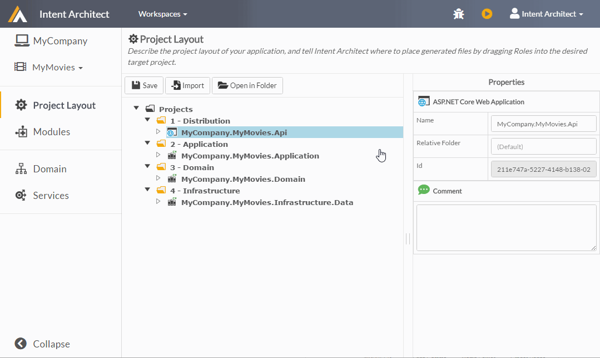
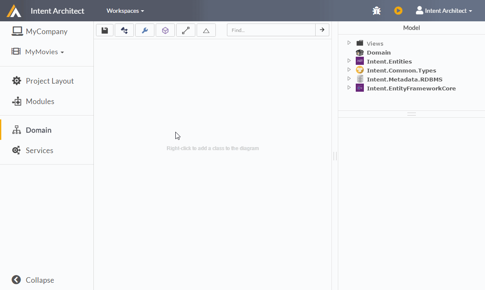
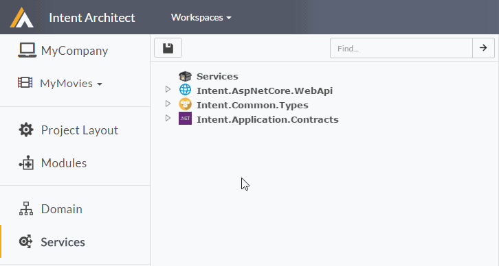
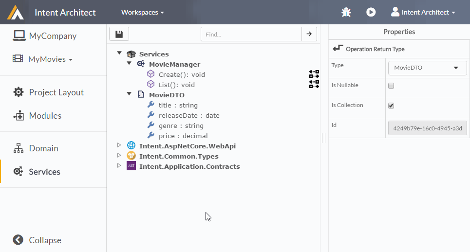
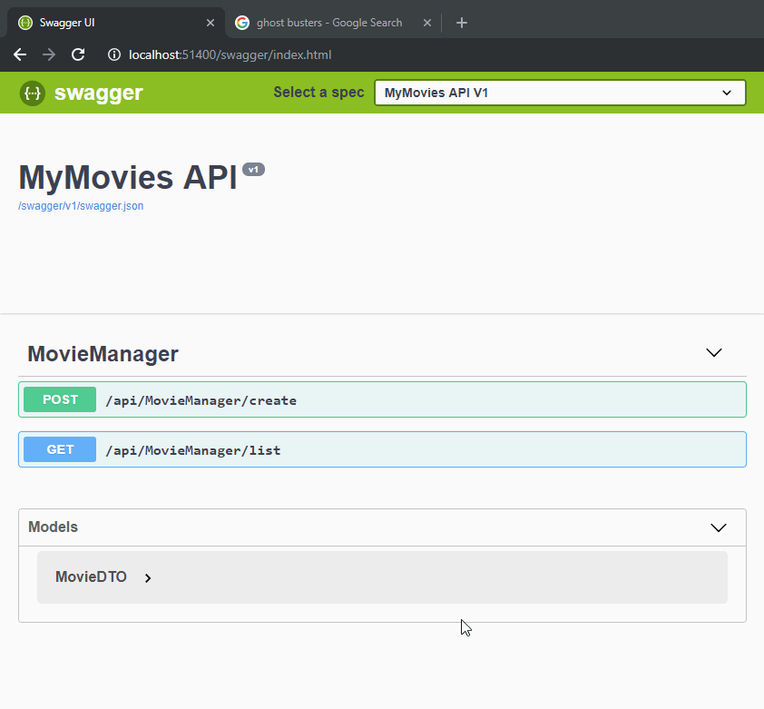

# Getting Started - create an ASP.NET Core web app.

This guide will take you through the steps required to create an ASP.NET Core web application using the open-source modules created by the Intent team. The aim is to show how you can describe your system in high-level models and allow a technology specific set of modules (ASP.NET Core modules in this guide) to realize that into code.

The open-source modules repository can be found [here](https://github.com/IntentSoftware/IntentArchitect). The modules are designed to support a hexagonal architecture (a.k.a. ports and adapters architecture), and the patterns are enterprise grade and production ready.

## 1. Installing and running Intent Architect

Get Intent Architect up and running through the following steps.

- Download the latest version of Intent Architect from the website: [https://intentarchitect.com/#/downloads](https://intentarchitect.com/#/downloads)
- Register an account: [https://intentarchitect.com/#/user-access/register](https://intentarchitect.com/#/user-access/register).
- Double click the downloaded executable to install and run Intent Architect.
- Log in using the credentials created for your account.

## 2. Create a workspace

A `workspace` provides the root location of your solution. This is typically the root folder of you version control repository. It may for example contain a single monolithic application or several microservices.

**From the home screen, click `Create new workspace...` under the 'Create' header.**

Fill in the Name, Description (optional), and Location of your workspace. You can also change the icon by clicking on it.


*Create Workspace Dialog*

|Field|Description|
|-|-|
|Icon|This is an icon which will be associated with the *workspace*. By default a random icon is chosen, but it can be changed at any time.|
|Name|The name of your workspace. This name should be alpha-numeric with no special characters or spaces.|
|Description|Any description or comments about this workspace for yourself (or your team).|
|Location|The folder where Intent Architect will save data for the workspace. This should point to a path under the same Source Control Management as your normal source code, so that it can be versioned and shared amongst the development team in the same way. Intent Architect does not append any additional sub directories, the directory selected will be the directory used.|

You will be presented with the `Create Solution` Dialog.

>[!TIP]
>Good names for Solutions would typically be things like the client name, your product name, business area / unit or your organization name.

**Once the workspace details have been filled out, click `Save`.**

The workspace will open automatically.

## 3. Create a new Application

Next we will create an `Application`. An application could represent a standalone monolithic application, a mircroservice, or simply a location for Intent Architect to generate code into.

**To create an application, click the `New Application` tile from within the workspace.**

A `Create application` wizard will be displayed, presenting a set of `application templates`.
- Select the `Web Application ASP.NET Core` application template.
- Capture the Name, Location, Icon and Description (option) of your application.


*Select an application template and fill out application details.*

|Field|Description|
|-|-|
|Name|The name of the application. This name should be alpha-numeric with no special characters or spaces.|
|Icon|This is an icon which will be associated with the *application*. By default a random icon is chosen, but it can be changed at any time.|
|Location|The folder where your application's data will be persisted. By default this will be in a sub-folder of the solution named after the Application name.|
|Description|A description of the Application.|
>[!TIP]
>`Application templates` like the ones show above are not baked into Intent Architect. They can be created relatively easily and are a great way to bundle modules into a comprehensive technology set. They can also define the default `Project Layout`. See the open-source Intent Architect GitHub repository (https://github.com/IntentSoftware/IntentArchitect) for examples on how to build application templates.

**Click `NEXT`.**

The `Web Application ASP.NET Core` application template provides a set of components which can be turned on or off. Each component represents one or more modules that will be installed. By default the main components are selected, with others presented as options.

We will want to test our services later, and for that we can use the [Swagger UI](https://swagger.io/tools/swagger-ui/).

**Select the `Swagger (Swashbuckle)` component for installation.**


*Select application components to install*

>[!TIP]
>You will be able to add or remove modules later, so don't worry about ensuring you get everything you need installed upfront.

**Click `CREATE`.**

Intent Architect will now create the application as defined by the `Web Application ASP.NET Core` application template and begin downloading all the necessary modules. Once downloading is complete the application will be opened automatically.

Applications open by default on the `Project Layout` section. This application template lays out the projects in the following way:


*Project Layout*

>[!TIP]
>The `Project Layout` is completely configurable. Add, remove or rename projects in accordance with your desired naming conventions. In order for Intent Architect to know in which project to place code generated by the modules, it uses `Roles` which are assigned to a project. Expand a project to see it's assigned `Roles`. By moving these `Roles` between projects, we can effectively decide where code is to be outputted.


## 4. Run the `Software Factory`

Your application is now created, and pre-configured with a `Project Layout` and modules for realising an ASP.NET Core web application. Now to generate the code, we must run the `Software Factory`. 

**To run the `Software Factory`, click the _'play'_ button in the top right hand corner (or press F5):**

The `Run Software Execution` dialogue will appear, providing an output log in the `Console` tab, followed by staging files it intends on creating, updating or deleting in the `Changes` tab:


*Software Factory Execution*

The `Software Factory` hasn’t created or altered any files at this point. The files are staged so that it is clear to the developer what the software factory is intending on doing. By clicking on one of the files, Intent Architect will open a diff-tool (by default Visual Studio) to compare changes. 

>[!TIP]
>Try clicking the `Startup.cs` file to see what Intent Architect intends to output. Note that the default Visual Studio installation locations are inspected to automatically wire up the diff-tool. If not found, an error will be shown. Any diff-tool can be used, and can be changed under your profile settings located in the top right hand corner, to the right of the Software Factory _"play"_ button..

**Click the `APPLY CHANGES` button.**

The `Software Factory` will apply the staged code changes from the list. We can now close the `Software Factory Execution` window.

**Click the `CLOSE` button.**

## 5. Run the application in Visual Studio

At this point, we've told Intent Architect that we want an ASP.NET Core web application, and allowed it to generate the required files for just that. To open the solution in Visual Studio, we need to navigate to the application's folder. An easy shortcut to the code is to navigate to the `Project Layout` section in the aside menu, and click on the `Open in Folder` button.

The folder should look something like this:


*Generated outputs*

**Open the solution (e.g. `MyMovies.sln` file) in Visual Studio 2017** or later (since this is a .NET Core application). The solution will look as follows:


*Visual Studio solution layout*

Allow Visual Studio to restore NuGet dependencies then **compile and run the application by clicking `Debug` -> `Start Debugging` menu items** (or press F5).

The server will be launched locally. **Navigate to `/swagger` relative url to open the Swagger UI.**


*Swagger UI - No operations defined in spec!*

Since we haven't described any services, the Swagger UI will be empty. Let's now begin describing what we want our web server to do (_describing our "intent"_).

## 6. Describing a Domain
A good place to start designing a system is with the Domain. The Domain should represent the business entities and their relationships to one another. 

>[!TIP]
>Modeling domains in this way brings _visibility_ and _transparency_ to your business layer. Developers can discuss design decision amongst each other (and even with business) with the knowledge that the diagram they are looking at represents the truth of the underlying code. In his book, **_Domain-Driven Design: Tackling Complexity in the Heart of Software_**, Eric Evans describes the value of having a model to align developers and domain experts.

To model our Movies domain, **navigate to the `Domain` modeler.**

Let's now a add a class called `Movie` to our Domain. To add a class, **right-click the diagram view and click `Add Class`.** The newly added class automatically allows you to rename it in the model window on the right. **Rename it to `Movie`.** Alternatively, right-click the class and click `Rename` (or press F2).

Next let's add attributes to our `Movie` class. To add an attribute, right-click the class and click `Add Attribute` (or press _ctrl + shift + a_).

**Add the following attributes:**


*Domain Modeler - adding classes and attributes.*

To change the `Type` of the attribute, select the desired type from the dropdown inside the `Properties` window that is displayed on selecting an element in the diagram.

The following `gif` illustrates this process:


*Domain Modeler - adding classes and attributes.*

**Press the _'save'_ icon to save your `Domain` model, and re-run the `Software Factory`.**

The changes should look as follows:


*Software Factory Execution - Domain changes.*

>[!NOTE]
>Looking through the changes above we can see the `Movie.cs` entity, it's state `MovieState.cs` and interface `IMovie.cs` being created, with a [repository](https://docs.microsoft.com/en-us/dotnet/standard/microservices-architecture/microservice-ddd-cqrs-patterns/infrastructure-persistence-layer-design) interface `IMovieRepository.cs` and [specification](https://deviq.com/specification-pattern/) object `MovieSpecification.cs`. These reside in the domain project (`MyCompany.MyMovies.Domain.csproj`), and as part of the architecture, none of these classes or interfaces has any _technology_ dependencies. 

>In the infrastructure project (`MyCompany.MyMovies.Infrastructure.csproj`) we see the [Entity Framework](https://docs.microsoft.com/en-gb/ef/core/) mapping `MovieMapping.cs` and the repository implementation `MovieRepository.cs`. These patterns are determined by the modules that were installed on application creation.

**Click `APPLY CHANGES` and close the `Software Factory Execution` window.**

## 7. Describing Services
Next, we want to create services to create and access our Movies. To do this, we must **navigate to the `Services` modeler.**

Let's create a service that will allow us to add and retrieve our movies. To add a service, **right-click the `Services` package and click on `New Service`.** Name the service `MovieManager`, and **add two operations, `Create` and `List`,** by right-clicking the new service and clicking on `New Operation`.


*Services - adding a service with operations*

Operations by themselves have limited uses. We need to describe what parameters they accept as well as what data they return. Our `Create` operation needs to accept a data object which we will refer to as a `Data Transfer Object (DTO)`. To add a DTO, simply **right-click the `Services` package and click `New DTO`.** We will name this DTO `MovieDTO`.

Next, we must describe the data fields that this DTO provides. Since we are using it to create a `Movie` entity, it should have the same fields as we modeled earlier in the Domain.

**Describe the `MovieDTO` as shown below:**


*Services - adding a DTO*

To wire up our DTO with our operations, we add parameters and return types. **right-click the `Create` operation and assign in a parameter called `dto` with Type `MovieDTO`. Next, right-click the `List` operation and assign it a return type of Type `MovieDTO`, and check the `Is Collection` option in the `Properties` on the right. Click the _"save"_ icon.**


*Services - assigning parameters and return types to operations*

The services should look as follows:


*Services - MovieManager.*

**Re-run the `Software Factory` and apply changes.**


*Software Factory Execution - Services changes.*

>[!NOTE]
>As can be expected, our service is created as an ASP.NET Core MVC controller `MovieManagerController.cs` in our API project (`MyCompany.MyMovies.Api.csproj`).

>In our application project (`MyCompany.MyMovies.Application.csproj`) the DTO `MovieDTO.cs`, service interface `IMovieManager.cs` and service implementation class `MovieManager.cs` is created.

>The service implementation class is where we will put our logic to save and retrieve movies. Let's do this now.

## 8. Writing code: implementing the service
Now that we have described our domain and services, and allowed Intent Architect to generate our required infrastructure, all that is left is to code our implementation. Since we will only be creating and retrieving Movie entities, this will be very easy.

**Re-open the solution in Visual Studio, and navigate to the service implementation class `MovieManager.cs`.** It will be located in the `MyCompany.MyMovies.Application` project, in the `ServiceImplementation` folder.

```csharp
using System;
using System.Collections.Generic;
using System.Linq;
using System.Threading.Tasks;
using Intent.RoslynWeaver.Attributes;
using MyCompany.MyMovies.Application;


[assembly: DefaultIntentManaged(Mode.Merge)]
[assembly: IntentTemplate("Intent.Application.ServiceImplementations", Version = "1.0")]

namespace MyCompany.MyMovies.Application.ServiceImplementation
{
    public class MovieManager : IMovieManager
    {
        public MovieManager()
        {
        }

        [IntentManaged(Mode.Merge, Body = Mode.Ignore, Signature = Mode.Fully)]
        public async Task Create(MovieDTO dto)
        {
            throw new NotImplementedException("Your implementation here...");
        }

        [IntentManaged(Mode.Merge, Body = Mode.Ignore, Signature = Mode.Fully)]
        public async Task<List<MovieDTO>> List()
        {
            throw new NotImplementedException("Your implementation here...");
        }

        public void Dispose()
        {
        }
    }
}
```

>[!NOTE]
>The attributes above the namespace (e.g. `[assembly: DefaultIntentManaged(Mode.Merge)]`) and above each method (e.g. `[IntentManaged(Mode.Merge, Body = Mode.Ignore, Signature = Mode.Fully)]`) are part of the Roslyn Weaving system that is provided by installing the `Intent.OutputManager.RoslynWeaver` module.

>This system ultimately takes the pain out of continuous code generation, making it possible to work alongside continuously-generated code and to take over methods and classes if the generated output isn't meeting the specific requirements. 


>In this case it allows you to add your _user-managed_ code to this file, while simultaneously allowing Intent Architect to change it later.

>The `[IntentManaged(Mode.Merge, Body = Mode.Ignore, Signature = Mode.Fully)]` attribute is instructing the Roslyn Weaving system to allow you to alter the body of the method (`Body = Mode.Ignore`), while Intent Architect must manage the signature (`Signature = Mode.Fully`). Therefore, if we update the signature of our operations in the `Services` modeler, it will update the signature, but **leave** your implementation as is.

>For more information on the Roslyn Weaving system, click [here](../../modules/roslyn_weaver/overview.md).

In this application architecture, the service implementation classes are where we implement our application layer business logic.

**Implement the `MovieManager.cs` service as follows:**

```csharp
using System.Collections.Generic;
using System.Linq;
using System.Threading.Tasks;
using Intent.RoslynWeaver.Attributes;
using MyCompany.MyMovies.Domain;

[assembly: DefaultIntentManaged(Mode.Merge)]
[assembly: IntentTemplate("Intent.Application.ServiceImplementations", Version = "1.0")]

namespace MyCompany.MyMovies.Application.ServiceImplementation
{
    public class MovieManager : IMovieManager
    {
        private readonly IMovieRepository _movieRepository;

        public MovieManager(IMovieRepository movieRepository)
        {
            _movieRepository = movieRepository;
        }

        [IntentManaged(Mode.Merge, Body = Mode.Ignore, Signature = Mode.Fully)]
        public async Task Create(MovieDTO dto)
        {
            // Add new movie to database
            _movieRepository.Add(new Movie()
            {
                Title = dto.Title,
                ReleaseDate = dto.ReleaseDate,
                Genre = dto.Genre,
                Price = dto.Price
            });
        }

        [IntentManaged(Mode.Merge, Body = Mode.Ignore, Signature = Mode.Fully)]
        public async Task<List<MovieDTO>> List()
        {
            // Fetch out all movies out of database
            var movies = await _movieRepository.FindAllAsync();

            // Convert to DTO list and return
            return movies.Select(x => MovieDTO.Create(
                title: x.Title, 
                releaseDate: x.ReleaseDate, 
                genre: x.Genre, 
                price: x.Price)).ToList();
        }

        public void Dispose()
        {
        }
    }
}
```

And that's all the code needed for our system to work :)

>[!NOTE]
>Since the `IMovieRepository` class is in the domain project (`MyCompany.MyMovies.Domain`), you will need to add a project reference to it in the `MyCompany.MyMovies.Application` project.

The last step before we run our application is we need to set up the database. Here we have two options:
 - Option 1: Use an in-memory database.
 - Option 2: Use the Entity Framework migration system to create our database (requires access to a SQL Server instance).

 ### Option 1: In-memory Database
 In the `Startup.cs` file, find the `ConfigureDbContext` method and update it as follows:
 ```csharp
        private void ConfigureDbContext(IServiceCollection services)
        {
            services.AddDbContext<MyMoviesDbContext>(x => x.UseInMemoryDatabase("MyMovies"));
        }
 ```

 ### Option 2: Entity Framework Migrations
1. Ensure that the connection string in the `appsettings.json` file are correct (by default it tries to access a local server through the following connection string: `"Server=.;Initial Catalog=MyMovies;Integrated Security=true;MultipleActiveResultSets=True"`).
2. Open the `MIGRATION_README.txt` file in the `MyCompany.MyMovies.Infrastructure.Data` project. This file is a reference for Entity Framework migration commands relevant to this application.
3. Open the `Package Manager Console` (Tools -> NuGet Package Manager -> Package Manager Console).
4. Run the _Create new migration_ command, changing the `{ChangeName}` option to "Initial": `Add-Migration -Name Initial -StartupProject "MyCompany.MyMovies.Api" -Project MyCompany.MyMovies.Infrastructure.Data`. This will create the migration.
5. Run the _Update to latest version_ command, changing the `{ChangeName}` option to "Initial": `Update-Database -StartupProject "MyCompany.MyMovies.Api" -Project MyCompany.MyMovies.Infrastructure.Data`. This will create the database and required table schema.

## 9. Run and test the app
**Rebuild and run the application (press F5)**.

Once the app is running, **navigate to the Swagger UI (`~/swagger`) test the services.**

### Testing the `Create` operation
For the `'POST /api/MovieManager/create'` service, use the Swagger UI to set the DTO body with data and execute it. The response should indicate that the call was successful:


*Swagger Test - Create Movie*

### Testing the `List` operation
For the `'GET /api/MovieManager/list'` service, use the Swagger UI to list the movies that were added to the database in the previous step:


*Swagger Test - List Movies*

## Summary

## What's Next?
