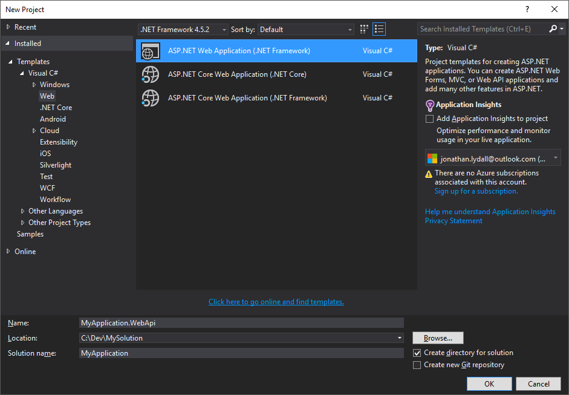
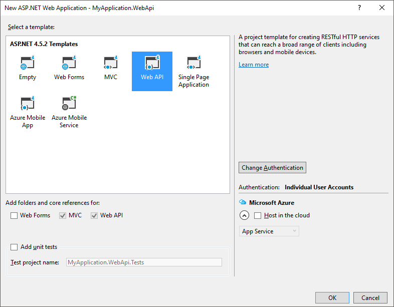
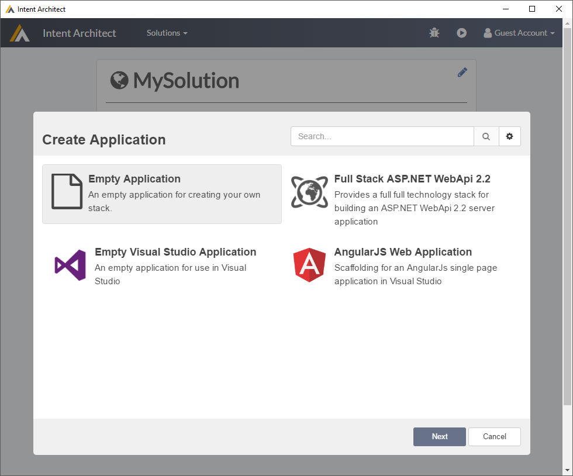
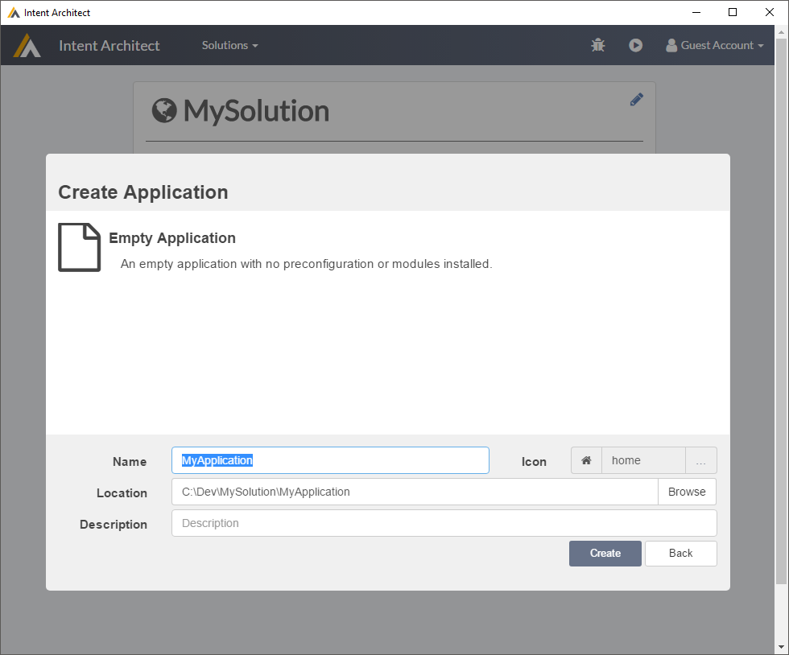
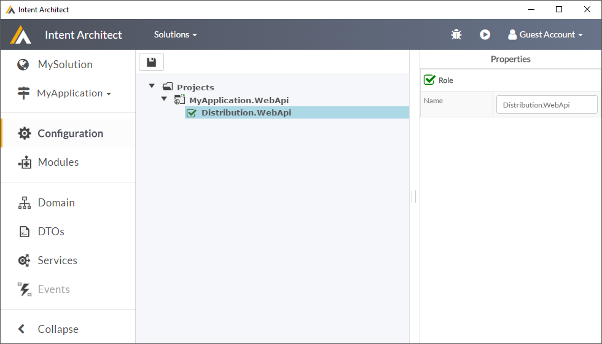

# Creating a Module From Scratch

This document is a detailed walkthrough of creating an [Intent Architect](https://intentarchitect.com/) module from scratch.

## I would prefer to skip all this reading and just see the final code

If you would prefer to quickly jump straight into a working example, we have a super quick guide [here](downloadable_example_module.md) on using a downloadable example module.

## This Tutorial

This tutorial will walk you through creating an Intent Architect module which will generate ASP.NET WebApi controllers based on the `Services` visual DSL in Intent Architect. 

Intent Architect is designed to work equally well on both new and existing projects. In this tutorial we will make a Module which adds additional WebApi Controllers to an existing application.

## Make a new Visual Studio Solution and Project

Create a WebApi project using Visual Studio's scaffolding feature:

- Open Visual Studio
- Create New Project
- Under `Visual C#`, `Web`, choose `ASP.NET Web Application (.NET Framework)`
    - Name: `MyApplication.WebApi`
    - Location: `C:\Dev\MySolution`
    - Solution name: `MyApplication`
    
- Press `OK`
- Use the `Web API` template

- Leave the default boxes checked (just `MVC` and `Web API`)
- (Optional) Press the `Change Authentication` button and choose `No Authentication` if you don't want to worry about authentication right now.
- Press `OK`

## Make a new Intent Architect Solution and Application

In Intent Architect, we will make a new solution in the same folder as our Visual Studio solution and project above:

- Open Intent Architect
- Make a new Solution:
    - Name: `MySolution`
    - Path: `C:\Dev\MySolution`
    
- Make a new Application
    - Use the `Empty Application` template
    
    - Give it name of `MyApplication`
    
- Go to `Modules`
    - Search for `Intent.VisualStudio.Projects` and install the module
    - Search for `Intent.NuGet.Installer` and install the module
    - Search for `Intent.OutputManager.RoslynWeaver` and install the module
- Go to `Configuration`
    - Right-click `Projects` and select `New Project`
    - Select the `WebApi` entry
    - Give it a name of `MyApplication.WebApi`.
    
- Use the play button to generate your application. Press `Apply Changes` when done.

## Creating the Module

In a new instance of Visual Studio, we are going to make a new project from which our Intent Architect Module will be packaged:

- Open a new instance of Visual Studio.
- Under `Visual C#`, `Windows`, choose `Class Library`.
    - Name: `Module.Example.WebApi`
    - Location: `C:\Dev\MySolution`
    - Solution name: `MySolution.Automation`
    
- Add the following Nuget packages:
    - `Intent.IntentArchitectPackager`
    - `Intent.SoftwareFactory.MetaModel` (which will install `Intent.SoftwareFactory.SDK` as a dependency)
- Add the following new items to the project (right-click `Module.Example.WebApi`, click `Add`, click `New Item`):
    
    - Module Specification File:
    
        Module specifications, or rather `.imodspec` files, are very similar to NuGet `.nuspec` files and are used by the Intent Architect's module packager and Intent Architect itself to understand the contents of a module, including what templates, decorators and settings it offers.

        - Visual Studio Project item type: `XML File`
        - Name: `Module.Example.WebApi.imodpec`
        - Content:
            ```xml
            <?xml version="1.0" encoding="utf-8"?>
            <package>
                <id>$id$</id>
                <version>0.0.1</version>
                <summary>Example module implementing a basic WebApi Controller</summary>
                <description>Example module implementing a basic WebApi Controller</description>
                <templates>
                    <template id="Module.Example.WebApi.WebApiController">
                        <role>Distribution.WebApi</role>
                    </template>
                </templates>
            </package>
            ```

    - Template File

        While Intent Architect does not require any particular kind of templating technology, we recommend using [Microsoft's T4 Text Templating](https://docs.microsoft.com/en-us/visualstudio/modeling/code-generation-and-t4-text-templates) with `.tt` files due to its convenience and rich feature set. For those familiar with `.aspx` files, T4 syntax is quite similar.

        With Intent Architect, you can get by without knowing very much about T4, but having at least a basic understanding of its [syntax](https://docs.microsoft.com/en-us/visualstudio/modeling/writing-a-t4-text-template) is highly recommended.

        While Visual Studio is able to compile T4 templates out the box, we recommend you install a Visual Studio extension, such as [this free one](http://t4-editor.tangible-engineering.com/Download_T4Editor_Plus_ModelingTools.html), which provides additional Visual Studio IDE features, such as T4 syntax highlighting.
        
        With Intent Architect, one needs to use T4's `Runtime Text Template` which creates a normal C# file each time the `.tt` file is saved.
        
        We also change the `.tt` file to inherit from an Intent Architect base templating class which allows Intent Architect's Software Factory to automatically capture the template output during the Software Factory run.

        - Visual Studio Project item type: `Runtime Text Template` (search in top right, or can be found under `Visual C# Items`, `General`)
        - Name: `WebApiControllerTemplate.tt`
        - Content:
            ```csharp
            <#@ template language="C#" inherits="IntentRoslynProjectItemTemplateBase<IServiceModel>"#>
            <#@ assembly name="System.Core" #>
            <#@ import namespace="Intent.MetaModel.Service" #>
            <#@ import namespace="Intent.SoftwareFactory.Templates" #>
            <#@ import namespace="System.Linq" #>
            <#@ import namespace="System.Text" #>
            <#@ import namespace="System.Collections.Generic" #>
            using Intent.CodeGen;

            [assembly: DefaultIntentManaged(Mode.Merge)]
            // Simple comment as output
            ```
    - Template's Partal File:
        
        While `.tt` files are ideal for mixing code with text, we have found that certain tasks, like encapsulating template logic in methods, is a very clunky experience. 

        Fortunately, T4 `Runtime Text Template` files actually generate a `.cs` file with a class inside it each time the `.tt` file is saved. These generated classes are `partial` which allows us to make our own corresponding `partial` class.
        
        These partial files which we can create are just completely normal `.cs` files, making them an ideal place to put more complicated template logic, such as constructors, utility methods, etc.
        
        You can read more about partial classes [here](https://docs.microsoft.com/en-us/dotnet/csharp/programming-guide/classes-and-structs/partial-classes-and-methods#partial-classes).

        - Visual Studio Project item type: `Class`
        - Name: `WebApiControllerTemplatePartial.cs`
        - Content:
            ```csharp
            using System;
            using System.Collections.Generic;
            using System.Linq;
            using System.Text;
            using System.Threading.Tasks;
            using Intent.MetaModel.Service;
            using Intent.SoftwareFactory.Engine;
            using Intent.SoftwareFactory.Templates;
            using Intent.SoftwareFactory.VisualStudio;

            namespace Module.Example.WebApi
            {
                public partial class WebApiControllerTemplate
                {
                    public const string Identifier = "Module.Example.WebApi.WebApiController";

                    public WebApiControllerTemplate(IProject project, IServiceModel model) : base(Identifier, project, model)
                    {
                    }

                    public override RoslynMergeConfig ConfigureRoslynMerger()
                    {
                        return new RoslynMergeConfig(new TemplateMetaData(Id, "1.0"));
                    }

                    protected override RoslynDefaultFileMetaData DefineRoslynDefaultFileMetaData()
                    {
                        return new RoslynDefaultFileMetaData(
                            overwriteBehaviour: OverwriteBehaviour.Always,
                            fileName: "${Name}Controller",
                            fileExtension: "cs",
                            defaultLocationInProject: @"Controllers",
                            className: "${Name}Controller",
                            @namespace: "${Project.Name}.Controllers");
                    }
                }
            }
            ```
    - Registration file:

        Intent Architect's Software Factory loads the .NET assemblies of all installed modules, then using reflection locates available templates by finding classes which implement `ITemplateRegistration` and then finally initializes the template defined inside.

        - Visual Studio Project item type: `Class`
        - Name: `WebApiControllerTemplateRegistration.cs`
        - Content:
            ```csharp
            using System;
            using System.Collections.Generic;
            using System.Linq;
            using Intent.MetaModel.Service;
            using Intent.SoftwareFactory;
            using Intent.SoftwareFactory.Engine;
            using Intent.SoftwareFactory.Templates;
            using Intent.SoftwareFactory.Templates.Registrations;

            namespace Module.Example.WebApi
            {
                public class WebApiControllerTemplateRegistration : ModelTemplateRegistrationBase<IServiceModel>
                {
                    private readonly IMetaDataManager _metaDataManager;

                    public WebApiControllerTemplateRegistration(IMetaDataManager metaDataManager)
                    {
                        _metaDataManager = metaDataManager;
                    }

                    public override ITemplate CreateTemplateInstance(IProject project, IServiceModel model)
                    {
                        return new WebApiControllerTemplate(project, model);
                    }

                    public override IEnumerable<IServiceModel> GetModels(IApplication application)
                    {
                        return _metaDataManager.GetMetaData<IServiceModel>(new MetaDataType("Service")).Where(x => x.Application.Name == application.ApplicationName).ToList();
                    }

                    public override string TemplateId => WebApiControllerTemplate.Identifier;
                }
            }
            ```

Build the Visual Studio Solution project and in Visual Studio's build output you should see the following line:
```
Successfully created package Module.Example.WebApi.0.0.1.imod
```

### How did it know to do that?

When you added the `Intent.IntentArchitectPackager` NuGet package to the project, it injected a task into the build action of the project to package up the module for you. The created `.mod` file is placed in your `$(SolutionFolder)\Intent.Modules` folder.

## Add the Module to your Intent Architect Application and Start Using It

This example module is now ready to be used within Intent Architect.

- Go to `Modules`:
    - Add your own repository:

        By adding a 'File System' based repository to our application, Intent Architect will be able to search for and install modules from your file system, much like it does so through the official Intent Architect repository.

        - Press the cog icon near the top right
        - Press `Add New` 
            - Name: `My Repository`
            - Address: `C:\Dev\MySolution\MySolution.Automation\Intent.Modules`
            - Press `Save`
    - From the drop down on the top right, ensure that `My Repository` is selected.
    - Press `Search`
    - You should see your module `Module.Example.WebApi`, select it and press `Install`
- Go to `Configuration`
    - Drag the `Distribution.WebApi` role onto your `MyApplication.WebApi` project, note how its icon changes to be green and checked.
- Go to `Services`
    - Make at least one service, ideally with an operation.


Now run the software factory and observe the changes generated. You can see that for each service you defined in Intent Architect, it has created a new controller in your Visual Studio project. Right now though these controllers have no real content, we're still going to have to add some more content to them.

## Automating the re-installation of your module each time you build it in Visual Studio

Before we move onto adding some useful output to our template, we are going to make our life a little easier.

Generally, Intent Architect will not re-copy or download the same version of a module except when you use the `Reinstall` button on the `Modules` screen. This can become tedious during development if you're changing and rebuilding your module often.

However, Intent Architect will restore *missing* modules, this means we can force a re-copying a module by deleting the copied/downloaded instance of it each time you rebuild the module in Visual Studio.

In Visual Studio:
- Right-click the `Module.Example.WebApi` project.
- Select `Properties`.
- Select the `Build Events` section.
- In the `Post-build event command line` box put the following:
    ```
    if exist "C:\Dev\MySolution\Intent.Modules\Module.Example.WebApi.0.0.1" rmdir "C:\Dev\MySolution\Intent.Modules\Module.Example.WebApi.0.0.1" /s /q
    ```

So we now delete the module from your Intent Architect's `Intent.Modules` folder each time your module builds, then when the Software Factory next runs, it will see the module is missing and automatically re-copy/re-download it. You will see in the Software Factory's log that the module was restored.

Now we can move back to improving our template.

## Have the template generate a class in a namespace

Next we'll make our template generate class names and their namespaces.

Change the content of the `WebApiControllerTemplate.tt` file to the following: 

```csharp
<#@ template language="C#" inherits="IntentRoslynProjectItemTemplateBase<IServiceModel>"#>
<#@ assembly name="System.Core" #>
<#@ import namespace="Intent.MetaModel.Service" #>
<#@ import namespace="Intent.SoftwareFactory.Templates" #>
<#@ import namespace="System.Linq" #>
<#@ import namespace="System.Text" #>
<#@ import namespace="System.Collections.Generic" #>
using System;
using Intent.CodeGen;

[assembly: DefaultIntentManaged(Mode.Merge)]

namespace <#= Namespace #>
{
    public class <#= ClassName #>
    {
    }
}
```

Build your module, run the software factory and observe that it now applies a namespace and class name to your controllers.

## Make the generated class extend ASP.NET WebApi's ApiController class

Change the content of the `WebApiControllerTemplate.tt` file to the following: 

```csharp
<#@ template language="C#" inherits="IntentRoslynProjectItemTemplateBase<IServiceModel>"#>
<#@ assembly name="System.Core" #>
<#@ import namespace="Intent.MetaModel.Service" #>
<#@ import namespace="Intent.SoftwareFactory.Templates" #>
<#@ import namespace="System.Linq" #>
<#@ import namespace="System.Text" #>
<#@ import namespace="System.Collections.Generic" #>
using System;
using System.Web.Http;
using Intent.CodeGen;

[assembly: DefaultIntentManaged(Mode.Merge)]

namespace <#= Namespace #>
{
    public class <#= ClassName #> : ApiController
    {
    }
}
```

Build your module, run the software factory and observe that the generated classes now derive from `ApiController`.

## Add operations to the generated class

If you haven't done so already, in Intent Architect ensure you have a service with at least one operation and that the operation has at least one parameter and a return type.

Change the content of the `WebApiControllerTemplatePartial.cs` file to the following: 

```csharp
using System;
using System.Collections.Generic;
using System.Linq;
using System.Text;
using System.Threading.Tasks;
using Intent.MetaModel.Service;
using Intent.SoftwareFactory.Engine;
using Intent.SoftwareFactory.Templates;
using Intent.SoftwareFactory.VisualStudio;

namespace Module.Example.WebApi
{
    public partial class WebApiControllerTemplate
    {
        public const string Identifier = "Module.Example.WebApi.WebApiController";

        public WebApiControllerTemplate(IProject project, IServiceModel model) : base(Identifier, project, model)
        {
        }

        public override RoslynMergeConfig ConfigureRoslynMerger()
        {
            return new RoslynMergeConfig(new TemplateMetaData(Id, "1.0"));
        }

        protected override RoslynDefaultFileMetaData DefineRoslynDefaultFileMetaData()
        {
            return new RoslynDefaultFileMetaData(
                overwriteBehaviour: OverwriteBehaviour.Always,
                fileName: Model.Name + "Controller",
                fileExtension: "cs",
                defaultLocationInProject: "Controllers",
                className: "${Name}Controller",
                @namespace: "${Project.Name}.Controllers");
        }

        // A helper method used by the template:
        private string GetOperationReturnType(IOperationModel o)
        {
            return o.ReturnType == null
                ? "void"
                : o.ReturnType.TypeReference.Name;
        }

        // A helper method used by the template:
        private string GetParameters(IOperationModel o)
        {
            return o.Parameters
                .Select(x => $"{x.TypeReference.Name} {x.Name}")
                .Aggregate((x, y) => x + ", " + y);
        }
    }
}
```

Also change the content of the `WebApiControllerTemplate.tt` file to the following: 
```csharp
<#@ template language="C#" inherits="IntentRoslynProjectItemTemplateBase<IServiceModel>"#>
<#@ assembly name="System.Core" #>
<#@ import namespace="Intent.MetaModel.Service" #>
<#@ import namespace="Intent.SoftwareFactory.Templates" #>
<#@ import namespace="System.Linq" #>
<#@ import namespace="System.Text" #>
<#@ import namespace="System.Collections.Generic" #>
using System;
using System.Web.Http;
using Intent.CodeGen;

[assembly: DefaultIntentManaged(Mode.Merge)]

namespace <#= Namespace #>
{
    public class <#= ClassName #> : ApiController
    {
<#    foreach (var operation in Model.Operations)
    {
#>
        [IntentManaged(Mode.Merge, Body = Mode.Ignore)]
        [AcceptVerbs("GET")]
        public <#= GetOperationReturnType(operation) #> <#= operation.Name #>(<#= GetParameters(operation) #>)
        {
            throw new NotImplementedException();
        }
<#
    }
#>
    }
}
```
Build your module, run the software factory and observe that the generated classes now have operations generated in them.

## Conclusion

We now have a module containing a template which generates basic ASP.NET WebApi controller classes.

It will make a file and class for each service you have defined with Intent Architect's `Services` DSL. For each file and class it generates, it will also make a method for each operation defined on each *service* from Intent Architect.