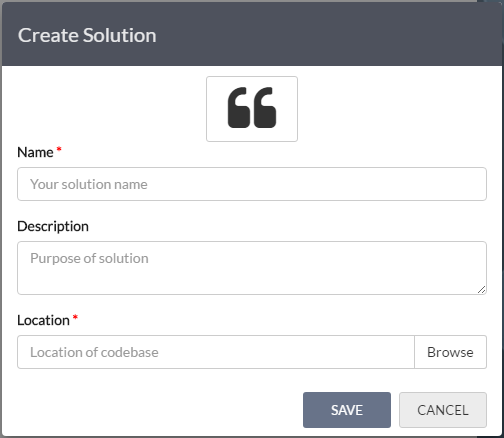
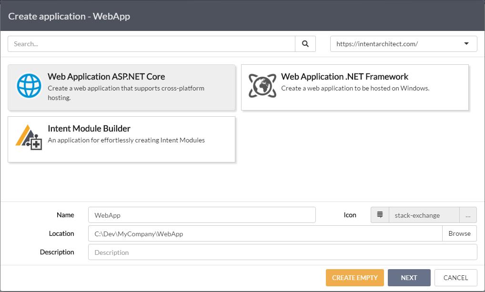
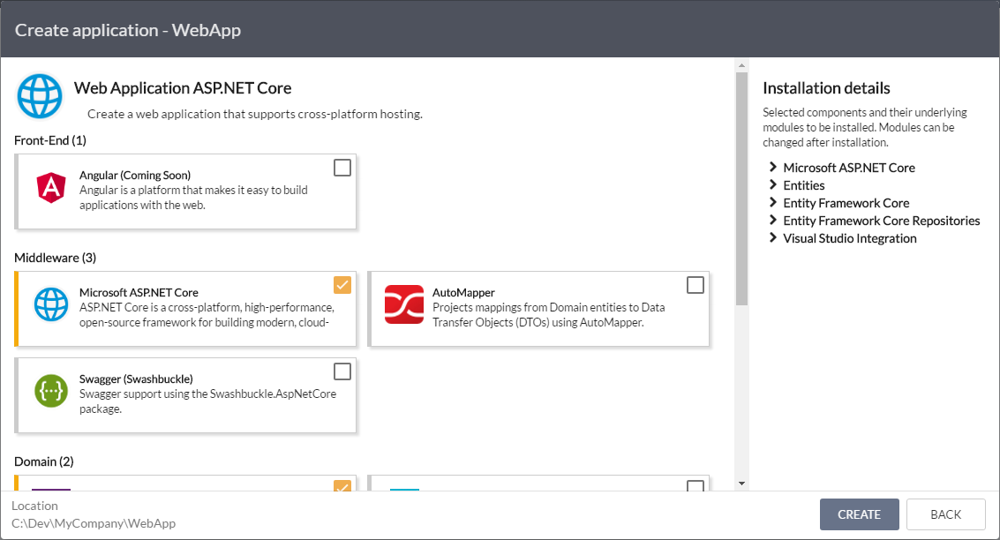
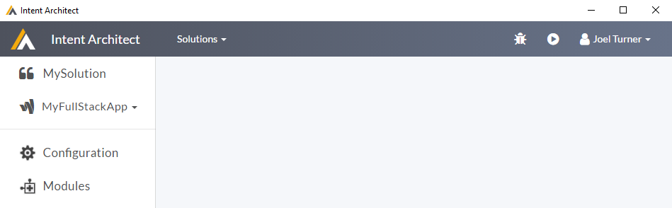
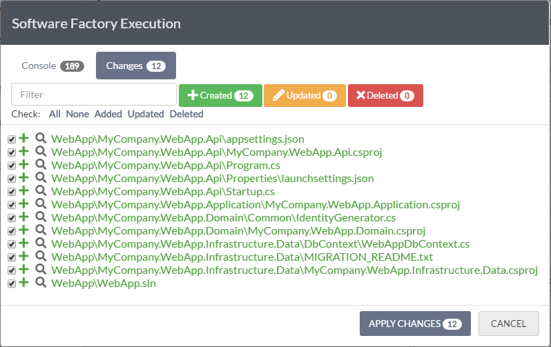
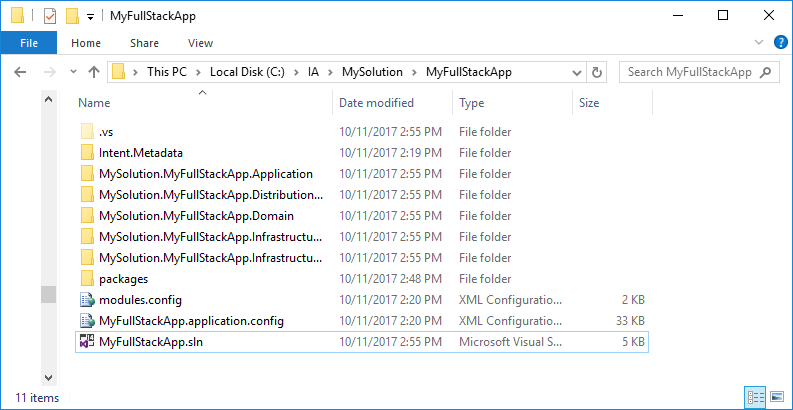
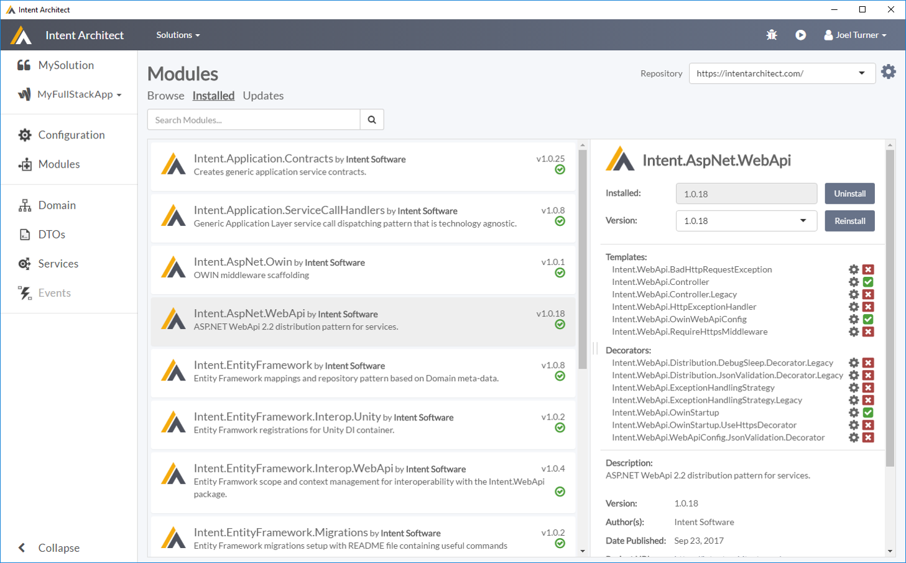
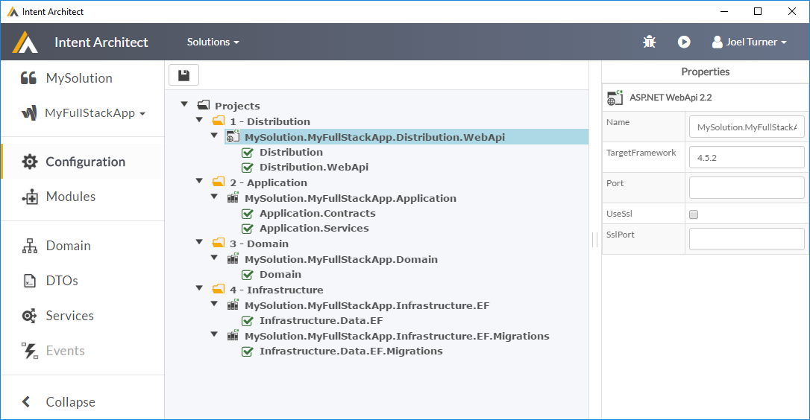

# Quick Start

Tooling in software helps us build more robust, maintainable applications faster then we could doing it all by hand. 

Intent Architect is an IDE-like tool which helps you better capture your design intent and uses that intent to build out aspects of your application as per your *'blueprints'*.

The goal of this guide is to give you a feel for the tool, illustrating how it works and what it can do for you. In this guide we're going to create a "full stack" ASP.NET WebApi 2.2 server with persistence and domain patterns in place.

Once completed, you'll have a basic understanding of how Intent Architect works and a foundation to begin exploring how to it can make your development world better.

## 1. Setup the development environment

Get Intent Architect up and running in 3 easy steps.

- Sign up at [https://intentarchitect.com/](https://intentarchitect.com/).
- Download the latest version of Intent Architect.
- Double clicking the downloaded .exe automatically, installs, creates shortcuts for, and starts Intent Architect, ready for you to begin working with it. 

## 2. Create a New Solution

A `Solution` is a logical grouping of `Applications` (components) of your system. Modern systems are typically composed of multiple cohesive applications which communicate with each other through well defined interfaces.  

**Click on `Create New Solution`, either in the body of the `Home` screen or from the `Solutions` drop down at the top of the screen.**

*Create Solution Dialog*

|Field|Description|
|-|-|
|Icon|This is an icon which will be associated with the *Solution*. By default a random icon is chosen, but it can be changed at any time.|
|Name|The name of your solution. This name should be alpha-numeric with no special characters or spaces.|
|Description|Any description or comments about this solution for yourself (or your team).|
|Location|The folder where Intent Architect will save data for the solution. This should point to a path under the same Source Control Management as your normal source code, so that it can be versioned and shared amongst the development team in the same way. Intent Architect does not append any additional sub directories, the directory selected will be the directory used.|

You will be presented with the `Create Solution` Dialog.

>[!TIP]
>Good names for Solutions would typically be things like the client name, your product name, business area / unit or your organization name.

**Fill out the dialog and press `Save`.**

## 3. Create a new Application

Next we will create an `Application`. As you would expect, in Intent Architect an `Application` is a single application of your overall system, for example, it could be a website including it's frontend along with backing services and infrastructure like database persistance. 

**Click the `New Application` tile.**

You will now be presented with a two-step wizard to create your application.
- Select an Application Template.
- Capture some basic details for the Application.

*Select an Application Template*

Each Application Template is pre-configured initial state of an application. They can install Modules, populate Metadata and anything else that can be manually configured through the front end. Intent Architect has a gallery of templates available online which will be added to over time. For the purposes of this guide, we will choose the `Full Stack ASP.NET WebAPI 2.2` *Application Template*.

**Select the `Full Stack ASP.NET WebAPI 2.2` Application Template and click `Next`.**

*Capture Application Details*

|Field|Description|
|-|-|
|Name|The name of the application. This name should be alpha-numeric with no special characters or spaces.|
|Icon|This is an icon which will be associated with the *application*. By default a random icon is chosen, but it can be changed at any time.|
|Location|The folder where your application's data will be persisted. By default this will be in a sub-folder of the solution named after the Application name.|
|Description|A description of the Application.|

**After capturing the details, press `Create`.**

## 4. Push the `Play` button

Your Application is now created, and pre-configured with various Modules and Metadata from the Application Template. 

*Application View*

**Click the `Play` button, in the top right hand corner.**

The `Run Software Factory` dialogue will appear, providing feedback of and interaction with the code generation process. Not worrying too much about the presented `Console` entries, once the Software Factory has run, the `Changes` tab is presented showing a list of all pending code changes. Reviewing the list, we can see it is wanting to create a Visual Studio solution, made up of the `.sln` file as well as `csproj` and various other infrastructura files.

*Software Factory execution 'Changes'*

**Click the `Apply Changes` button.**

At this point the software factory applies all the pending code changes from the list and then downloads and installs any required NuGet packages, depending on your computer and internet speed, this may take a little while. These NuGet packages were installed based on the configured Module dependencies, once downloaded and installed, they will not need to be downloaded or installed again on future presses of the `Play` button.

**Click the `Close` button.**

At this point you can navigate to the folder on your hard drive which you specified for your application and you should see something like this:

*Generated outputs*

Open the solution in Visual Studio 2015/2017 (output will be in the location chosen for your application).

Compile and run (hit F5).

## What just happened?

What may not obvious at this point is what caused the code to be generated, and why it was generated like that. 

If you look at the Modules section of you application, on the installed tab you should see something similar to this:

*Installed Modules*

Here you can see there are a collection of modules which have been installed by the application template. Each of these modules is affecting what code is generated as well as how it is generated. 

You can try uninstall and reinstalling Modules, then pressing the `Play` button to see what affect they have on the code generation.

In a less contrived scenario you would hand pick which modules you wished to use or create your own.

Another aspect which is affecting the code generation is the Application Configuration. If you go the `Configuration` section, you will see the following:

*Application project configuration*

This is Metadata describing how you want your actual source code to be structured in addition to where you would like the code generation from installed modules to go. This is done by mapping `Target Roles` from the `Modules` onto your project structure.

>[!NOTE]
>The project types available are again supplied by modules, in this case specifically, from the Intent.VisualStudio Module. New project types can be added through the Modules system.    

## Add additional Metadata to describe your Application
Play around in Intent Architect by adding Services, Domain classes and DTOs, each time pressing `Play` to see how the patterns are realized in your codebase.
