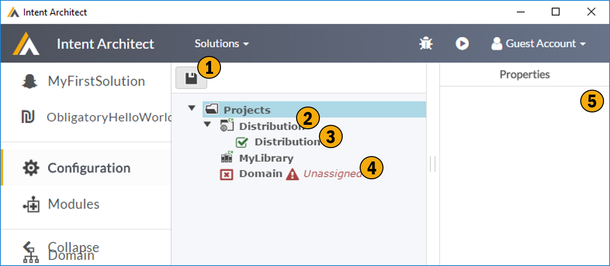

# Application Configuration

Describe your application's code project structure. Here you conceptually lay out how the physical code structure you would like, or how it actually is if you are using Intent Architect against an existing code base. The are 2 main purposes behind describing this structure:-
- Flexibility, allowing you to map out where you would like the generated code outputs to go.
- Generate and/or manage your actual code projects and solutions 

Generated code is mapped to the projects through a role system. Templates in Modules target roles (defined by the Template creator), when such a module is added to your application those roles becomes available on this screen for assignment. Assigning a role to a project is effectively saying 'Place all generated output related to this role into this project'. It is recommended to use standard conventions for roles e.g. Domain, Persistence, UI, Services, Contracts, etc. 

## 1. Save
Save your application configuration, save the world.

## 2. Project
Add one or more projects, these projects represent the actual code projects of your code solution. These projects can either be created by Intent Architect or be existing projects. Projects have project types, project types are dynamic and available in Intent Architect through modules. Our Visual Studio module ships with several standard .Net project types. 

## 3. Assigned Roles
These are the roles currently assigned to this specific projects. These roles mean that any generated code targeting these roles will be placed in this project. 

## 4. Unassigned Roles
This is a list of roles which have been registered, through the modules you have added to your application, which are currently not mapped onto a project. These roles need to be mapped to the desired projects.

## 5. Properties window
Show the properties of the currently selected item, and typically allows them to be edited. There is also a context menu available on items for editing.