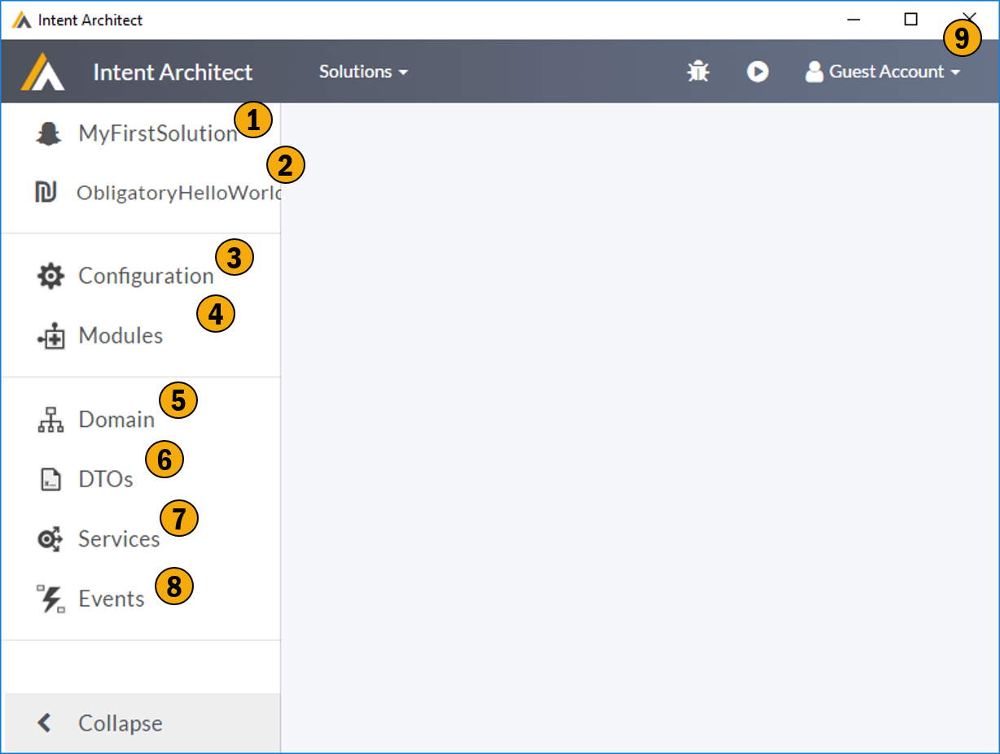

# Application Screen

This screen is where you configure / describe your application and generate code for your application. On this screen you can configure you application, select patterns (modules) you would like to use and describe your high level architecture through our meta data generating DSLs.

## 1. Solution
This is the solution the application belongs too.

## 2. Current Application
This drop down indicates which application you are currently working with. You can swap between the various applications within the solution here.

## 3. Configuration
This section allows you to configure how you would like your application's code to be structured. It allows you describe your code projects structures and map the code generation onto that project structure. 

## 4. Modules
This section allows you to manages your applications modules. These modules can be many things but typically represent the patterns you would like to see in your application code. 

## 5. Domain
This DSL allows you to describe your applications domain model using UML. 

## 6. DTO
This DSL allows you to describe your applications data contracts. This DSL also supports concepts like describing your contracts with reference to your domain allowing you to introduce compile time dependencies without introducing a runtime dependencies. 

## 7. Services
This DSL allows you to describe your applications services. 

## 8. Events
Not implemented yet. This DSL will allow for describing inbound and outbound application events.

## 9. Shell
All the functions in this area are described in [Shell](shell.md).

