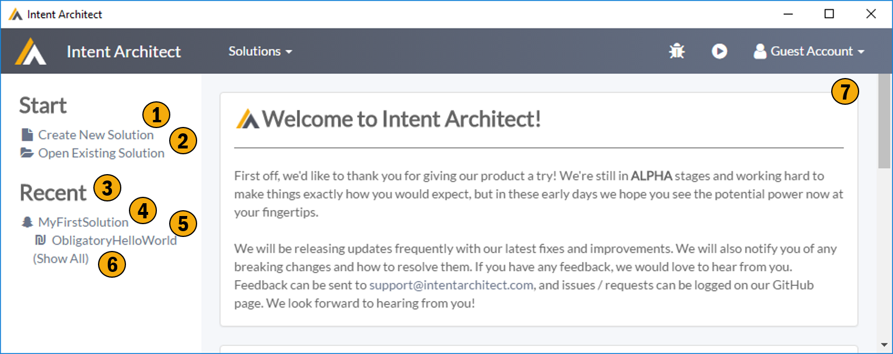

# Home Screen

The home screen is a general landing page, it allows you to create new solutions, provides short cuts to your recently accessed applications, and solutions, as well as keeping you updated with our news feed.

## 1. Create New Solution
Allows you to create a new solution, as stated. Solutions are just a named grouping concept for one or more applications.

## 2. Open Existing Solution
Find and open a previously created solution. These would be files with the '.isln' extension. 

## 3. Recent
Contains a list of recently accessed solution and applications.

## 4. Recently Accessed Solution
Click me to open this recently accessed solution. 

## 5. Recently Accessed Application
Click me to open this recently accessed application.

## 6. Show All
Shows all the applications within the recently access solution, not just the recently accessed applications.

## 7. News Feed
Our new feed, hopefully containing links and information you find useful.