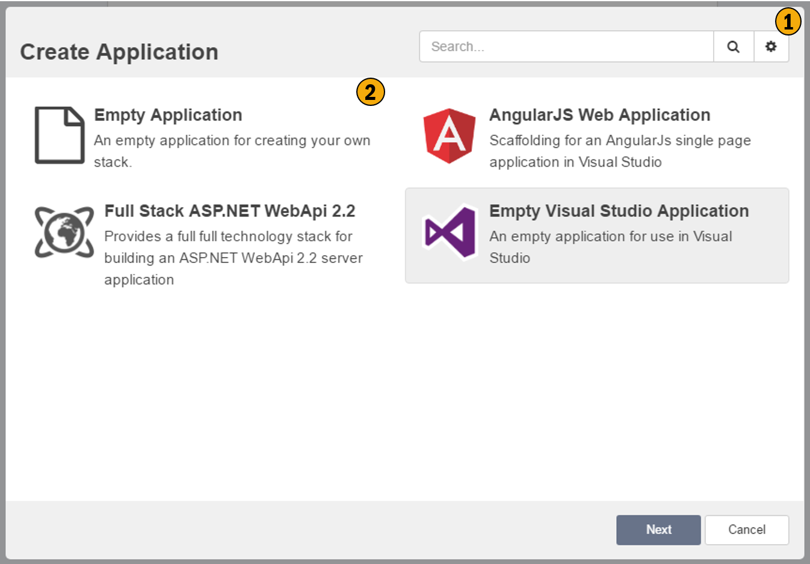

# New Application Wizard

This wizard creates new applications with in the current solution. This wizard will prompt you to select an Application Template to start with, based on you selection your application will be configured accordingly.

## 1. Repository Configuration
This allows you to configure your repositories, i.e. where Intent Architect is discovering your application templates and Modules. 

## 2. Application Templates
This is a list of application templates you can base your application on. Application templates pre-configure your application according to the template. Application Template simply initialize you application to a pre-defined state, everything the Application Template does can be done manually through the UI.

## 3. Application Template description
This section provides more detailed information about the Application Template and it's intentions, this information is supplied by the Application Template's creator.

## 4. Icon Selection
Associate an Icon with you application. This icon is used purely for visual purposes within Intent Architect and is meant to make it easier to visually see which application you are working with, this is particularly useful for users who work with many applications.

## 5. Location
This is the folder where you would like the application and it's associated data to be stored. By default the location will be a folder with the same name as the project within the Solutions directory.

## 6. Create
Will create the application based on your selections. 