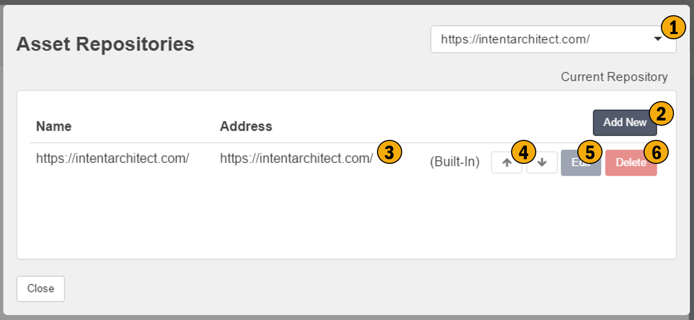

# Repository Configuration

This screen allows you to configure the Repositories for your application. These repositories are the sources of Application Templates and Modules. Repositories can be represented by a service or a physical folder on your hard drive. 

## 1. Current Repository
This control allows you to change / choose your default repository 

## 2. Add New
Allows you to add new repositories, i.e. new sources of Applications Templates and Modules. 

## 3. Address
This is Uri for the repository, it can either be in the form of a URL to a service or a folder location on your hard drive.

## 4. Ordering
These arrows allow you to order the list of repositories in order of preference, with the top most repository being the most prefered. Whenever cascading actions / searches must be performed across the repositories they will be performed in the order you have specified here.

## 5. Edit
Modify the details of the repository.

## 6. Delete
Remove the repository.