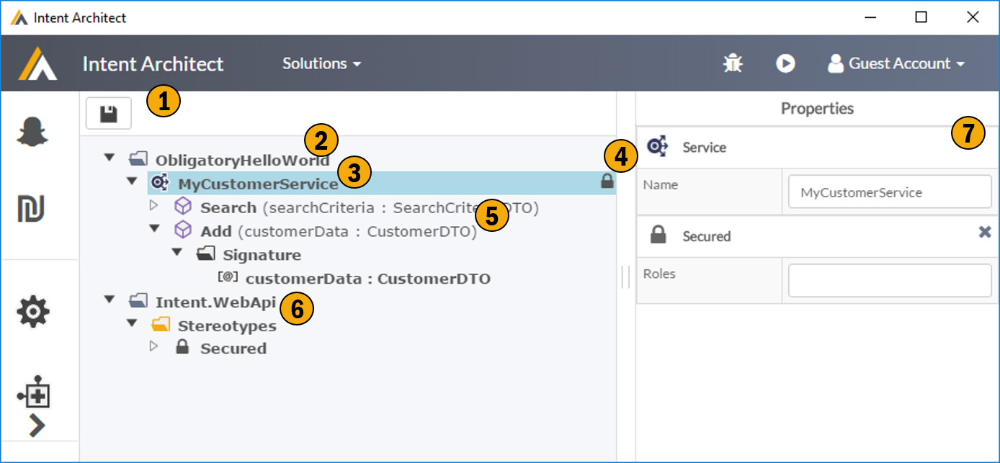

# Services

This screen allows to describe your services. As with all the meta data describing DSLs this data is technology agnotic and can be extending using your own custom meta data through the stereotype system. 

## 1. Save

## 2. Folders
This tool supports a dynamic folder structure allowing you store data contract meta data in a structure which makes sense to you. 

## 3. Service Definition
This ia an example of a service definition. The basic service meta data is fairly simplistic but can be extended to describe any service related concepts you wish to model through the use of stereotypes. It's important to note that these are logical services and could be realized in any technology of your choice.

## 4. Stereotype Icon
This is an example a stereotype on a service, the 'lock' icon is the visual showing the "secured" stereotype is applied to the service. The visualization of stereotype is customizable through the stereotype definitions. 

## 5. Service Operation
This the logical definition of a service operation, it defines the basic contract and can be enriched through the stereotype system.

## 6. Supporting Model Artifacts
These would be the extensions to the service model, namely custom data types, enumerations and stereotype definitions. Note these can be manually created or imported by Modules.

## 7. Property Window
This shows, and allows for editing, the properties of the currently selected item.