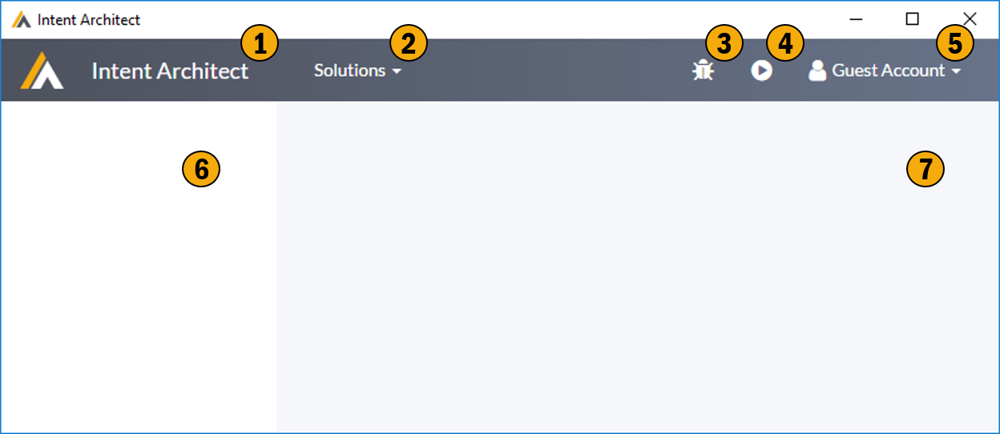

# The Shell

This is the basic shell of Intent Architect which is typically always visible no matter where you are in the application.

## 1. Home Screen Area
There is no place like home.  

## 2. Solution drop down
This list contains a complete list of all you Intent Architect solutions. This drop down can be used to switch between solutions.  

## 3. Debug button
This button is equivalent to clicking the Play button, the difference being this button will also attach the Visual Studio debugger to the execution, allowing you to debug your modules. Don't forget to include the PDB files into your module if you want to debug them. 

## 4. Play button
This almighty button runs the software factory for the application you currently have open. This will typically result in Intent Architect generating source code into your solution. 

## 5. User context
Show the currently logged in user and provides access to all user related functionality.

## 6. Context specific menu
This area typically contains a menu of actions applicable to your current context. 

## 7. Content Region
The region contains the content you are currently passionately engaged with.