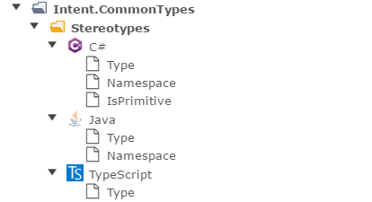
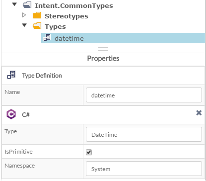

# Intent Common Types

## Overview

This module provides technology agnostic primitive types for modeling. It also provides an extensible type conversion system to allow this agnostic types to be realized into technology specific types with templates.

Installing this module will install MetaData Data types into the various standard Intent Architect DSLs (e.g. Domain Modeller). 


*Installed MetaData Data types*

It will also install Stereotypes for describing type conversions, this module install type converters for C#, Java and TypeScript.


*Installed Stereotypes*

These stereotypes can be applied to any data types to describe its technology specific type. In the image below we can see an example of mapping the technology agnostic 'datetime' onto the equivalent C# type.


*Mapping Datetime to C#*

Within your template simply pass the MetaData model data type to the Types.Get method to resolve the technology specific type within your template (see pseudo code example below). 

```csharp

    public class MyTemplate : ...,  IRequireTypeResolver
    {
        public ITypeResolver Types { get; set; }

        public void Sample ()
        {
            foreach (var attribute in Model.Attributes)
            {
                var technologySpecificType = Types.Get(attribute.Type);
            }
        }
    }

```

If you are wondering how the TypeResolver knew which technology specific type to use, it is based on the templates file extension. If for some reason you require different behaviour there is the ITypeResolverFactoryResolution interface which allows you to adapt / change this. 

## How to make a template Type Resolver aware of other types
You may want the Type resolver to be aware for other Types generated by other templates in the case simply implement the following.

```csharp

        private ITypeResolver _types;
        public ITypeResolver Types
        { get
            {
                return _types;
            }
            set
            {
                _types = value;
                _types.AddClassTypeSource(ClassTypeSource.InProject(this.Project, "MyOtherTemplateId"));
            }
        }

```

## Implementing Type Resolvers for other languages

This can be done by implementing your own ITypeResolverFactory. Feel free to check out this module on GitHub for an example of how it can be done.
