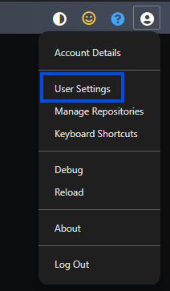
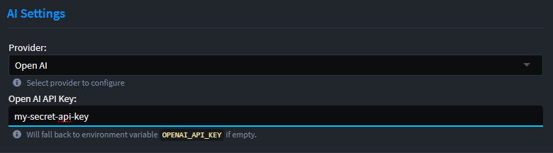

# Intent.Common.AI

The `Intent.Common.AI` module provides shared infrastructure, settings, and metadata used across all AI-related modules in Intent Architect.

This module includes:

- Common configuration models for AI providers
- Standardized settings for prompts, token limits, and model selection
- Utilities and abstractions to streamline AI module development

> ℹ️ This module is intended to be used as a dependency for other AI modules and is not directly used for AI task execution.

## User Settings

AI provider details are configured in **User Settings**. These settings are user-specific, stored outside of the solution folder, and are not committed to source control.

The **User Settings** are available from the `User` menu in the top-right hand corner of Intent Architect:

Within the **User Settings**, is an **AI Settings** section:

### Available Settings

- **Provider**: The AI provider to use. Supported options:
  - [OpenAI](https://platform.openai.com)
  - [Azure OpenAI](https://azure.microsoft.com/en-us/pricing/details/cognitive-services/openai-service/?msockid=3ed3013722c562b10463146623386323)
  - [Anthropic](https://console.anthropic.com)
  - [Open Router](https://openrouter.ai)
  - [Ollama](https://ollama.com)

- **Model**: The LLM model to use, specific to the selected provider.
- **API Key**: The API key used to authenticate with the provider.
  - You can store a separate key for each provider if needed.
  - Instead of storing them in here, you can fall back to using environment variables:
    - **OpenAI**: `OPENAI_API_KEY`
    - **Azure OpenAI**: `AZURE_OPENAI_API_KEY`
    - **Anthropic**: `ANTHROPIC_API_KEY`
    - **Open Router**: `OPENROUTER_API_KEY`
- **Max Tokens**: Specifies the maximum number of tokens (input + output) the AI can process in a single prompt.
- **API URL**: The endpoint URL used to connect to the AI provider’s API.
- **Deployment Name**: The name of the deployed model to use when calling the AI provider.
