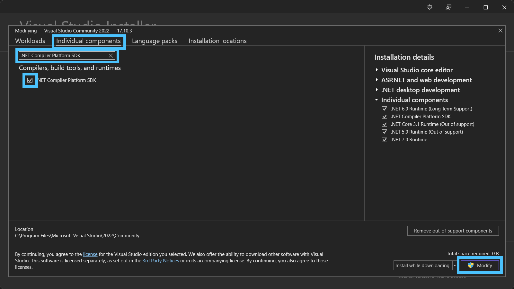

# C# File Builder

Try follow Roslyn terminology for concepts, an easy way to see what terminology it uses is by installing and using the _Syntax Visualizer_ for Visual Studio which shows details of whatever your caret is on in the text editor:

More details: <https://learn.microsoft.com/dotnet/csharp/roslyn-sdk/syntax-visualizer?tabs=csharp>

## Installing Syntax Analyzer for Visual Studio

Open _Visual Studio Installer_ from your Start Menu.

Click _Modify_ on your Visual Studio installation:

On the _Modifying_ screen:

- Select the _Individual components_ tab.
- Enter `.NET Compiler Platform SDK` into the _Search components_ box.
- Check the _.NET Compiler Platform SDK_ component.
- Press the _Modify_ button.

## Using the Syntax Analyzer in Visual Studio

The window can be opened by clicking _View_, _Other Windows_, _Syntax Visualizer_ menu option:

Or alternatively using `Ctrl+Q` shortcut in Visual Studio to open the _Feature Search_ window and filtering for it:

## Alternative Syntax Visualizers

- [Sharplab.io](https://sharplab.io/) (web-based)