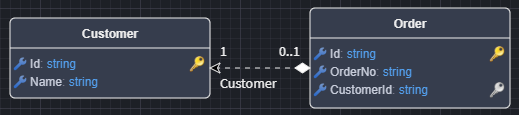

# Intent.Metadata.DocumentDB

This module provides `Domain Designer` metadata and scripting support for Document DB orientated modules.

## Domain Designer modeling

The `Domain Designer` has been extended with several stereotypes for modeling Document Db technology specific concepts in your domain.

### Document Database - Package stereotype

The `Document Database` stereotype is applied to a `Domain Package`, and configures it to use the Document DB modelling paradigm.

The stereotype may be applied automatically but can also be applied manually to `Domain Packages` if required.

This stereotype has a Provider property, to specify which specific type of Document Db technology the Domain Package should be realized in. This drop down has the following options.

- Default (None selected), if no provider is specified and you have a single Document DB Provider module installed (e.g. Intent.CosmosDB), that module will be used by default.
- Custom, the backing implementation will need to be implemented through custom code.
- Dynamic installed module providers (e.g. CosmosDB, MongoDd, Dapr), any Document DB Provider implementing modules will show as options here.

If you have multiple Document DB technologies you would need to configure which Domain Packages are for which Document DB technologies.

### Primary Key - Attribute stereotype

The `Primary Key` stereotype indicates that an `Attribute` is the document's primary key.

By default any `Class`'s added to your domain will have an `Attribute` added named `Id` with the `Primary Key` stereotype applied to it.

This stereotype is visualized as a golden key icon.

### Foreign Key - Attribute stereotype

The `Foreign Key` stereotype indicates an `Attribute` has been introduced to a `Class` as a result of a modeled `Association`, for example:

In this diagram you can see the `CustomerId` attribute has been introduced, with the `Foreign Key` stereotype, as a result of the many-to-one relationship between `Basket` and `Customer`.

For the Document DB paradigm, association between different aggregate roots are denotes by dotted line associations as these are references between documents.

The `Foreign Key` stereotype's are automatically managed when modeling associations. This stereotype is visualized as a silver key icon.
