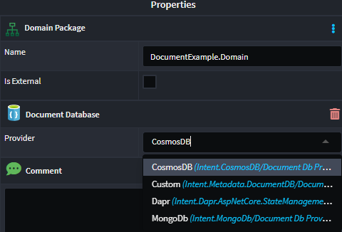

# Intent.Metadata.DocumentDB

This module provides `Domain Designer` metadata and scripting support for Document DB-oriented modules.

## Domain Designer Modeling

The `Domain Designer` has been extended with several stereotypes for modeling Document DB technology-specific concepts in your domain.

### Document Database - Package Stereotype

The `Document Database` stereotype is applied to a `Domain Package` and configures it to use the Document DB modeling paradigm.

The stereotype may be applied automatically but can also be applied manually to `Domain Packages` if required.

This stereotype includes a **Provider** property, which specifies which specific type of Document DB technology the Domain Package should be realized in. The available options in the drop-down are as follows:

- **Default (None selected)**: If no provider is specified and you have a single Document DB provider module installed (e.g., Intent.CosmosDB), that module will be used by default.
- **Custom**: The backing implementation must be implemented through custom code.
- **Dynamic installed module providers** (e.g., CosmosDB, MongoDB, Dapr): Any Document DB provider-implementing modules will show as options here.

If you have multiple Document DB technologies, you must configure which Domain Packages are mapped to which Document DB technologies.

### Primary Key - Attribute Stereotype

The `Primary Key` stereotype indicates that an `Attribute` is the document's primary key.

By default, any `Class` added to your domain will have an `Attribute` named `Id` with the `Primary Key` stereotype applied.

This stereotype is visualized with a golden key icon.

#### Primary Key Type

The default type for the `Primary Key` is `Object ID` (string). This can be changed using the `Document Database > Id Type` application setting.

The available options are:

- **Object ID (string)** - the default
- **GUID**

#### Primary Key Creation

The default behavior for `Primary Key` creation is that it will be applied to **all** entities (with the exception of child entities with one-to-one relationships).

This behavior can be modified using the `Document Database > Key Creation Mode` application setting.

The available options are:

- **All** - The default. All modeled entities, except for *child entities with one-to-one relationships*, will automatically be assigned a `Primary Key`.
- **Only on Documents** - Only parent entities (no *child entities*) will automatically be assigned a `Primary Key`.

**Visual example** of an `All` modeled *one-to-many* relationship where the child entity (OrderItem) **has** a `Primary Key`:

**Visual example** of an `Only on Documents` modeled *one-to-many* relationship where the child entity (OrderItem) **does not** have a `Primary Key`:

> [!NOTE]
> The `Create CRUD CQRS Operations` accelerator in the `Service Designer` requires that an entity has a `Primary Key` (i.e., that the `Key Creation Mode` is set to `All`). If a child entity does not have a `Primary Key`, it will not be available for selection when using the `Create CRUD CQRS Operations` accelerator.

### Foreign Key - Attribute Stereotype

The `Foreign Key` stereotype indicates that an `Attribute` has been introduced to a `Class` as a result of a modeled `Association`. For example:

In this diagram, you can see that the `CustomerId` attribute has been introduced, with the `Foreign Key` stereotype, as a result of the many-to-one relationship between `Basket` and `Customer`.

In the Document DB paradigm, associations between different aggregate roots are denoted by dotted-line associations, as these are references between documents.

The `Foreign Key` stereotype is automatically managed when modeling associations. This stereotype is visualized with a silver key icon.

#### Compositional Relationship

This is the default relationship when modeling an `Association` and is represented by a **black diamond** on the source end of the relationship and a **solid line** between the two entities.

With this relationship, the child entity is considered a part of the parent entity and cannot exist without it.

In this example, an *OrderItem* has a `Compositional Relationship` with *Order* and cannot exist independently of an *Order*. It is considered part of the *Order*.

#### Aggregational Relationship

When the `Source End` of the `Association` has been set as `Is Nullable`, the relationship is considered an `Aggregational Relationship`. This is represented by a **white diamond** on the source end of the relationship and a **dotted line** between the two entities.

This relationship is modeled by setting the `Is Nullable` property of the `Source End` of the `Association` to **true**. In this case, the "child" entity can exist independently of the "parent" entity.

In this example, an *Address* has an `Aggregational Relationship` with *Order* and can exist independently of an *Order*.

