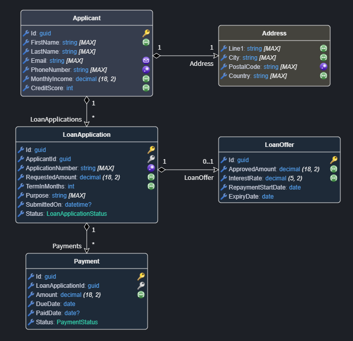

# Intent.Metadata.Domain.Constraints

This Intent Architect module adds Domain Designer metadata for modeling validation rules on entity attributes.



## What This Module Provides

The module contributes domain-level constraint stereotypes you can apply to `Attribute` elements:

| Constraint           | Intended Rule Semantics                                                                                           | Properties                                                             |
|----------------------|-------------------------------------------------------------------------------------------------------------------|------------------------------------------------------------------------|
| `Required`           | Ensures a value is present (non-nullable fields are implicitly required).                                         | None                                                                   |
| `Text Limits`        | Restricts the inclusive length of text values.                                                                    | `Min Length` (optional, inclusive), `Max Length` (optional, inclusive) |
| `Numeric Limits`     | Configures inclusive minimum and/or maximum numeric value restrictions.                                           | `Min Value` (optional, inclusive), `Max Value` (optional, inclusive)   |
| `Collection Limits`  | Configures inclusive minimum and/or maximum collection size settings, ensuring controlled collection cardinality. | `Min Length` (optional, inclusive), `Max Length` (optional, inclusive) |
| `Regular Expression` | Text value must match the provided pattern.                                                                       | `Pattern` (required), `Message` (optional custom message)              |
| `Email`              | Validates that a text value is in a valid email address format.                                                   | None                                                                   |
| `Url`                | Validates that a value is in a valid absolute URL format.                                                         | None                                                                   |
| `Base64`             | Validates that a text value is Base64 encoded.                                                                    | None                                                                   |

These constraints are metadata only. They are realized by downstream modules that consume the metadata.

## How To Apply

Use the `Add Domain Constraint` context menu on a domain attribute to apply common constraints:

1. Open the Domain Designer and select an `Attribute` on an entity.
2. Right-click and choose `Add Domain Constraint`.
3. Select the desired constraint.
4. Configure the constraint properties where applicable.


## FluentValidation Integration

When this module is used together with modules such as `Intent.Application.FluentValidation.Dtos` and `Intent.Application.MediatR.FluentValidation`, modeled domain constraints are emitted as generated FluentValidation rules in your application layer.

In other words, you model constraints once in the Domain Designer, and compatible modules generate validator chains from that metadata.

For example, a mapped DTO can produce rules like:

- `Name`: `Required`, `Text Limits (3..100)`, `Regular Expression ("^[A-Za-z ]+$")`
- `Age`: `Numeric Limits (18..120)`
- `Website`: `Url`
- `Tags`: `Collection Limits (1..10)`

The generated validator can look similar to:

```csharp
public class CreateProductCommandValidator : AbstractValidator<CreateProductCommand>
{
	[IntentManaged(Mode.Merge)]
	public CreateProductCommandValidator()
	{
		ConfigureValidationRules();
	}

	private void ConfigureValidationRules()
	{
		RuleFor(v => v.Name)
			.NotEmpty()
			.Length(3, 100)
			.Matches(@"^[A-Za-z ]+$");

		RuleFor(v => v.Age)
			.InclusiveBetween(18, 120);

		RuleFor(v => v.Website)
			.Must(value => Uri.TryCreate(value, UriKind.Absolute, out _))
			.WithMessage("Website must be a valid URL.");

		RuleFor(v => v.Tags)
			.Must(c => c?.Count >= 1 && c?.Count <= 10)
			.WithMessage("Tags must contain between 1 and 10 items.");
	}
}
```

## Behavior Notes

- If both domain constraints and explicit FluentValidation stereotypes exist for the same rule-space (for example length or numeric bounds), explicit FluentValidation rules take precedence and overlapping domain rules are skipped.
