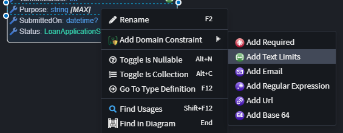

# Intent.Metadata.Domain.Constraints

This Intent Architect module adds Domain Designer metadata for modeling validation rules on entity attributes.

## What It Provides

- `Required`
	- Ensures a value is present.
	- Properties:
		- None

- `Text Limits`
	- Restricts the length of text values.
	- Properties:
		- `Min Length` (optional)
		- `Max Length` (optional)

- `Numeric Limits`
	- Restricts numeric values to a range.
	- Properties:
		- `Min Value` (optional)
		- `Max Value` (optional)

- `Collection Limits`
	- Restricts the number of items in a collection.
	- Properties:
		- `Min Length` (optional)
		- `Max Length` (optional)

- `Regular Expression`
	- Validates a value against a regex pattern.
	- Properties:
		- `Pattern` (required)
		- `Message` (optional custom validation message)

- `Email`
	- Validates email format.
	- Properties:
		- None

- `Url`
	- Validates URL format.
	- Properties:
		- None

- `Base64`
	- Validates that a value is Base64 encoded.
	- Properties:
		- None

These constraints are metadata-driven and can be consumed by downstream modules to generate technology-specific validation implementations.

Use the `Add Domain Constraint` [context menu](#how-to-apply) on a domain attribute to apply common constraints.

## FluentValidation Integration

When this module is used together with modules such as `Intent.Application.FluentValidation.Dtos` and `Intent.Application.MediatR.FluentValidation`, the modeled domain constraints can be realized as generated FluentValidation rules in your application layer.

In other words, you model the constraints once in the Domain Designer, and compatible FluentValidation modules can generate corresponding validation rule definitions from that metadata.

For example, if a DTO property is modeled with:

- `Required`
- `Text Limits` with `Min Length = 3` and `Max Length = 100`
- `Regular Expression` with `Pattern = "^[A-Za-z ]+$"`

The generated validator can look similar to:

```csharp
public class CreateProductCommandValidator : AbstractValidator<CreateProductCommand>
{
	[IntentManaged(Mode.Merge)]
	public CreateProductCommandValidator()
	{
		ConfigureValidationRules();
	}

	private void ConfigureValidationRules()
	{
		RuleFor(v => v.Age)
			.InclusiveBetween(18, 120);

		RuleFor(v => v.Percentage)
			.InclusiveBetween(0, 100);

		RuleFor(v => v.Price)
			.InclusiveBetween(1m, 10000m);
	}
}
```

Exact generated output can vary based on the target application templates and module versions in use.

## How To Apply

1. Open the Domain Designer and select an `Attribute` on an entity.
2. Right-click and choose `Add Domain Constraint`.
3. Select the desired constraint.
4. Configure the constraint properties where applicable.

