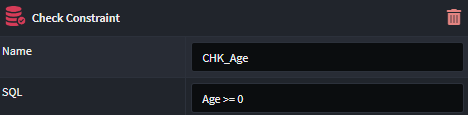
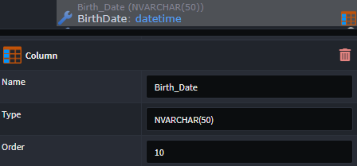
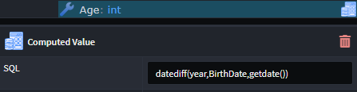

# Intent.Metadata.RDBMS

This Intent Architect module provides support for describing `Entities` in `Relational DB` terms. This include (but is not limited to) concepts such as tables, columns, schemas, keys, constraints.

## Creating a Check Constraint

To add a `check constraint` to an entity, the `Check Constraint` stereotype is used:

1. Right-click on the `Class` requiring the constraint, and select `Apply Stereotype` (or select the `Class` and press `F3`)
2. Click `Check Constraint`.
3. In the `Class` properties, specify a `name` for the constraint, as well as the constraint `SQL`

## Modifying Column Properties

When a database `Table` is created based on a `Class`, heuristics is used to determine the properties of the database `Columns` from the type of the Class `Attributes`.

The default properties of the column can be modified using the `Column` stereotype:

1. Right-click on the `Class Attribute` requiring the update, and select `Apply Stereotype` (or select the `Attribute` and press `F3`)
2. Click `Check Constraint`.
3. In the `Attribute` properties, `name`, `type` and `order` can be specified.

## Create a Computed Column

To mark a `Column` as being a `computed column`, the `Computed Value` stereotype is used:

1. Right-click on the relevant `Class Attribute`, and select `Apply Stereotype` (or select the `Class` and press `F3`)
2. Click `Computed Value`.
3. In the `Attribute` properties, the `SQL formula` for the calculation can be specified.

