# Intent.Metadata.RDBMS

This Intent Architect module provides support for describing `Entities` in `Relational DB` terms. This include (but is not limited to) concepts such as tables, columns, schemas, keys, constraints.

For `Entity Framework` specific functionality, please see the [Entity Framework Core Module Readme](https://github.com/IntentArchitect/Intent.Modules.NET/blob/master/Modules/Intent.Modules.EntityFrameworkCore/README.md).

## Key Management

### Key Creation Mode

By default, `primary keys` and `foreign keys` are automatically added to `classes` as they are being modelled. This behavior can be changed using the `Key Creation Mode` setting, found on the application `Settings` screen.

The available options are:

- **Explicitly Add PKs and FKs automatically** (the default), involves the keys automatically added when the entities are being modelled.
- **Manually add PKs and FKs**, involves the keys manually being added as the entities are being modelled.
- **Remove all managed PKs and FKs**

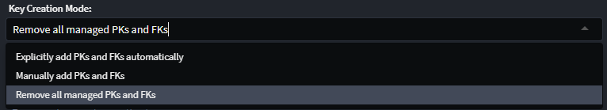

### Primary Key Type

By default any `Class`'s added to your domain will have an `Attribute` added named `Id` with the `Primary Key` stereotype applied to it. The type of this attribute will default to the configured `Database Settings > Key Type`, which can be configured in your application settings. This stereotype is visualized as a golden key icon.

The available options are:

- **guid**
- **int**
- **long**

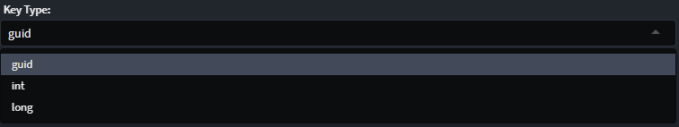

## Modify Table Properties

### Modify Schema

The `Schema` stereotype allows you to specify the SQL Schema for your tables / views , if required.

The `Schema` stereotype can be manually applied to a `Class`, `Folder` or `Package`.

The `Schema` stereotype can be applied hierarchically i.e. if you apply it to a `Package` all tables / views in the package will belong to that schema.
Similarly you can apply the `Schema` stereotype to a folder, all tables / views under that folder belong to that schema.

The "Closest" `Schema` stereotype to the `Class` will apply to the class.

> [!NOTE]
> If you have `Table` or `View` stereotypes with schema's specified these are more specific and will override the `Schema` stereotype. If you do not fill the schema in on these stereotypes, the schema name will fall > back to the "Closest" `Schema` stereotype.

Once the stereotype is applied, the following values can be set:

- **Name**, defines the name for the schema.

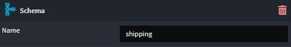

### Create an Index

An `index` can be modelled in the `Domain Designer` on a class, using the `Add Index` menu option.

1. Find the `Class` you want to add an Index to, in the `Domain Designer` tree panel or diagram.
2. Right-lick on the `Class` and select `Add Index`
3. Select one or more columns on which the index is created.

You will see an `Index` has been added to the `Class`. If the order of the attributes in the index is not correct, you can re-order them by dragging them around.

The following `index` properties can be set:

- **Name**, defines the name of the index
- **Use Default Name**, is used to revert the index back to the default name (if the name had been changed)
- **Unique**, defines if this a unique index or not
- **Filter**, defines whether or not to filter what is indexed or not
- **Filter Custom Value** (only available when **Filter** type is _Custom_), is the SQL expression to use for filtering. e.g. `WHERE Status = 'active'`
- **Fill Factor**, controls the percentage of index page space filled, reserving room for future growth.

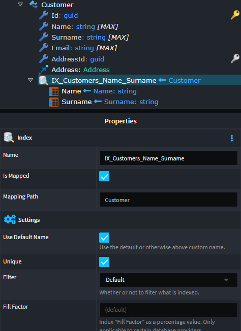

On the `index column` the following properties can be set:

- **Type**, defines type of index, if part of the `key` or an `included` column.
- **Sort Direction**, to determine if the index is sorted _descending_ or _ascending_

### Create a Check Constraint

To add a `check constraint` to a `class`, the `Check Constraint` stereotype is used.

Once applied to `Class`, the following properties can be set:

- **Name**, defines the name of the constraint
- **SQL**, is the SQL expression that is used to define the check constraint

### Create a Table Trigger

A `trigger` can be created on a table using the `Add Trigger` menu option.

1. Right-click on the `Class` requiring the `trigger`, and select `Add Trigger`.
2. Select one or more columns on which the index is created.

The following `Trigger` properties can be set:

- **Name**, defines the name of the trigger

### Create Join Table Constraint

The `Join Table` stereotype allows you to specify SQL table name for the joining table implied by a `many to many` relationship in your model, if required.

The `Join Table` stereotype can be manually applied to an association, allowing you to specify the joining table's name. This stereotype is visualized by stereotype's icon.

Once applied to `Association`, the following properties can be set:

- **Name**, defines the name of the join table

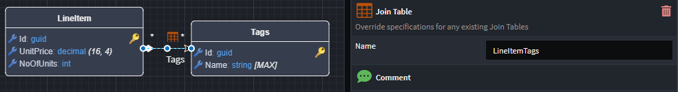

## Modify Column Properties

### Modify Column Type

When a database `Table` is created based on a `Class`, heuristics is used to determine the properties of the database `Columns` based on the type of the Class `Attributes`.

The default properties of the column can be modified using the `Column` stereotype.

Once applied to a `attribute`, the presence of the stereotype is indicated by the stereotype icon next to the `attribute` name, with the following properties now available to be set:

- **Name**, overwrites the default name of the column.
- **Type**, overwrites the default type of the column.
- **Order**, overwrites the default order of the column.

### Create a Primary Key Constraint

By default any `Class`'s added to your domain will have an `Attribute` added named `Id` with the `Primary Key` stereotype applied to it. The type of this attribute will default to the configured `Database Settings > Key Type`, which can be configured in your application settings.

This stereotype can be manually applied to `Attribute`s and can be applied to multiple `Attribute`s in the case of composite primary keys. This stereotype is visualized as a golden key icon.

Once applied, the following `Attribute` properties can be set:

- **Identity**, flag to indicate if the `primary key` is an _Identity_ or not
- **Data source**` The source of the primary keys.

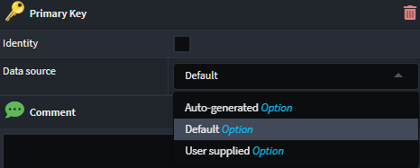

### Foreign Key Constraints

The `Foreign Key` stereotype indicates an `Attribute` has been introduced to a `Class` as a result of a modeled `Association`. The `Foreign Key` stereotypes are automatically managed when modeling associations. This stereotype is visualized as a silver key icon.

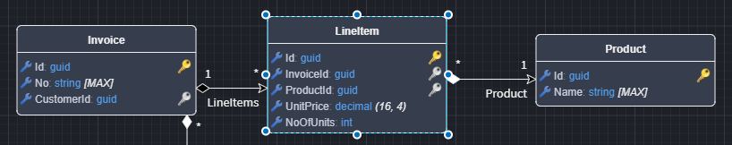

### Create a Column Index

To create an `index` on a column, the `Index` stereotype is used

1. Right-click on the relevant `Class Attribute` and select `Apply Stereotype` (or select the `Attribute` and press `F3`)
2. Click `Index`.

The following `Attribute` properties can be set:

- **UniqueKey**, is the unique name of the index
- **IsUnique**, is a flag to determine if the index is a unique index or not
- **Sort Direction**, to determine if the index is sorted _descending_ or _ascending_

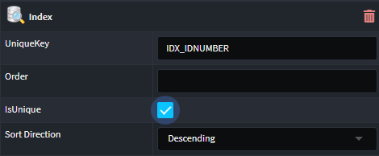

### Create a Computed Column

To mark a `Column` as being a `computed column`, the `Computed Value` stereotype is used.

Once applied to a `attribute`, the presence of the stereotype is indicated by the stereotype icon next to the `attribute` name, with the following properties now available to be set:

- **SQL**, specifies the formula used to compute the calculated value.

### Set Column Decimal Precision

To set the `precision` and `scale` of a decimal column, the `Decimal Constraints` stereotype is used.
The `Decimal Constraint` stereotype can be manually applied to any attribute of type `decimal`. This stereotype is visualized by the `({precision},{scale})` text after the decimal type.

The following `Attribute` properties can be set:

- **Precision**, defines the total number of digits that can be stored, both before and after the decimal point.
- **Scale**,  defines the number of digits allowed after the decimal point.

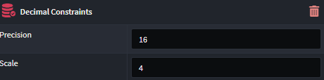

> [!NOTE]
> The decimal precision can also be set at a _global_ level (applicable to all entities) using the `Decimal precision and scale` setting on the application `Settings` screen. If this value is set (in the format `{Precision},{Scale}`), any decimal attribute modelled in the `Domain Designer` will automatically be realized with the precision set to the value specified.

### Create a Column Default Constraint

To set a `default value` on a column, the `Default Constraint` stereotype is used.

Once applied to a `attribute`, the presence of the stereotype is indicated by the stereotype icon next to the `attribute` name, with the following properties now available to be set:

- **Value**, the default value for the column. This can be a `literal` or an `expression`:

  - **Literal**, specifies the constant value assigned to a column when no value is provided during insertion.
  - **Expression**, defines dynamic formula or function used to generate the default value for the column.
- **Treat as SQL Expression**, flags if the **Value** field is a `literal` or `expression`.

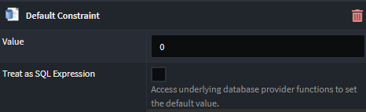
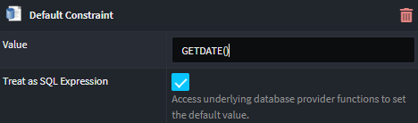

### Create a Text Constraint

The `Text Constraint` stereotype allows you to configure the specifics of how an `Attribute` of type `string` should be realized in the database.

Once applied to a `attribute` of type `string`,the following properties available to be set:

- **SQL Data Type**, which indicates the SQL Datatype for the database.
- **MaxLength**, which indicates the maximum storage size of the string.

By default `strings` are realized in SQL as `nvarchar(max)`. The `Text Constraint` stereotype is automatically applied to any attributes of type `string`. This stereotype is visualized by the `[{size}]` text after the string type.

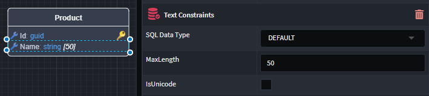

## Create a View

If there are SQL Views in your database which you want to reference in you domain, you can model those views as `Class`'s and apply the `View` stereotype to them.

Once applied to a `Class`, the stereotype is visualized by stereotype's icon on the top right of the `Class`, with the following properties available to be set:

- **Name**, indicates the name of the view.
- **Schema**, which indicates the maximum storage size of the string.

If not specified, the **name** will default to the pluralized version of the `Class` name, and the **schema** to the dbo schema. The SQL view must exist in the database for this to work.

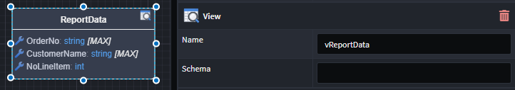
