# Intent.Metadata.RDBMS

This **Intent Architect** module provides support for describing `Entities` in `Relational DB` terms. This includes, but is not limited to, concepts such as tables, columns, schemas, keys, and constraints.

For `Entity Framework` specific functionality, please refer to the [Entity Framework Core Module README](https://github.com/IntentArchitect/Intent.Modules.NET/blob/master/Modules/Intent.Modules.EntityFrameworkCore/README.md).

## Key Management

### Key Creation Mode

By default, `primary keys` and `foreign keys` are automatically added to `classes` as they are being modeled. This behavior can be modified using the `Key Creation Mode` setting found on the application `Settings` screen.

The available options are:

- **Explicitly Add PKs and FKs automatically** (default): Automatically adds keys during modeling.
- **Manually add PKs and FKs**: Allows for manual addition of keys during modeling.

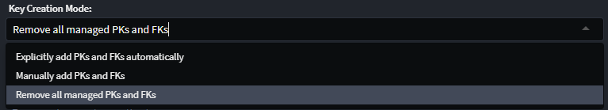

### Primary Key Type

By default, each `Class` in your domain will have an `Attribute` named `Id` with the `Primary Key` stereotype applied. The type of this attribute defaults to the configured `Database Settings > Key Type`, which can be modified in your application settings. This stereotype is visualized as a golden key icon.

The available options for primary key types are:

- **guid**
- **int**
- **long**

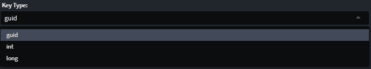

## Configure SQL Table specifics

### Modify Schema

The `Schema` stereotype allows you to specify the SQL schema for your tables/views, if necessary.

The `Schema` stereotype can be manually applied to a `Class`, `Folder`, or `Package`.

It can be applied hierarchically: for example, if applied to a `Package`, all tables/views within that package will belong to that schema. Similarly, applying it to a folder will affect all tables/views within that folder.

The "closest" `Schema` stereotype to the `Class` will be applied to the class.

> [!NOTE]  
> If a `Table` or `View` stereotype has a schema defined, it will override the "Closest" `Schema` stereotype. If the schema is not filled in on these stereotypes, the schema name will fall back to the "Closest" `Schema` stereotype.

Once applied, the following properties can be set:

- **Name**: Defines the name of the schema.

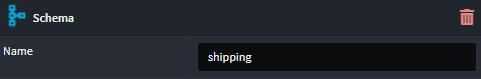

### Create an Index

To create an index on a class, use the `Add Index`.

1. Locate the `Class` you want to add an index to, in the `Domain Designer` tree or diagram.
2. Right-click on the `Class` and select `Add Index`.
3. Choose one or more columns on which the index should be created.

You will see an index has been added to the `Class`. You can reorder the index columns by dragging them as needed.

The following properties can be set for the index:

- **Name**: Defines the name of the index.
- **Use Default Name**: Reverts to the default index name if it was previously changed.
- **Unique**: Indicates whether the index is unique.
- **Filter**: Specifies whether the index should be filtered.
- **Filter Custom Value** (only available when **Filter** type is _Custom_): Defines the SQL expression used for filtering (e.g., `WHERE Status = 'active'`).
- **Fill Factor**: Specifies the percentage of index page space to fill, leaving room for future growth.

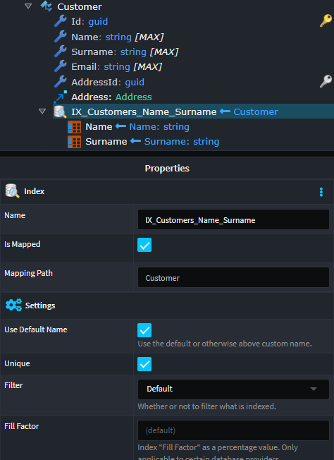

For index columns, the following properties can be set:

- **Type**: Defines the index type, whether part of the `key` or an `included` column.
- **Sort Direction**: Determines if the index is sorted in _ascending_ or _descending_ order.

### Create a Check Constraint

To add a `check constraint` to a `Class`, apply the `Check Constraint` stereotype.

Once applied, the following properties can be set:

- **Name**: Defines the name of the constraint.
- **SQL**: Specifies the SQL expression for defining the check constraint.

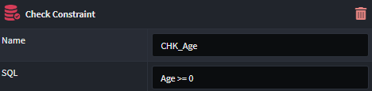

### Communicate Trigger Existence

In certain scenarios, it's necessary to inform the underlying provider (specifically, Entity Framework Core) that a table has an associated trigger. For more information on why this may be required, see. See [here for more details](https://learn.microsoft.com/en-us/ef/core/providers/sql-server/misc#savechanges-and-database-triggers) as to why this might be required.

This is modeled in the `Domain Designer` with the `Add Trigger` option.

1. Right-click on the `Class` that requires the `trigger`, and select `Add Trigger`.

The following properties can be configured for the trigger:

- **Name**: Defines the name of the trigger.

> [!NOTE]  
> The actual `trigger` implementation is not modeled in the `Domain Designer`. The `trigger` stereotype is used only to mark to the underlying provider (specifically, Entity Framework Core) that the table has an existing trigger. This allows Entity Framework to correctly generate the appropriate SQL statements.

### Create Join Table Constraint

The `Join Table` stereotype allows you to define the SQL table name for a joining table implied by a `many-to-many` relationship.

The `Join Table` stereotype can be manually applied to an association, specifying the name of the joining table. This stereotype is visualized by its icon.

Once applied, the following property can be set:

- **Name**: Defines the name of the join table.

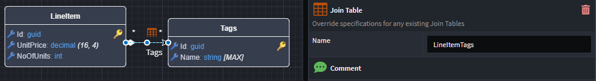

## Configure SQL Column specifics

### Modify Column Type

When a database `Table` is created based on a `Class`, heuristics determine the column properties based on the type of the `Class` attributes.

To modify these properties, apply the `Column` stereotype to the attribute.

Once applied, the following properties can be set:

- **Name**: Overwrites the default name of the column.
- **Type**: Overwrites the default type of the column.
- **Order**: Overwrites the default order of the column.

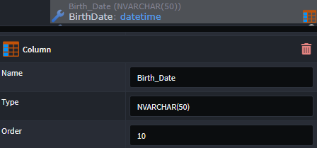

### Create a Primary Key Constraint

By default, each `Class` in your domain will have an `Attribute` named `Id` with the `Primary Key` stereotype. The type of this attribute will default to the configured `Database Settings > Key Type`.

This stereotype can be manually applied to `Attributes`, and can also be applied to multiple `Attributes` to create composite primary keys. The stereotype is represented by a golden key icon.

Once applied, the following properties can be set for the `Attribute`:

- **Identity**: Indicates if the primary key is an _Identity_.
- **Data Source**: Specifies the source of the primary key.

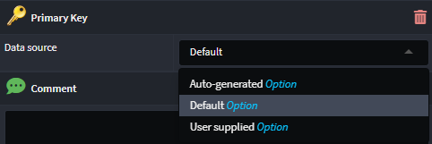

### Foreign Key Constraints

The `Foreign Key` stereotype indicates an attribute has been introduced to a `Class` as a result of a modeled `Association`. The `Foreign Key` stereotype is automatically managed when modeling associations. It is represented by a silver key icon.

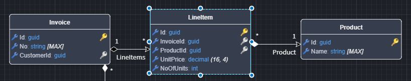

### Create a Column Index

To create an index on a column, apply the `Index` stereotype to the relevant `Class Attribute`.

1. Right-click on the `Class Attribute` and select `Apply Stereotype` (or press `F3`).
2. Choose `Index`.

The following properties can be set for the attribute:

- **UniqueKey**: Defines the unique name of the index.
- **IsUnique**: A flag to determine if the index is unique.
- **Sort Direction**: Specifies the sort order (ascending or descending).

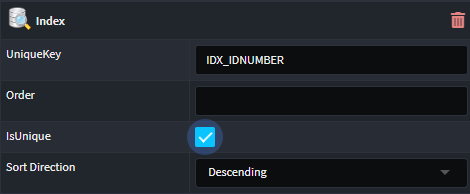

### Create a Computed Column

To define a `computed column`, apply the `Computed Value` stereotype to the attribute.

Once applied, the following property can be set:

- **SQL**: Defines the formula used to compute the calculated value.

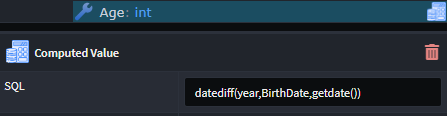

### Set Column Decimal Precision

To set the `precision` and `scale` for a decimal column, apply the `Decimal Constraints` stereotype to any attribute of type `decimal`. This stereotype is represented by `({precision},{scale})` next to the decimal type.

The following properties can be set:

- **Precision**: Defines the total number of digits that can be stored, both before and after the decimal point.
- **Scale**: Defines the number of digits allowed after the decimal point.

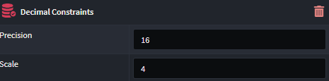

> [!NOTE]  
> The decimal precision can also be set globally (for all entities) using the `Decimal Precision and Scale` setting on the application `Settings` screen. If set, this value will automatically be applied to any decimal attribute modeled in the `Domain Designer`.

### Create a Column Default Constraint

To set a `default value` on a column, apply the `Default Constraint` stereotype.

Once applied, the following properties can be set:

- **Value**: The default value for the column, which can be either a `literal` or an `expression`:
  - **Literal**: Specifies the constant value assigned to the column when no value is provided.
  - **Expression**: Defines the dynamic formula or function used to generate the default value.

- **Treat as SQL Expression**: Flags whether the **Value** field is a `literal` or `expression`.

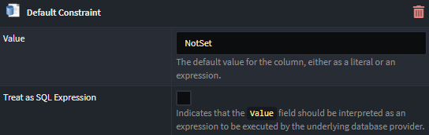
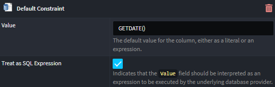

### Create a Text Constraint

The `Text Constraint` stereotype allows you to configure how an `Attribute` of type `string` should be represented in the database.

Once applied to a `string` attribute, the following properties are available to be set:

- **SQL Data Type**: Specifies the SQL data type for the database.
- **MaxLength**: Defines the maximum storage size of the string.

By default, `strings` are represented in SQL as `nvarchar(max)`. The `Text Constraint` stereotype is automatically applied to any attributes of type `string` and is visualized by the `[{size}]` text next to the string type.

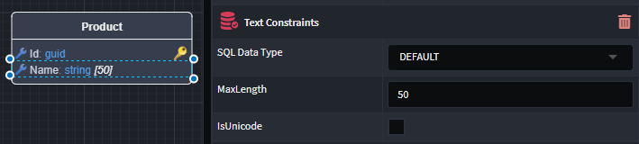

## Entities Backed by SQL Views

If there are SQL Views in your database that you want to reference in your domain, you can model these views as `Class`es and apply the `View` stereotype to them.

Once applied to a `Class`, the stereotype is visualized by its icon in the top right corner of the `Class`, and the following properties are available to be set:

- **Name**: Defines the name of the view.
- **Schema**: Specifies the schema for the view.

If the **Name** is not specified, it will default to the pluralized version of the `Class` name. If the **Schema** is not specified, it will default to the `dbo` schema. The SQL view must exist in the database for this to work.

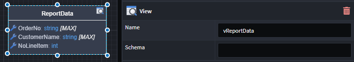
