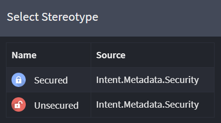
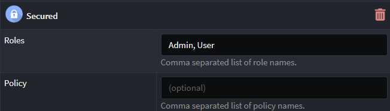
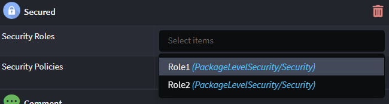
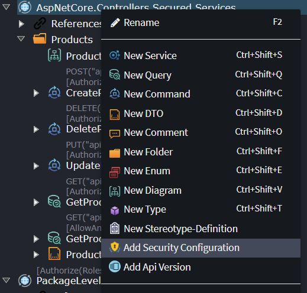
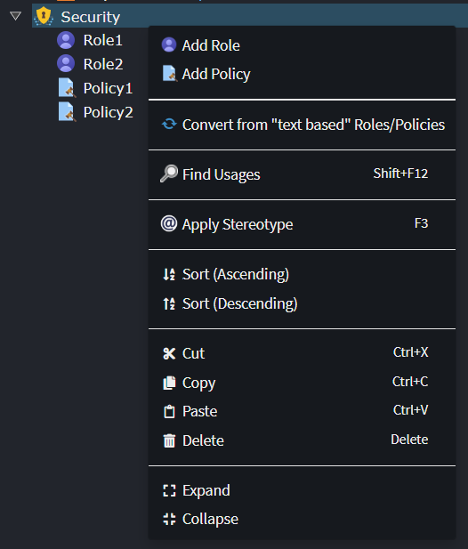

# Intent.Metadata.Security

This Intent Architect module provides programming language agnostic metadata for use in Intent Architect designers around modelling of "Security" concepts such as role and security policy requirements to apply to resources.

## The `Secured` and `Unsecured` stereotypes

This package provides a `Secured` and `Unsecured` stereotype which can be applied to the Service Packages, Services, Service Operations and CQRS Operations:

The `Secured` stereotype allows specifying that a resource is only accessible to authorized users and optionally that the authorized user must be within a Role or adhere to a security Policy.

Depending on whether [common Roles and Policies are defined](#defining-common-roles-and-policies), Roles and Policies are specified either by entering a comma separated list of names (as per the example above), or alternatively by selecting one or more pre-defined items from a dropdown as per the example below:

If multiple Roles or Policies are specified on a Secured stereotype, only one of them need apply to the incoming user, essentially you are specifying that the user needs to be in _any_ of roles and meeting _any_ of the security policies in order to be considered authorized.

The Unsecured stereotype can be used to specify that a resource does not require a user to authenticated in order to be accessed. It is only necessary to apply this if you wish a particular resource to "opt-out" of being secure if a parent element/package or application setting would otherwise cause the resource to be secured implicitly.

### Applying multiple Secured stereotypes to a resource

It is possible to have multiple `Secured` stereotypes applied to the same resource, either explicitly on the resource itself or through a parent of the resource (such as its parent Service or containing Service Package) also having the stereotype applied to it.

For most technologies when there are multiple Secured stereotypes applied it is required that the security requirement of _all_ the Secured stereotypes are met.

> [!NOTE]
>
> This can be technology dependent, for example with ASP.NET Core Controllers the above is true, while with FastEndpoints [it is not possible to specify that an authenticated user be within _all_ roles or meet the requirements of _all_ policies](https://fast-endpoints.com/docs/security).

## Defining common Roles and Policies

Although it is sometimes convenient to simply enter comma separated values for Roles and Policies, in some circumstances it may be preferable to pre-define the available Roles and Policies and then only allow selection from these specifically. This has advantages such as:

- Being able to see a central list of available Role and Policy names.
- Allows centrally updating the name of a Role or Policy.
- Avoids mistakes of incorrectly using a mistyped or invalid Role/Policy names.

To define Roles and Policy names, you need to first have a security configuration added to your package, right-click a Services Package and select the _Add Security Configuration_ option:

> [!NOTE]
>
> If you don't see the option on the context menu, there may already be a `Security` element in the package, meaning there is no need to make an additional one.

On the Security element you then have the option to _Add Role_, _Add Policy_ and if you had already used comma separated roles there is an option to _Convert from "text based" Roles/Policies_ which will update all existing Secured stereotypes to use pre-defined Role/Policy names, creating new ones as needed:

