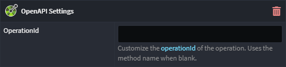

# Intent.Metadata.WebApi

This Intent Architect module provides programming language agnostic metadata for use in Intent Architect designers around modelling of "WebApi" concepts, such as verbs, routes and other HTTP related settings for endpoints.

## OpenAPI Settings stereotype

The OpenAPI Settings stereotype can be applied to service `Operation`s, `Query`s, `Command`s and `Azure Function`s to control OpenAPI specific settings of it. It needs to be manually applied when needed.

### OpenAPI Settings OperationId property

Allows controlling the [`operationId`](https://swagger.io/docs/specification/paths-and-operations/) for the endpoint. When blank it will use the endpoint's "method" name by default.
