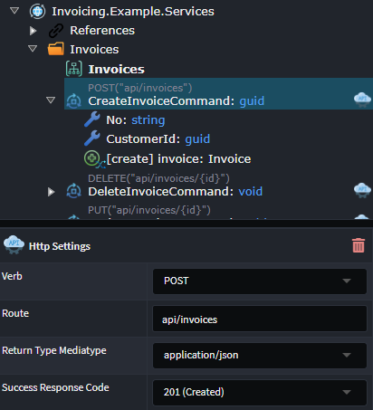
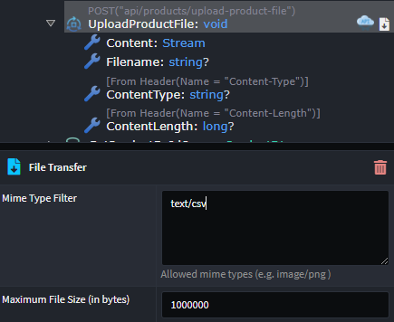
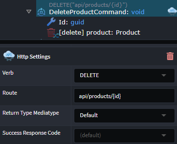
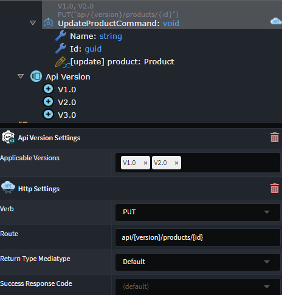

# Intent.Metadata.WebApi

This Intent Architect module provides programming language agnostic metadata for use in Intent Architect designers around modelling of "WebApi" concepts, such as verbs, routes and other HTTP related settings for endpoints.

## Exposing an HTTP Endpoint

To create an Http Endpoint for an external party to invoke, an existing `Service`, `Operation`, `Command` or `Query` needs to be _exposed as an Http endpoint_.

1. On the diagram, hover your mouse over the `Service`, `Operation`, `Command` or `Query` to be exposed and click the `Suggestion` (:bulb:) icon.
2. Select the `Expose as Http Endpoint` option.
3. Items that are exposed as HTTP endpoints are indicated with a visual icon. You can view and configure HTTP-related properties by accessing the endpoint's properties. These property values are automatically set based on the item's heuristics but can be manually adjusted if necessary:

    - `Verb`: HTTP method to define the action performed by the endpoint
    - `Route`: The route on which the endpoint is exposed
    - `Return Type Mediatype`: Specifies the nature and format of a data being returned from the endpoint
    - `Success Response Code`: The Http response code returned on successful invocation of the endpoint

> [!TIP]
> Multiple items of type `Service`, `Operation`, `Command` or `Query` can be exposed at once. Select the multiple items to expose in the diagram or tree view using the Ctrl key, right-click on one of the selected items and select `Expose as Http Endpoint`

## Exposing a File Download Endpoint

To create an Http Endpoint that provides file downloading capabilities, an existing `Operation`, `Command` or `Query` needs to be exposed.

1. In the Services Designer, either in the tree view, or in a diagram, select the one or more of the following types `Operation`, `Command` or `Query`.
2. Right-click on any of the highlighted items, and select  `Expose as Http File Download`.
3. Items that are exposed as HTTP endpoints are indicated with a visual icon. You can view and configure [HTTP-related](#exposing-an-http-endpoint) properties by accessing the endpoint's properties. These property values are automatically set based on the item's heuristics but can be manually adjusted if necessary.

When exposing the item as a file download endpoint the following configuration is automatically applied:

1. A `DTO`, called `FileDownloadDto` is created, containing the following properties describing the returned file:

    - `Content`: Stream
    - `Filename`: string
    - `ContentType`: string

2. The `Operation`, `Command` or `Query` being exposed, is updated to have a `Return Type` of `FileDownloadDto`.

## Exposing a File Upload Endpoint

To create an Http Endpoint that provides file upload capabilities, an existing `Operation` or `Command` needs to be exposed.

1. In the Services Designer, either in the tree view, or in a diagram, select the one or more `Operation` or `Command` types.
2. Right-click on any of the highlighted items, and select  `Expose as Http File Upload`.
3. Items that are exposed as HTTP endpoints are indicated with a visual icon. You can view and configure [HTTP-related](#exposing-an-http-endpoint) properties by accessing the endpoint's properties. These property values are automatically set based on the item's heuristics but can be manually adjusted if necessary.

When exposing the item as a `file download endpoint` the following configuration is automatically applied:

1. The following fields are added as either properties (in the case of a `Command`) or as parameters (in the case of an `Operation`):

    - `Content`: Stream
    - `Filename`: string
    - `ContentType`: string (from header)
    - `ContentLength`: long (from header)

2. In addition to the [Http Settings](#exposing-an-http-endpoint) properties available on the item for configuration, properties available related to the `File Transfer` are also available and configurable:

    - `Mime Type Filter`: allows for the restriction of mime types allowed for upload
    - `Maximum File Size (in bytes)`: The maximum file size allowed for upload

## Configuring Route Parameters

`URI template` format can be used to specify a `route parameter` in the `Http Settings` `Route`. The variable name used as the placeholder is required to exists either:

- As a property on a `Command` or `Query`
- As a parameter on an `Operation`

For example, when a `route` is specified as `api/product/{id}`, a property/parameter named `id` is required.

## Versioning an Endpoint

Versioning capabilities can be applied to an existing `Service`, `Operation`, `Command` or `Query`. The following steps are required:

1. `Configure the available versions`:

    1. Right-click on the Service Package (the root item in the tree view) and select `Add Api Version`. An item called `Api Version` should have been added to the tree.
    2. Right-click on the `Api Version` and select `Add Version`. Change the auto-generated version name if required.
    3. Add multiple versions by repeating step two above.

2. `Enable versioning on endpoint`:

    1. Right-click on the `Service`, `Operation`, `Command` or `Query` being versioned, and select `Apply Stereotype`.
    2. Click `Api Version Settings`.

3. `Configure endpoint version(s)`

    1. An `Applicable Versions` property will now be available on the item to which the stereotype was applied.
    2. Select one or more versions to apply to the endpoint.
    3. The [Http Settings Route](#exposing-an-http-endpoint) configuration will now also contain a required `{version}` placeholder. This placeholder can manually be relocated within the `Route`, but must be present.

## Changing Serialization Naming Conventions

The JSON property name used when serializing or deserializing a field on a `DTO` can be configured to using the `Serialization Settings` stereotype.

1. Right-click on the `DTO` (to have the serialization settings applied to all fields), or on a specific `DTO Field` (to have it apply only to that field) and select `Apply Stereotype`
2. Click `Serialization Settings`
3. On the `DTO` or `DTO Field` properties, select the `Field Naming Convention` to use

Selecting the `Custom` option for `Field Naming Convention` allows for a custom name to be specified for the serialization of the property

## Changing Parameter Binding Source

The binding source of an Operation `Parameter` or incoming `DTO Field` can be changed using the `Parameter Settings` stereotype.

1. Right-click on the `Parameter` or `DTO Field` and select `Apply Stereotype`
2. Click `Parameter Settings`
3. On the `Parameter` or `DTO Field` properties, under `Parameter Settings`, configure the `Source` of the information for the parameter.

    Available options include:
    - Default: A heuristic is used by Intent to make a "best guess" as to what the source should be
    - From Body
    - From Form
    - From Header: the `Header Name` must also be supplied if this option is chosen
    - From Query: the `Query String Name` must also be supplied if this option is chosen
    - From Route

## Operation OpenAPI Configuration

To change the way in which a `Service`, `Operation`, `Command`, `Query` or `Azure Function` is reflected in the OpenAPI specification, the `OpenAPI Settings` stereotype is used.

1. Right-click on a `Service`, `Operation`, `Command` or `Query` and select `Apply Stereotype`
2. Click `OpenAPI Settings`
3. On the item's properties, under `Open Settings`, the following options are available:

    - `Ignore`: Whether to hide the endpoint from the OpenAPI spec.
    - `OperationId`: Allows controlling the [`operationId`](https://swagger.io/docs/specification/paths-and-operations/) for the endpoint of the operation. When blank it will use the endpoint's "method" name by default

## Parameter OpenAPI Configuration

To change the way in which a `Parameter`, `DTO Field` is reflected in the OpenAPI specification, the `OpenAPI Settings` stereotype is used.

1. Right-click on a `Parameter`, `DTO Field` and select `Apply Stereotype`
2. Click `OpenAPI Settings`
3. On the item's properties, under `Open Settings`, the following options are available:

    - `Example Value`: Allows customization of the `example value` which is generated in the OpenAPI spec (and therefor what appears on the Swagger UI)
