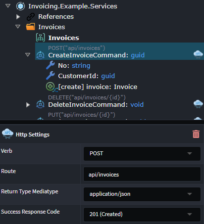
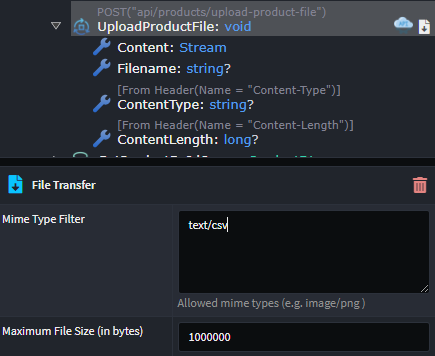
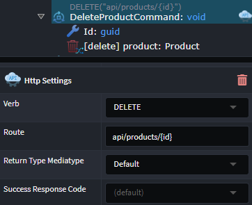
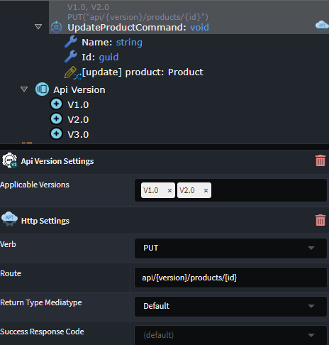

# Intent.Metadata.WebApi

This Intent Architect module provides programming language-agnostic metadata for use in Intent Architect designers around modeling "WebApi" concepts, such as verbs, routes, and other HTTP-related settings for endpoints.

## Expose Service as an HTTP Endpoint

To create an HTTP Endpoint for an external party to invoke, an existing `Service`, `Operation`, `Command`, or `Query` needs to be _exposed as an HTTP endpoint_.

1. On the diagram, hover your mouse over the `Service`, `Operation`, `Command`, or `Query` to be exposed and click the `Suggestion` (:bulb:) icon.
2. Select the `Expose as HTTP Endpoint` option.
3. Items exposed as HTTP endpoints are indicated with a visual icon. You can view and configure HTTP-related properties by accessing the endpoint's properties. These property values are automatically set based on the item's heuristics but can be manually adjusted if necessary:

    - **Verb**: HTTP method to define the action performed by the endpoint.
    - **Route**: The route on which the endpoint is exposed.
    - **Return Type Mediatype**: Specifies the nature and format of the data being returned from the endpoint.
    - **Success Response Code**: The HTTP response code returned on successful invocation of the endpoint.

> [!TIP]
> Multiple items of type `Service`, `Operation`, `Command`, or `Query` can be exposed at once. Select multiple items to expose in the diagram or tree view using the Ctrl key, right-click on one of the selected items, and select `Expose as HTTP Endpoint`.

## Expose Service as an HTTP File Download Endpoint

To create an HTTP Endpoint that provides file downloading capabilities, an existing `Operation`, `Command`, or `Query` needs to be exposed.

1. In the Services Designer, either in the tree view or in a diagram, select one or more of the following types: `Operation`, `Command`, or `Query`.
2. Right-click on any of the highlighted items and select `Expose as HTTP File Download`.
3. Items exposed as HTTP endpoints are indicated with a visual icon. You can view and configure [HTTP-related](#expose-service-as-an-http-endpoint) properties by accessing the endpoint's properties. These property values are automatically set based on the item's heuristics but can be manually adjusted if necessary.

When exposing the item as a file download endpoint, the following configuration is automatically applied:

1. A `DTO`, called `FileDownloadDto`, is created, containing the following properties describing the returned file:
    - **Content**: Stream
    - **Filename**: string
    - **ContentType**: string

2. The `Operation`, `Command`, or `Query` being exposed is updated to have a `Return Type` of `FileDownloadDto`.

## Expose Service as an HTTP File Upload Endpoint

To create an HTTP Endpoint that provides file upload capabilities, an existing `Operation` or `Command` needs to be exposed.

1. In the Services Designer, either in the tree view or in a diagram, select one or more `Operation` or `Command` types.
2. Right-click on any of the highlighted items and select `Expose as HTTP File Upload`.
3. Items exposed as HTTP endpoints are indicated with a visual icon. You can view and configure [HTTP-related](#expose-service-as-an-http-endpoint) properties by accessing the endpoint's properties. These property values are automatically set based on the item's heuristics but can be manually adjusted if necessary.

When exposing the item as a file upload endpoint, the following configuration is automatically applied:

1. The following fields are added as either properties (in the case of a `Command`) or parameters (in the case of an `Operation`):
    - **Content**: Stream
    - **Filename**: string
    - **ContentType**: string (from header)
    - **ContentLength**: long (from header)

2. In addition to the [HTTP Settings](#expose-service-as-an-http-endpoint) properties available on the item for configuration, properties related to the `File Transfer` are also available and configurable:
    - **Mime Type Filter**: Restricts mime types allowed for upload.
    - **Maximum File Size (in bytes)**: The maximum file size allowed for upload.

## Configure an HTTP Endpoint

### Configuring Route Parameters

The `URI template` format can be used to specify a `route parameter` in the `Http Settings` `Route`. The variable name used as the placeholder must exist either:

- As a property on a `Command` or `Query`
- As a parameter on an `Operation`

For example, when a `route` is specified as `api/product/{id}`, a property/parameter named `id` is required.

### Versioning an Endpoint

Versioning capabilities can be applied to an existing `Service`, `Operation`, `Command`, or `Query`. The following steps are required:

#### 1. Configure the Available Versions

1. Right-click on the Service Package (the root item in the tree view) and select `Add Api Version`. An item called `Api Version` should be added to the tree.
2. Right-click on the `Api Version` and select `Add Version`. Change the auto-generated version name if required.
3. Add multiple versions by repeating step two above.

#### 2. Enable Versioning on Endpoint

1. Right-click on the `Service`, `Operation`, `Command`, or `Query` being versioned, and select `Apply Stereotype`.
2. Click `Api Version Settings`.

#### 3. Configure Endpoint Version(s)

1. An `Applicable Versions` property will now be available on the item to which the stereotype was applied.
2. Select one or more versions to apply to the endpoint.
3. The [Http Settings Route](#expose-service-as-an-http-endpoint) configuration will now also contain a required `{version}` placeholder. This placeholder can be manually relocated within the `Route`, but it must be present.

### Changing Serialization Naming Conventions

The JSON property name used when serializing or deserializing a field on a `DTO` can be configured using the `Serialization Settings` stereotype.

Once the stereotype is applied to the `DTO` or `DTO Field`, the `Field Naming Convention` to use can be selected.

Selecting the `Custom` option for `Field Naming Convention` allows you to specify a custom name for the serialization of the property.

### Changing Parameter Binding Source

The binding source of an `Operation Parameter` or incoming `DTO Field` can be changed using the `Parameter Settings` stereotype.

Once the stereotype is applied to a `Parameter` or `DTO Field`, the `Source` of the information for the parameter can be selected.

Available options include:

- **Default**: A heuristic is used by Intent to make a "best guess" as to what the source should be.
- **From Body**.
- **From Form**.
- **From Header**: The `Header Name` must also be supplied if this option is chosen.
- **From Query**: The `Query String Name` must also be supplied if this option is chosen.
- **From Route**.

### Operation OpenAPI Configuration

To change the way in which a `Service`, `Operation`, `Command`, `Query`, or `Azure Function` is reflected in the OpenAPI specification, the `OpenAPI Settings` stereotype is used.

Once the stereotype is applied to a `Service`, `Operation`, `Command`, or `Query`, the following properties are available:

- **Ignore**: Whether to hide the endpoint from the OpenAPI spec.
- **OperationId**: Allows controlling the [`operationId`](https://swagger.io/docs/specification/paths-and-operations/) for the endpoint of the operation. When blank, it will use the endpoint's "method" name by default.

### Parameter OpenAPI Configuration

To change the way in which a `Parameter`, `DTO Field` is reflected in the OpenAPI specification, the `OpenAPI Settings` stereotype is used.

Once the stereotype is applied to a `Parameter` or `DTO Field`, the following properties are available:

- **Example Value**: Allows customization of the `example value` generated in the OpenAPI spec (and thus what appears in the Swagger UI).
