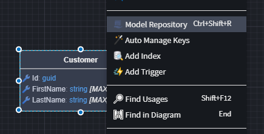

# Intent.Modelers.Domain.Repositories

The **Repository Pattern** is a common design pattern in software development that encapsulates data access logic, providing a clean separation between domain/business logic and data persistence.

Repositories act as intermediaries between the application and data sources (e.g., relational databases or document stores). They abstract query operations and centralize data access logic, resulting in:

- Improved **testability**
- Enhanced **maintainability**
- Greater **flexibility** to change data strategies without impacting business logic

The `Intent.Modelers.Domain.Repositories` module enables you to model repositories within **Intent Architect**. These repositories are then realized differently based on:

- The selected **Domain Database Type**:  
  - *Relational*
  - *Document*
- The installed **Module**:  
  - e.g. *Entity Framework*, *CosmosDB*

## Modeling an Entity Repository

By default, a `Repository` is generated for each qualifying domain entity, including standard **CRUD operations**. You can extend this repository with **custom operations and functionality**.

### How to Extend a Repository

1. In the **Domain Designer**, right-click the entity you want to extend.
2. Select **`Model Repository`**.



This creates a repository specific to that entity, where you can define additional operations. These operations will be generated in code alongside the standard CRUD methods.

### Example Generated Repository

``` csharp
[IntentManaged(Mode.Merge, Signature = Mode.Fully)]
public class CustomerRepository : RepositoryBase<Customer, Customer, ApplicationDbContext>, ICustomerRepository
{
    public CustomerRepository(ApplicationDbContext dbContext, IMapper mapper) : base(dbContext, mapper)
    {
    }

    [IntentManaged(Mode.Fully, Body = Mode.Ignore)]
    public int GetCustomerCount()
    {
        // TODO: Implement GetCustomerCount (CustomerRepository) functionality
        throw new NotImplementedException("Your implementation here...");
    }

    public async Task<TProjection?> FindByIdProjectToAsync<TProjection>(
        Guid id,
        CancellationToken cancellationToken = default)
    {
        return await FindProjectToAsync<TProjection>(x => x.Id == id, cancellationToken);
    }
    // other methods
}
```

Notes:

- Custom methods are marked with `[IntentManaged(..., Body = Mode.Ignore)]` so that their logic is not overwritten during code generation.
- You must implement the logic manually to match your specific use case.

### Complex Parameter Entities

If complex objects need to be passed to or returned from a repository operation, a Data Contract or Value Object should be used.

- Learn how to [create a Domain Contract](https://docs.intentarchitect.com/articles/application-development/modelling/domain-designer/modeling-the-domain/modeling-the-domainhtml#creating-a-domain-contract)
- Learn more about [Value Objects](https://docs.intentarchitect.com/articles/modules-dotnet/intent-valueobjects/intent-valueobjects.html)

Once defined, a Domain Contract can be used as a parameter or return type in a repository operation:


