# Intent.Modules.Modelers.Domain.StoredProcedures

This module provides a technology agnostic way to model database stored procedures in the Domain Designer. Technology specific modules (such as `Intent.EntityFrameworkCore.Repositories` for .NET) are responsible for generating actual code from modelled data.

Stored procedures are exposed through `Repository` element types on the designer which can be created on domain packages and folders:

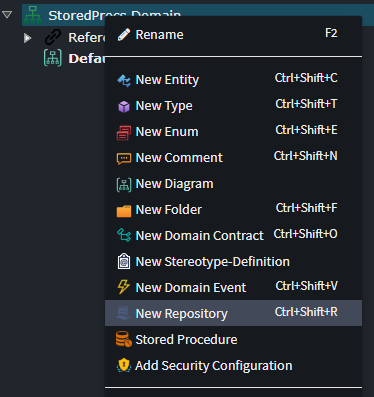

> [!NOTE]
> `Stored Procedure` elements created on a `Folder` or `Package` are not generally generated but [can be used as mapping targets for operations](#mapping-stored-procedure-invocations).

## Creating a stored procedure

On a `Repository` and `Package` and `Folder` elements you can create `Stored Procedure` element:

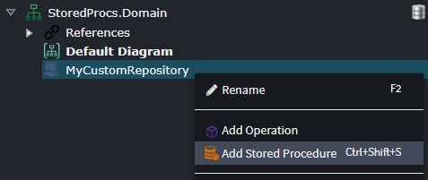

A `Stored Procedure` has the following properties:

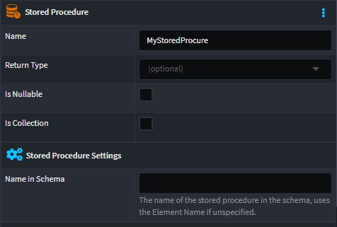

- **Return Type** - Specifies the return value of the stored procedure, can be `void`.
- **Is Nullable** - Whether the return type's value can be null.
- **Is Collection** - Whether the return type's value is a set of results.
- **Name in Schema** - The name of the stored procedure in the database schema, if unspecified then the name of Stored Procedure element is used.

If the stored procedure has any in/out parameters, they can be specified by adding parameters to it:

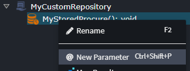

A `Stored Procedure Parameter` has the following properties:

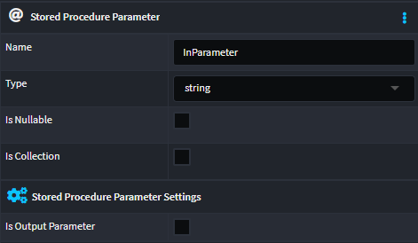

- **Type** - Specifies the type of the parameter.
- **Is Nullable** - Whether the type's value can be null.
- **Is Collection** - Whether the type's value is a set of values.
- **Is Output Parameter** - Whether it is an output parameter, i.e. not an input.

## Mapping Stored Procedure Invocations

When a `Stored Procedure` has output parameters you may need to create an invocation mapping to it from an `Operation` on a `Repository` in order to be able to access all the returned data.

For example, consider the following stored procedure which will return the sum of two numbers and has an output parameter which contains the product of them:

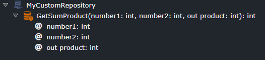

To be able to use both returned results, we will want to model an `Operation` on the `Repository`, set its result type to a `Data Contract` with attributes for each result, then map the `Operation` to the `Stored Procedure` configuring how to pass in the input parameters and return the result and output parameters.

1. Ensure you have a `Data Contract` modelled with an `Attribute` for each result we want to return:

  

  > [!TIP]
  > To create a `Data Contract` you use the `New Domain Contract` context menu option.

2. Create an `Operation` on the `Repository`, setting its return type to the `Data Contract` and adding input parameters:

  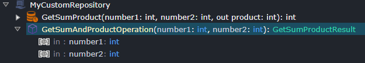

3. On the `Operation` use the _Map to Stored Procedure_ context menu option:

  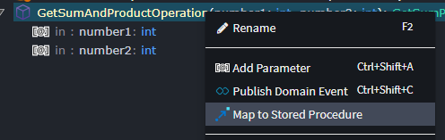

4. Set its type to the `Stored Procedure`:

  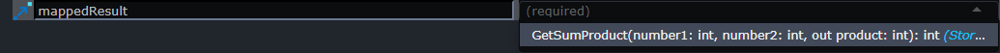

5. On choosing the type in the prior step a mapping screen will appear, this mapping screen is for configuring the source for input parameters for the stored procedure, ensure all the parameters for the Stored Procedure are mapped by dragging elements from the left pane to the right:

  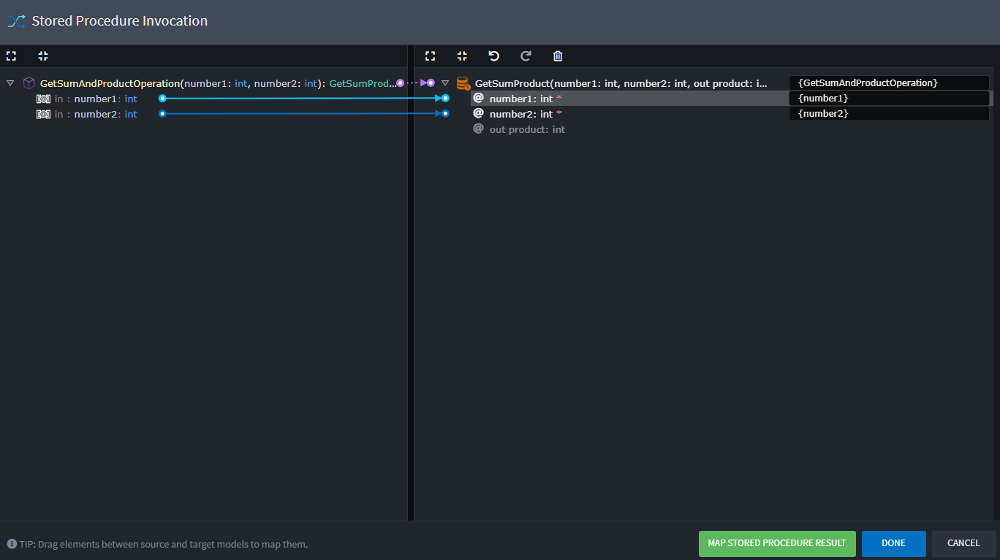

6. Press the green _MAP STORED PROCEDURE RESULT_ button at the bottom-right of the screen to go to the screen for mapping the result of the Stored Procedure, here we configure how to map the result. Map any results as desired onto corresponding attributes of the `Data Contract`, for example:

  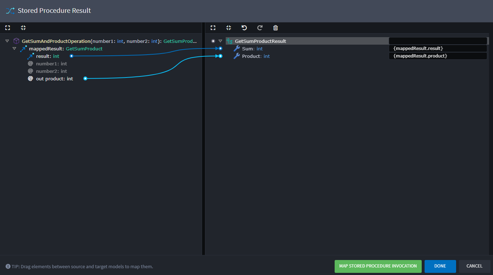

7. Press _DONE_ then save the designer by pressing the button in the toolbar or using the shortcut key (Ctrl + S).

We have now completed exposing the stored procedure through an `Operation`. We are now able to map to this `Operation` from the Services designer to be able use the Stored Procedure:

1. In the Services Designer, create a DTO for the result:

  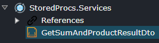

2. Right-click the DTO and choose the _Map from Domain..._ option, choose `GetSumAndProductResult` and check all the Attributes and press DONE:

  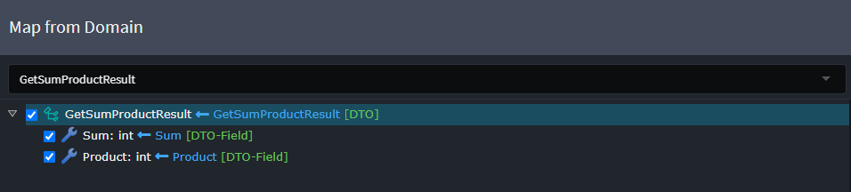

  It should have created the following:

  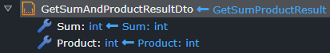

3. Create a `GetSumAndProductQuery` `Query` and set its result to the `DTO`:

  

4. Right-click the query and select the _Call Service Operation_ option, set the type to the the `Operation`:

  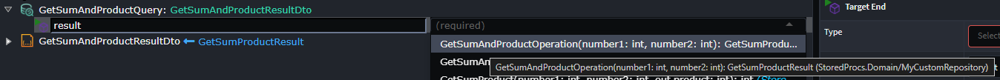

  > [!TIP]
  >
  > You can hover over the types to see their full path in their respective packages.

5. On choosing the type in the prior step a mapping screen will appear, this mapping screen is for configuring the source for input parameters for the stored procedure. You can double click each parameter on the right to have a new field automatically created on the Query, ensure all the parameters for the operation are mapped and then press DONE:

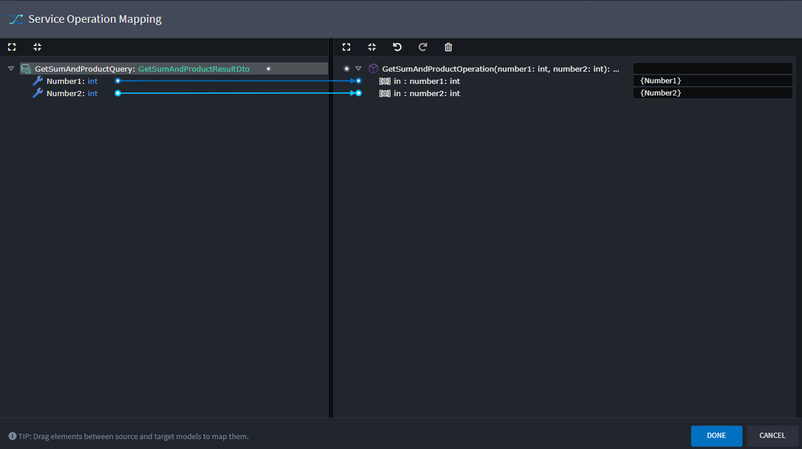

We have now completed configuring the mapping. For supported technologies (such as the .NET Clean Architecture Application Template) this will result in generation of a handler for the query which will inject the custom repository, call the operation on it, which executes the stored procedure and ultimately passes the result back to the DTO and returned.
