# Intent.Modelers.Eventing

This module extends the services designer to allow for modeling of integration events and commands.

## Modeling Integration Events and Commands

### Ensure an `Eventing Package` exists in the Services designer

In order to start modeling Integration Events and Commands, you will need to have an `Eventing Package` created in the `Services` Designer. If at least 5.0.5 of this module was initially installed, this would have been added automatically, if you upgraded this module from an earlier version, you may need to manually create the package.

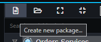

Give it a name that will become the `base Namespace` for all Events and Commands that will be modeled and placed inside it.

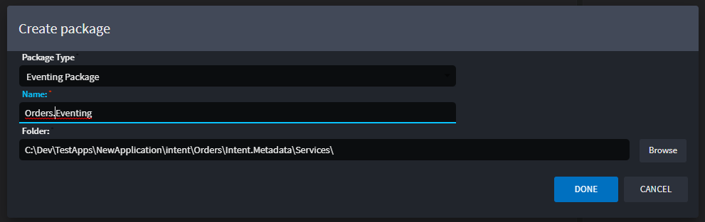

Once its created, you will need to reference this package from your Services package.

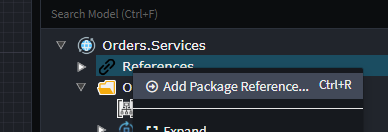

Now select your Eventing Package from the list.

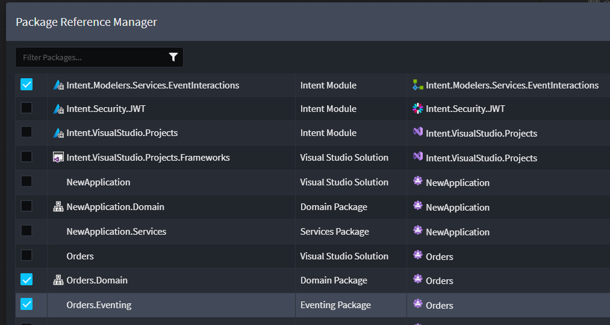

### Publishing Integration Events

Create an Integration Event by right-clicking on the Eventing Package or Folder and selecting `New Message`.

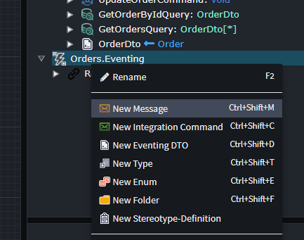

You can drag that Message onto the diagram in order to make publish from elements or subscribe handlers to those Events.

Right click on an element you wish to publish from (that has the context menu option available).

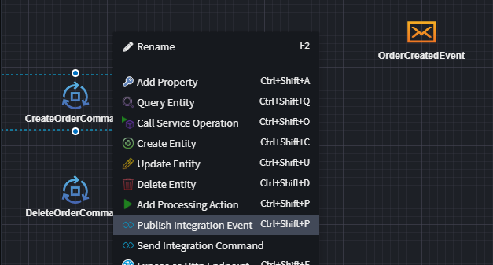

Drag the line to the Message that needs to be published.

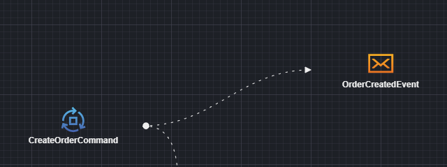

Finally map what the element should populate on the Message by right-clicking on the dotted line and selecting the `Map to Message` option.

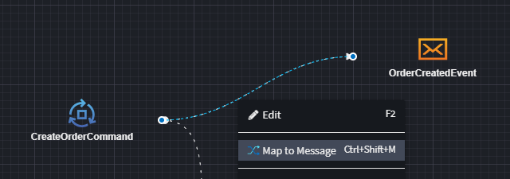

### Subscribing to Integration Events

Right click on the diagram or the Services tree-view and select `New Integration Event Handler`.

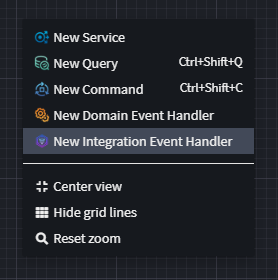

Introduce the Message that you want to subscribe to by either creating it (as a duplicate potentially) as done [here](#publishing-integration-events) or by referencing the package that contains that Event in Intent Architect through right-clicking on `References` of your Services package and selecting `Add Package Reference...`.

Ensure that the Message is present on the diagram.

To subscribe to the Event, right-click on the newly created Integration Event Handler and select `Subscribe to Integration Event`.

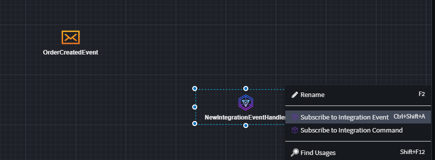

Drag the line to the Event message and will then add a handler operation to work from.

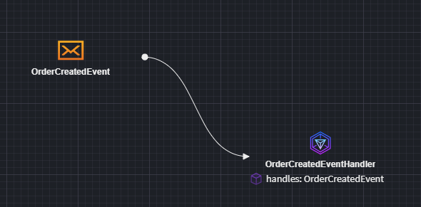

### Sending Integration Commands

Create an Integration Command by right-clicking on the Eventing Package or Folder and selecting `New Integration Command`.

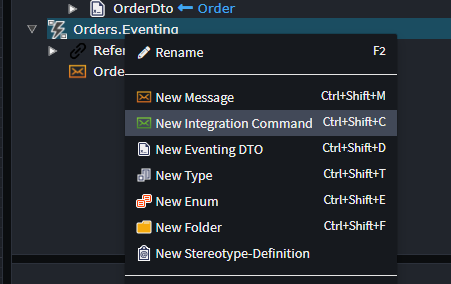

You can drag that Integration Command onto the diagram in order to make publish from elements or subscribe handlers to those Commands.

Right click on an element you wish to publish from (that has the context menu option available).

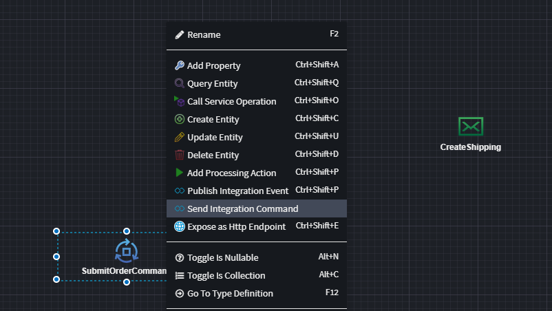

Drag the line to the Command that needs to be Sent.

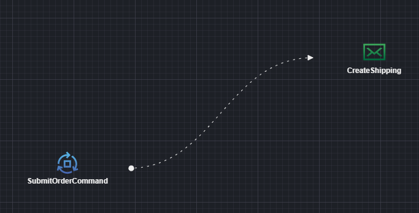

Finally map what the element should populate on the Command by right-clicking on the dotted line and selecting the `Map to Message` option.

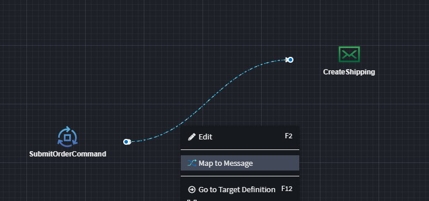

### Subscribing to Integration Commands

Right click on the diagram or the Services tree-view and select `New Integration Event Handler`.

Introduce the Integration Command that you want to subscribe to by either creating it (as a duplicate potentially) as done [here](#sending-integration-commands) or by referencing the package that contains that Integration Command in Intent Architect through right-clicking on `References` of your Services package and selecting `Add Package Reference...`.
Ensure that the Integration Command is present on the diagram.

To subscribe to the Integration Command, right-click on the newly created Integration Event Handler and select `Subscribe to Integration Command`.

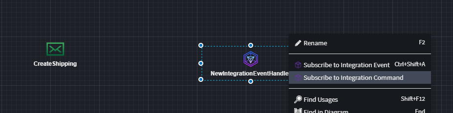

Drag the line to the Integration Command and will then add a handler operation to work from.

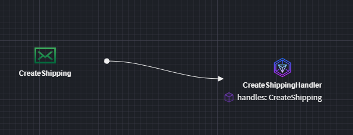

## Related Modules

### Intent.Eventing.MassTransit

Realizes eventing implementations for data modeled by this designer extension by generating MassTransit patterns.

See the [README](https://github.com/IntentArchitect/Intent.Modules.NET/blob/development/Modules/Intent.Modules.Eventing.MassTransit/README.md) for more information.

### Intent.Eventing.Kafka

Realizes eventing implementations for data modeled by this designer extension by Kafka patterns.

See the [README](https://github.com/IntentArchitect/Intent.Modules.NET/blob/development/Modules/Intent.Modules.Eventing.Kafka/README.md) for more information.
