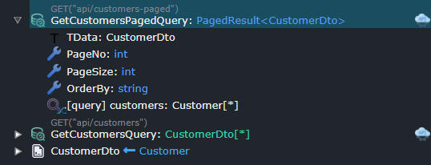

# Intent.Modelers.Services.DomainInteractions

This module provides designer support for our CRUD Modules.

## Pagination

When modeling your services any `Query` and/or service `Operation` which return `PagedResult<T>` will be realized as a paginated implementation.

A paginated end point would typically have the following parameters:

- `PageNo` (int), the page you wish to return data from. (This sequence is 1 based i.e. 1,2,3...)
- `PageSize` (int), the no of items to return per page.
- `OrderBy` (string), string based order by clause.

If you would like 0 based page Indexing (0,1,2,...) replace `PageNo` with `PageIndex`.

If you want don't want to specify and `order by` clause, you can remove this parameter from your `Query` or service `Operation`.

### string based order by clause examples

Given a Customer with a Name and Surname these would all be valid order by clauses.

- "Name" - order by Name ascending
- "Surname" - order by Surname ascending
- "Name asc" - order by Surname ascending
- "Surname desc" - order by Surname descending
- "Surname desc, Name asc" - order by Surname descending, then Name ascending

You can use the `Paginate` context menu option on `Query` and/or service `Operation` elements to easily configure these endpoints.
