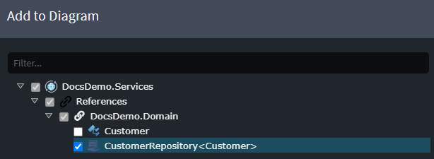
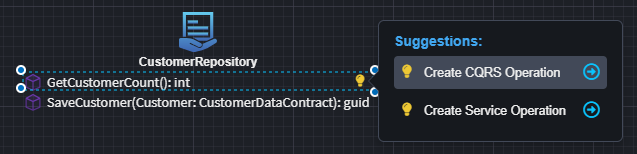
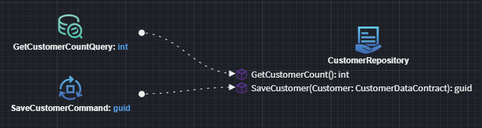
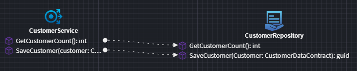
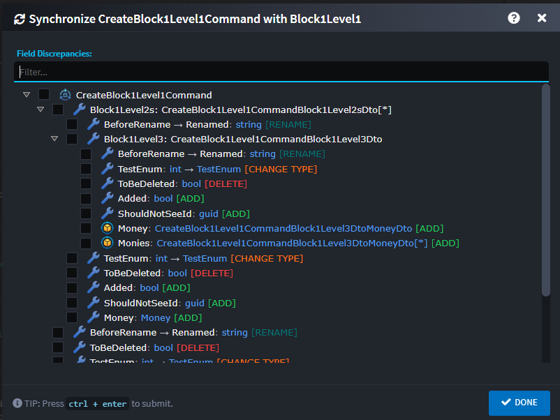

# Intent.Modelers.Services.DomainInteractions

This module provides designer support for our CRUD Modules.

## Domain Interaction Settings

This section defines how the application interacts with the Domain Layer. Each setting influences how data is mapped, queried, and updated within the domain.

### Default Mapping Mode

The Intent Architect mapping mode to use. Defaults to `Advanced Mapping`. Generally should not be changed.

### Default Query Implementation

Determines how entities are retrieved from the Domain Layer and mapped to DTOs.

- **Default**: Uses `AutoMapper`'s traditional mapping method, leveraging **Intent Architect** mapping configurations to map Domain Entities to DTOs.  
- **Project To**: Uses `AutoMapper ProjectTo`, enabling optimized database queries by mapping directly within LINQ expressions based on **Intent Architect** configurations. 

### Null Child Update Implementation

Controls how **null child entities** in a request are handled when updating the Domain Layer.  

- **Ignore**  
  If a `NULL` child entity is present in a service request, the existing child entity in the domain remains unchanged.  

  ``` csharp
  // if a NULL ProductDetails is received, existing ProductDetails details will remain unchanged
  if (request.ProductDetails != null)
  {
      entity.ProductDetails ??= new Domain.Entities.ProductDetails();
      entity.ProductDetails.Name = request.ProductDetails?.Name;
      entity.ProductDetails.Qty = request.ProductDetails?.Qty;
  }
  ```

- **Set to NULL** (Default behavior)  
  If a `NULL` child entity is present in a service request, the corresponding child entity in the domain is explicitly set to `NULL`.  
  
  ``` csharp
  // if a NULL ProductDetails is received, existing ProductDetails details will be set to null
  if (request.ProductDetails != null)
  {
      entity.ProductDetails ??= new Domain.Entities.ProductDetails();
      entity.ProductDetails.Name = request.ProductDetails?.Name;
      entity.ProductDetails.Qty = request.ProductDetails?.Qty;
  }
  else
  {
    entity.ProductDetails = null;
  }
  ```

## Pagination

When modeling your services any `Query` and/or service `Operation` which return `PagedResult<T>` will be realized as a paginated implementation.


A paginated end point would typically have the following parameters:

- `PageNo` (int), the page you wish to return data from. (This sequence is 1 based i.e. 1,2,3...)
- `PageSize` (int), the no of items to return per page.
- `OrderBy` (string), string based order by clause.

If you would like 0 based page Indexing (0,1,2,...) replace `PageNo` with `PageIndex`.

If you want don't want to specify and `order by` clause, you can remove this parameter from your `Query` or service `Operation`.

### string based order by clause examples

Given a Customer with a Name and Surname these would all be valid order by clauses.

- "Name" - order by Name ascending
- "Surname" - order by Surname ascending
- "Name asc" - order by Surname ascending
- "Surname desc" - order by Surname descending
- "Surname desc, Name asc" - order by Surname descending, then Name ascending

You can use the `Paginate` context menu option on `Query` and/or service `Operation` elements to easily configure these endpoints.

## Modeling a Repository Operation Call

To model the invocation of a `Repository Operation`, two accelerators are available, supporting either **CQRS** or **Traditional** service styles.

Alternatively, you can create the services, invocations, and mappings **manually** without using the provided accelerators, offering full control over the structure and implementation.

### Reference the Repository

1. In the **Service Designer**, within a diagram, right-click and select **`Add to Diagram`**.
2. Choose the previously created `Repository` and click **Done**.



### Create the Service

Once the repository is added to the diagram, a *suggestion* will appear to either:

- **Create a CQRS Operation**  
- **Create a Service Operation**

These options allow you to quickly scaffold a service that invokes the repository operation.



### CQRS Operation

Use the **`Create CQRS Operation`** option to generate either a `Command` or a `Query` that calls the repository:



### Traditional Service Operation

Use the **`Create Service Operation`** option to generate a traditional service method for calling the repository:



## Service Synchronizer

The Service Synchronizer is a feature in Intent Architect that synchronizes Data Transfer Object (DTO) fields with their associated entity attributes, ensuring consistency between service layer DTOs and domain entities.

### How It Works

Instead of manually updating DTOs to reflect changes in the underlying domain entities, the DTO Field Synchronizer automates this process.
It analyzes field mappings through entity associations (Create and Update) and presents discrepancies in a hierarchical tree view dialog, where users can selectively apply changes.

### Usage

Hover over Commands, Queries, or Service Operations to see the suggestion icon and click on it. 
Select the `Syncrhonize with {Entity}` option.
The tool identifies four types of discrepancies:

- **ADD**: Missing fields that exist in the entity
- **DELETE**: Orphaned fields no longer in the entity
- **RENAME**: Field name changes
- **CHANGE TYPE**: Type mismatches

Select the fields you would like to synchronize and then click on DONE.
The selected changes will be applied to the respective element.



### Supported Structures

This can currently only be applied on Commands, Queries and Service Operations.
The Domain elements that it supports are Entities, composite related Entities, and Value Objects.
