# Intent.Modelers.Services.ProxyInteractions

Services modeler extensions for describing interactions between an application's services and its domain.

## Mapping from CQRS Operations and Services to Service Proxies

> [!NOTE]
> You will also need version `5.2.0` or higher of the `Intent.Modelers.ServiceProxies` module installed or you may encounter errors when trying the below.

As usual for _Service Proxies_, you will need to have a reference from the Service Proxies package to the Services package to which you want service proxies created:

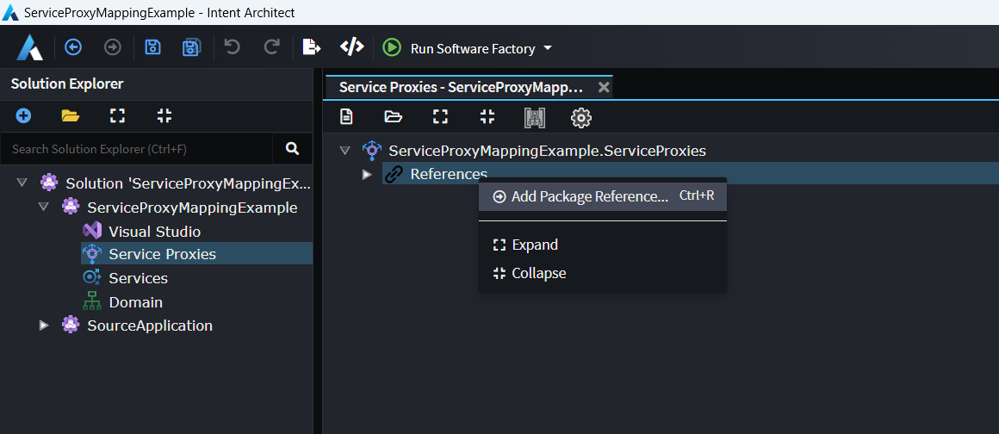

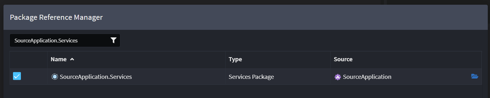

Create a Service Proxy, select the operations for it, and press DONE:

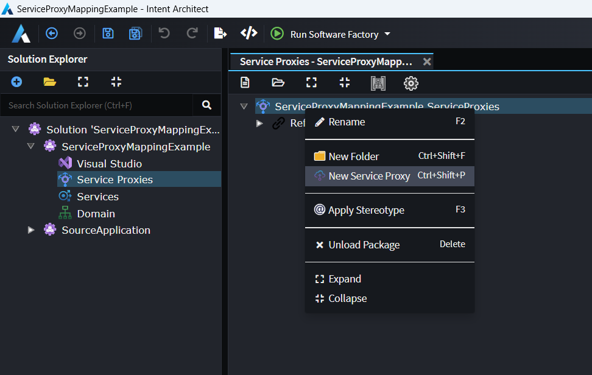

Then from Services designer, add two references, one to the Service Proxies' package, and the other to the package of the ultimate source application's Domain designer:

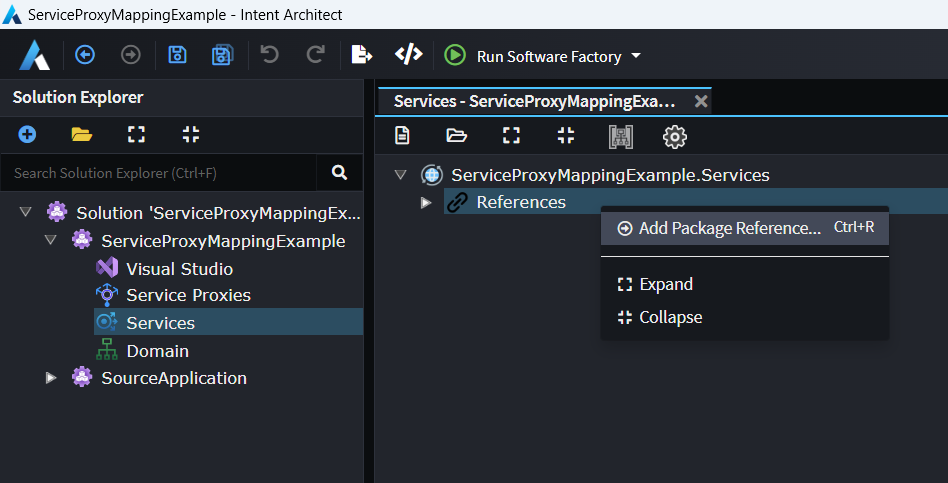

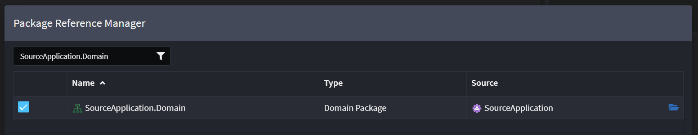

> [!NOTE]
> It is due a limitation with the current version of Intent Architect that a reference is needed to the ultimate source application's Domain package, a future version of Intent will fix this so that it will no longer be required to add a reference to the Domain package.

Load the ServiceProxies' package into the designer:

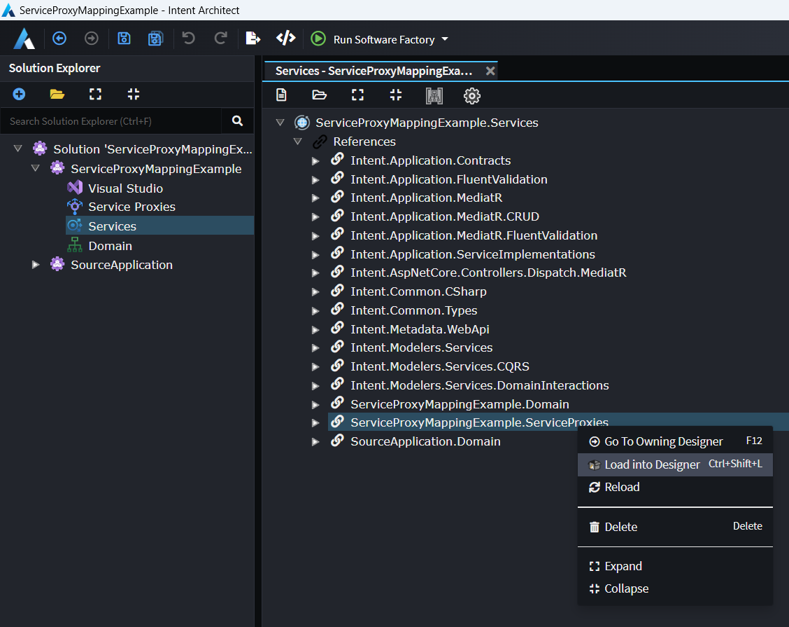

If you'd like to visually see the mappings on a diagram, you can create a Diagram in the Services designer if you don't have one already, open it, and then drag the Service Proxy onto it:

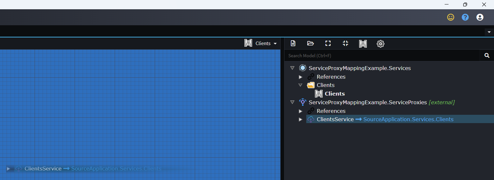

To create CQRS operations mapped to the Service Proxy, right-click the Service Proxy and select the _Create CQRS Operations_ option:

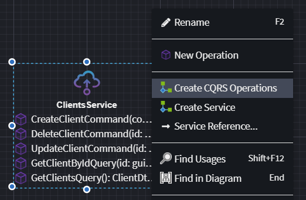

Which will generate the following:

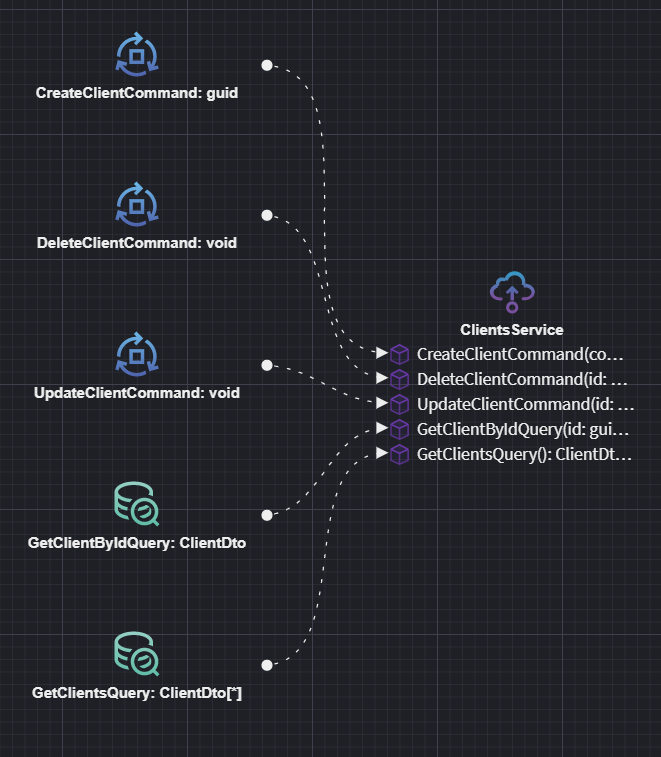

To create a Service mapped to the Service Proxy, right-click the Service Proxy and select the _Create Service_ option:

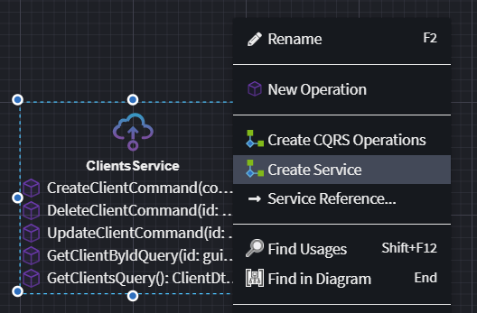

Which will generate the following:

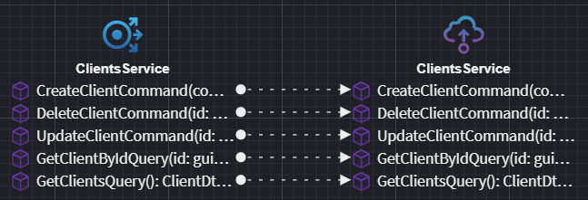

When you run the Software Factory, it will now generate implementations for the CQRS Operations or Services which inject the service proxy interface, call the methods and return the result.
