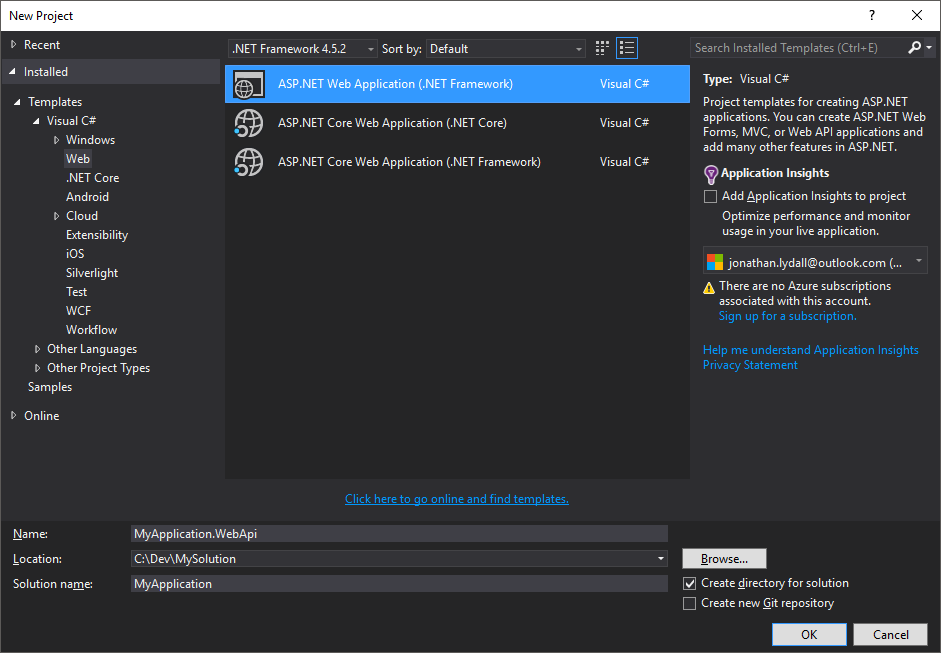
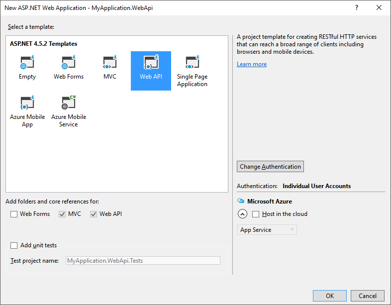
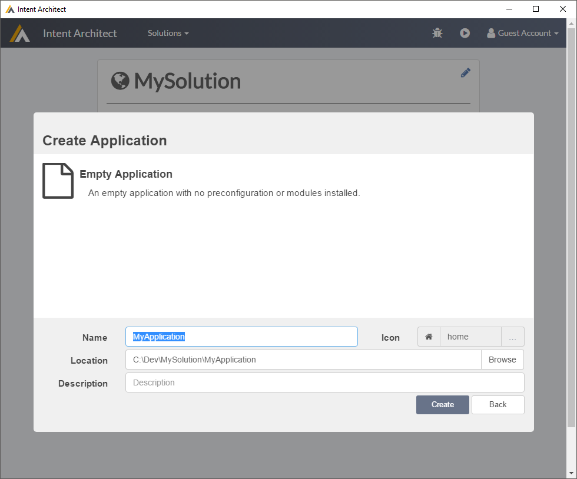

# Make Your Own Module - Complete Example - ASP.NET Web API Controllers 

This tutorial will walk you through creating an Intent Architect module which will generate ASP.NET WebApi controllers based on the `Services` visual DSL in Intent Architect. 

Intent Architect is designed to work on both new and existing projects. In this tutorial we will have the template add additional WebApi Controllers to an existing application.

## Make a new Visual Studio Solution and Project

We will create a WebApi project using Visual Studio's scaffolding feature. 

- Open Visual Studio
- Create New Project
- Under `Visual C#`, `Web`, choose `ASP.NET Web Application (.NET Framework)`
    - Name: `MyApplication.WebApi`
    - Location: `C:\Dev\MySolution`
    - Solution name: `MyApplication`
    
- Press `OK`
- Use `Web API` template

- Leave default boxes checked (just `MVC` and `Web API`)
- (Optional) Press the `Change Authentication` button and choose `No Authentication` if you don't want to worry about authentication right now.
- Press `OK`

## Make a new Intent Architect Solution and Application

In Intent Architect, we will make a new solution in the same folder as our Visual Studio solution and project above.

- Open Intent Architect
- Make a new Solution:
    - Name: `MySolution`
    - Path: `C:\Dev\MySolution`
    
- Make a new Application
    - Use the `Empty Application` template
    
    - Give it name of `MyApplication`
    
- Go to `Modules`
    - Search for `Intent.VisualStudio.Projects` and install the module
    - Search for `Intent.NuGet.Installer` and install the module
    - Search for `Intent.OutputManager.RoslynWeaver` and install the module
- Go to `Configuration`
    - Right-click `Projects` and select `New Project`
    - Select the `WebApi` entry
    - Give it a name of `MyApplication.WebApi`.
    
- Use the play button to generate your application. Press `Apply Changes` when done.

## Creating the Module

In a new instance of Visual Studio we are going to make a new project from which our Intent Architect Module will be packaged.

- Open a new instance of Visual Studio
- Under `Visual C#`, `Windows`, choose `Class Library`.
    - Name: `Module.Example.WebApi`
    - Location: `C:\Dev\MySolution`
    - Solution name: `MySolution.Automation`
    
- Add the following Nuget packages:
    - `Intent.IntentArchitectPackager`
    - `Intent.SoftwareFactory.MetaModel` (which will install `Intent.SoftwareFactory.SDK` as a dependency)
- Add following new items to the project (right-click `Module.Example.WebApi`, `Add`, `New Item`):
    
    - Module Specification File:
    
        A module specification, or rather, `.imodspec` files are very similar to NuGet `.nuspec` files and are used by the module packager and Intent Architect to understand the contents of a module, including what templates, decorators and settings it has available.

        - Visual Studio Project item type: `XML File`
        - Name: `Module.Example.WebApi.imodpec`
        - Content:
            ```xml
            <?xml version=`1.0` encoding=`utf-8`?>
            <package>
                <id>$id$</id>
                <version>0.0.1</version>
                <templates>
                    <template id=`Module.Example.WebApi.WebApiController`>
                        <role>Distribution.WebApi</role>
                    </template>
                </templates>
            </package>
            ```

    - Template

        A convenient and powerful templating engine for the Intent Architect's Software Factory is T4. Visual Studio has support and tooling for T4 out the box and it provides a convenient way to mix code and text together through `.tt` files. By using a `Runtime Text Template`, normal C# code is created each time the `.tt` file is saved.
        
        By making the `.tt` inherit from an Intent Architect base templating class, Intent Architect's Software Factory automatically captures the template output during the Software Factory run.

        - Visual Studio Project item type: `Runtime Text Template` (search in top right, or can be found under `Visual C# Items`, `General`)
        - Name: `WebApiControllerTemplate.tt`
        - Content:
            ```csharp
            <#@ template language=`C#` inherits=`IntentRoslynProjectItemTemplateBase<IServiceModel>`#>
            <#@ assembly name=`System.Core` #>
            <#@ import namespace=`Intent.MetaModel.Service` #>
            <#@ import namespace=`Intent.SoftwareFactory.Templates` #>
            <#@ import namespace=`System.Linq` #>
            <#@ import namespace=`System.Text` #>
            <#@ import namespace=`System.Collections.Generic` #>
            using Intent.CodeGen;

            [assembly: DefaultIntentManaged(Mode.Merge)]
            // Simple comment as output
            ```
    - Template's Partal File:
        
        T4 `Runtime Text Template` files re-generate a `.cs` file with a class inside it each time the `.tt` file is saved. These generated classes are `partial` which allows us to make other corresponding `partial` classes.

        By creating a partial class which is just another `.cs` file to Visual Studio, unlike `.tt` files, full Visual Studio IntelliSense and other C# features available to them. This makes partial classes the ideal place to put more complicated backing logic for our templates, such as constructors, utility methods, etc.

        - Visual Studio Project item type: `Class`
        - Name: `WebApiControllerTemplatePartial.cs`
        - Content:
            ```csharp
            using System;
            using System.Collections.Generic;
            using System.Linq;
            using System.Text;
            using System.Threading.Tasks;
            using Intent.MetaModel.Service;
            using Intent.SoftwareFactory.Engine;
            using Intent.SoftwareFactory.Templates;
            using Intent.SoftwareFactory.VisualStudio;

            namespace Module.Example.WebApi
            {
                public partial class WebApiControllerTemplate
                {
                    public const string Identifier = "Module.Example.WebApi.WebApiController";

                    public WebApiControllerTemplate(IProject project, IServiceModel model) : base(Identifier, project, model)
                    {
                    }

                    public override RoslynMergeConfig ConfigureRoslynMerger()
                    {
                        return new RoslynMergeConfig(new TemplateMetaData(Id, `1.0`));
                    }

                    protected override RoslynDefaultFileMetaData DefineRoslynDefaultFileMetaData()
                    {
                        return new RoslynDefaultFileMetaData(
                            overwriteBehaviour: OverwriteBehaviour.Always,
                            fileName: Model.Name + `Controller`,
                            fileExtension: `cs`,
                            defaultLocationInProject: @`Controllers`,
                            className: `${Name}Controller`,
                            @namespace: `${Project.Name}.Controllers`);
                    }
                }
            }
            ```
    - Registration file:

        Intent Architect's Software Factory loads module assemblies and using reflection locates available templates by finding classes which implement `ITemplateRegistration` and then initializes the templates defined inside.

        - Visual Studio Project item type: `Class`
        - Name: `WebApiControllerTemplateRegistration.cs`
        - Content:
            ```csharp
            using System;
            using System.Collections.Generic;
            using System.Linq;
            using Intent.MetaModel.Service;
            using Intent.SoftwareFactory;
            using Intent.SoftwareFactory.Engine;
            using Intent.SoftwareFactory.Templates;
            using Intent.SoftwareFactory.Templates.Registrations;

            namespace Module.Example.WebApi
            {
                public class WebApiControllerTemplateRegistration : ModelTemplateRegistrationBase<IServiceModel>
                {
                    private readonly IMetaDataManager _metaDataManager;

                    public WebApiControllerTemplateRegistration(IMetaDataManager metaDataManager)
                    {
                        _metaDataManager = metaDataManager;
                    }

                    public override ITemplate CreateTemplateInstance(IProject project, IServiceModel model)
                    {
                        return new WebApiControllerTemplate(project, model);
                    }

                    public override IEnumerable<IServiceModel> GetModels(IApplication application)
                    {
                        return _metaDataManager.GetMetaData<IServiceModel>(new MetaDataType(`Service`)).Where(x => x.Application.Name == application.ApplicationName).ToList();
                    }

                    public override string TemplateId => WebApiControllerTemplate.Identifier;
                }
            }
            ```

Build the Visual Studio Solution project and in Visual Studio's build output you should see the following line:
```
Successfully created package Module.Example.WebApi.0.0.1.imod
```

When you added the `Intent.IntentArchitectPackager` NuGet package to the project, it injected a task into the build action of the project to package up the module for you. This module file is placed in your `$(SolutionFolder)\Intent.Modules` folder.

## Add the Module to your Intent Architect Application and Start Using It

This example module is now ready to be used within Intent Architect.

- Go to `Modules`:
    - Add your own repository

        By adding 'File System' based repository to our application, Intent Architect will be able to search for and install modules from your file system, much like it does so through the official Intent Architect repository.

        - Press the cog icon near the top right
        - Press `Add New` 
            - Name: `My Repository`
            - Address: `C:\Dev\MySolution\MySolution.Automation\Intent.Modules`
            - Press `Save`
    - From the drop down on the top right, ensure that `My Repository` is selected.
    - Press `Search`
    - You should see your module `Module.Example.WebApi`, select it and press `Install`
- Go to `Configuration`
    - Drag the `Distribution.WebApi` role onto your `MyApplication.WebApi` project, note how its icon changes to be green and checked.
- Go to `Services`
    - Make a few services


Now run the software factory and observe the changes generated. You can see that for each service you defined in Intent Architect, it has created a new controller in your Visual Studio project. Right now though these controllers have no real content, we're still going to have to add some more content to them.

## Force re-install of rebuilt module

Once Intent Architect has downloaded and installed a module, it won't try re-download it again. This creates a problem in that whenever you make a change and rebuild your module while devloping it, you won't see you changes apply unless you uninstall and re-install the module in Intent Architect.

Having to re-install your module every time gets tedious very fast, fortunately though there is a way to automate this re-install during the build process of your module. In Visual Studio, right-click the `Module.Example.WebApi` project and select `Properties`. Select the `Build Events` section and in the `Post-build event command line` box put the following:

```
if exist "C:\Dev\MySolution\Intent.Modules\Module.Example.WebApi.0.0.1" rmdir "C:\Dev\MySolution\Intent.Modules\Module.Example.WebApi.0.0.1" /s /q
```

What this does is delete the module from your Intent Architect's `Intent.Modules` folder each time your module builds, then later when the Software Factory runs, it will see the module is missing and automatically re-download the missing package. You will see in the log during the software factory run that the module is being restored.

Now we can move back to improving our template.

## Have the template generate a class in a namespace

Let's make our template generate class names and their namespaces.

Change the content of the `WebApiControllerTemplate.tt` file to the following: 

```csharp
<#@ template language=`C#` inherits=`IntentRoslynProjectItemTemplateBase<IServiceModel>`#>
<#@ assembly name=`System.Core` #>
<#@ import namespace=`Intent.MetaModel.Service` #>
<#@ import namespace=`Intent.SoftwareFactory.Templates` #>
<#@ import namespace=`System.Linq` #>
<#@ import namespace=`System.Text` #>
<#@ import namespace=`System.Collections.Generic` #>
using System;
using Intent.CodeGen;

[assembly: DefaultIntentManaged(Mode.Merge)]

namespace <#= Namespace #>
{
    public class <#= ClassName #>
    {
    }
}
```

Build your module, run the software factory and observe that it now applies a namespace and class name to your controllers.

## Make the generated class extend ASP.NET WebApi's ApiController class

Change the content of the `WebApiControllerTemplate.tt` file to the following: 

```csharp
<#@ template language=`C#` inherits=`IntentRoslynProjectItemTemplateBase<IServiceModel>`#>
<#@ assembly name=`System.Core` #>
<#@ import namespace=`Intent.MetaModel.Service` #>
<#@ import namespace=`Intent.SoftwareFactory.Templates` #>
<#@ import namespace=`System.Linq` #>
<#@ import namespace=`System.Text` #>
<#@ import namespace=`System.Collections.Generic` #>
using System;
using System.Web.Http;
using Intent.CodeGen;

[assembly: DefaultIntentManaged(Mode.Merge)]

namespace <#= Namespace #>
{
    public class <#= ClassName #> : ApiController
    {
    }
}
```

Build your module, run the software factory and observe that the generated classes now derive from `ApiController`.

## Add operations to the generated class

If you haven't done so already, in Intent Architect ensure you have a service with at least one operation and the operation has at least one parameter and a return type.

Change the content of the `WebApiControllerTemplatePartial.cs` file to the following: 

```csharp
using System;
using System.Collections.Generic;
using System.Linq;
using System.Text;
using System.Threading.Tasks;
using Intent.MetaModel.Service;
using Intent.SoftwareFactory.Engine;
using Intent.SoftwareFactory.Templates;
using Intent.SoftwareFactory.VisualStudio;

namespace Module.Example.WebApi
{
    public partial class WebApiControllerTemplate
    {
        public const string Identifier = `Module.Example.WebApi.WebApiController`;

        public WebApiControllerTemplate(IProject project, IServiceModel model) : base(Identifier, project, model)
        {
        }

        public override RoslynMergeConfig ConfigureRoslynMerger()
        {
            return new RoslynMergeConfig(new TemplateMetaData(Id, `1.0`));
        }

        protected override RoslynDefaultFileMetaData DefineRoslynDefaultFileMetaData()
        {
            return new RoslynDefaultFileMetaData(
                overwriteBehaviour: OverwriteBehaviour.Always,
                fileName: Model.Name + `Controller`,
                fileExtension: `cs`,
                defaultLocationInProject: @`Controllers`,
                className: `${Name}Controller`,
                @namespace: `${Project.Name}.Controllers`);
        }

        // A helper method used by the template:
        private string GetOperationReturnType(IOperationModel o)
        {
            return o.ReturnType == null
                ? `void`
                : o.ReturnType.TypeReference.Name;
        }

        // A helper method used by the template:
        private string GetParameters(IOperationModel o)
        {
            return o.Parameters
                .Select(x => $`{x.TypeReference.Name} {x.Name}`)
                .Aggregate((x, y) => x + `, ` + y);
        }
    }
}
```

Change the content of the `WebApiControllerTemplate.tt` file to the following: 
```csharp
<#@ template language=`C#` inherits=`IntentRoslynProjectItemTemplateBase<IServiceModel>`#>
<#@ assembly name=`System.Core` #>
<#@ import namespace=`Intent.MetaModel.Service` #>
<#@ import namespace=`Intent.SoftwareFactory.Templates` #>
<#@ import namespace=`System.Linq` #>
<#@ import namespace=`System.Text` #>
<#@ import namespace=`System.Collections.Generic` #>
using System;
using System.Web.Http;
using Intent.CodeGen;

[assembly: DefaultIntentManaged(Mode.Merge)]

namespace <#= Namespace #>
{
    public class <#= ClassName #> : ApiController
    {
<#    foreach (var operation in Model.Operations)
    {
#>
        [IntentManaged(Mode.Merge, Body = Mode.Ignore)]
        [AcceptVerbs(`GET`)]
        public <#= GetOperationReturnType(operation) #> <#= operation.Name #>(<#= GetParameters(operation) #>)
        {
            throw new NotImplementedException();
        }
<#
    }
#>
    }
}
```
Build your module, run the software factory and observe that the generated classes now have operations generated in them.