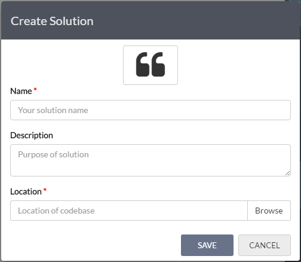
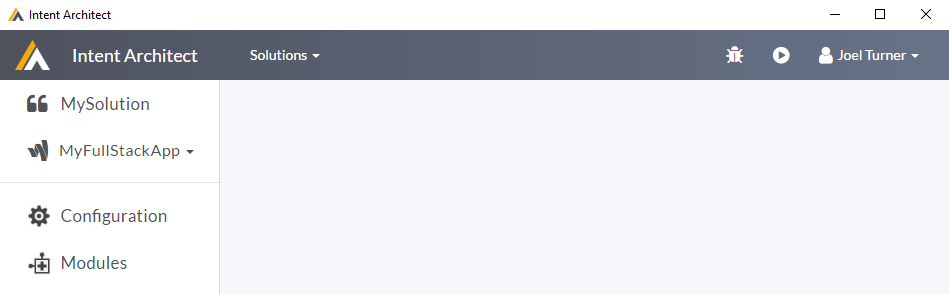
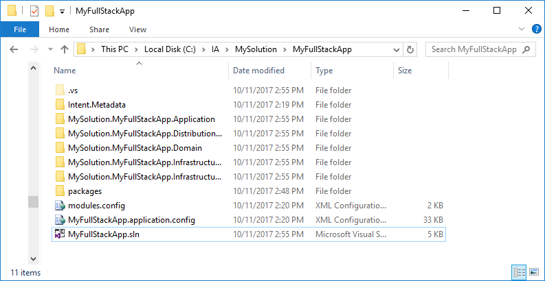
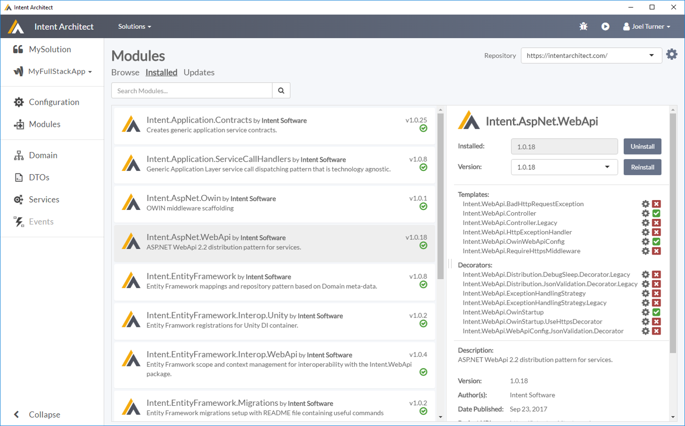

# Quick Start

Tooling in software helps us build more robust, maintainable applications faster then we could doing it all by hand. 

Intent Architect is an IDE-like tool which allows helps you better capture your design intent and uses that intent to build out those aspects of your application as per your *'blueprints'*.

The goal of this guide is to  give you a feel for the tool illustrating how it works and what it can do for you. In the guide we're going to create a "full stack" ASP.NET WebApi 2.2 server with persistence and domain patterns in place.

By the end, you'll have a basic understanding of how Intent Architect works and a foundation to begin exploring how Intent Architect can make your development world better.

## 1. Setup the development environment

Get your Intent Architect up and running in 3 easy steps.

- Sign up on the Intent Architect [website](http://www.intentarchitect.com)
- Download and Install the latest version of the application
- Start Intent Architect and sign in using your site registration credentials 

## 2. Create a new Solution

A Solution a logical grouping mechanism of applications, modern systems are typically made up of multiple applications. Solutions allow us to simply put these applications together as a logical unit.

**Click on 'Create New Solution' either in the middle of the Home screen or from the Solutions drop down.**

*Create Solution Dialog*

|Field|Description|
|-|-|
|Icon|This is an icon which will be associated with you solution. Change it to something more appropriate or use the randomly assigned one.|
|Name|The name of your solution. This name should be alpha-numeric with no special characters or spaces.|
|Description|A description of the solution.|
|Location|The folder where Intent Architect can persist data associated with this solution. You would typically want to place this folder inside your Source Control Repository, so that your information can be versioned and shared amongst the development team. Intent Architect does not append any additional sub directories, the directory selected will be the directory used.|

You will be presented with Create Solution Dialog.

>[!TIP]
>Good names for Solutions would typically be things like the client, your product name, business area / unit or your organization name

**Fill out the dialog and press 'Save'.**

## 3. Create a new Application

Next we will create an Application. An Application is exactly what you would expect, it is the Intent Architects representation of the actual application you are building. 

**Click the 'New Application' block.**

You will now be presented with a 2 step wizard to create your application.
- Select an Application Template
- Capture your Application's details

*Select an Application Template*

Application Templates are just that, they are templates which configure the initial state of your applications. They can install Modules, populate Metadata and any other thing you could manually configure through the front end. Intent Architect comes with prebuilt Application Templates it is also possible to create your own. For the purposes of this guide we will choose the Full Stack ASP.NET WebAPI 2.2 Application Template.

**Select the 'Full Stack ASP.NET WebAPI 2.2' Application Template and click 'Next'.**

*Capture Application Details*

|Field|Description|
|-|-|
|Name|The name of your application. This name should be alpha-numeric with no special characters or spaces.|
|Icon|This is an icon which will be associated with you application. Change it to something more appropriate or use the randomly assigned one.|
|Location|The folder where your application's data will be persisted. By default this will be in a sub-folder of the solution named after the Application name.|
|Description|A description of the Application.|

**Fill out the dialog and press 'Create'.**

## 4. Push the 'Play' button

Your Application is now created, and pre-configured with various Modules and Metadata from the Application Template. 

*Application View*

**Click the 'Play' button, in the top right hand corner.**

A dialog will popup, this dialog is giving feedback and interaction with the code generation process. Not worrying to much about the details, it should stop focused on the 'Changes' tab, at this point the software factory is presenting you with a list of all the code changes it would like to make. Reviewing the list we can see it is creating much of Visual Studio infrastructure for us, names 'sln', 'csproj' and various other infrastructural files.

*Software Factory execution 'Changes'*

**Click the 'Apply Changes' button.**

At this point the software factory is applying you changes. At this point it may feel a little slow, but if you look closely at the console you will notice that it is installing various Nuget packages. These packages are being installed based on the configured Module dependencies. The slowness you are currently experiencing is the actual Nuget download. This obviously only happens on the initial installation of the Nuget packages.  

**Click the 'Close' button.**

At this point you can navigate to the folder you specified for your application and you should see something like this.

*Generated outputs*

Open the solution in Visual Studio 2015/2017 (output will be in the location chosen for your application)

Compile and run (hit F5)

## What just happened?

So the part that is probably not obvious at this point is what caused the code to be generated and why it was generated like that. 

If you look in the Modules section of you application, on the installed tab you should see something similar to this.

*Installed Modules*

Here you can see there are a collection on modules which have been installed as part of the application template. Each of these modules is affecting what code is generated and how it is generated. 

You can try uninstall and reinstalling Modules to see what affect they have on the code generation.

In a less contrived scenario you would hand pick which modules you wished to use or create your own.

Another aspect which is affecting the code generation is the Application Configuration. If you go the 'Configuration' section, you will find the following.

*Application project configuration*

This is Metadata describing how you want you actual source code to be structured. This section not only described how you want your source code projects to be structured but where you would like the code generation from the modules to go. This is done by mapping 'Target Roles' from the Modules onto your project structure.

>[!NOTE]
>The project types available are again supplied by modules, in this case specifically from the Intent.VisualStudio Module. New project types can be added through the Modules system.    

## Add additional Metadata to describe your Application
Play around in Intent Architect by adding Services, Domain classes and DTOs, and see how the patterns are realized in your codebase.

Don't forget to click 'Play' for your design to be realized in code.
