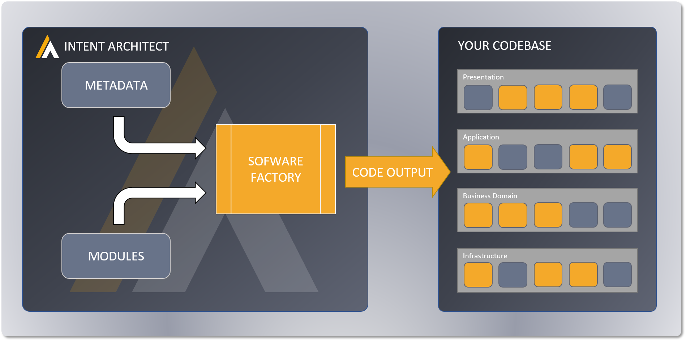
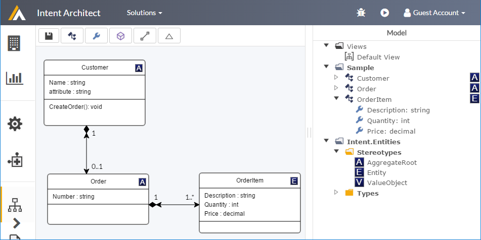
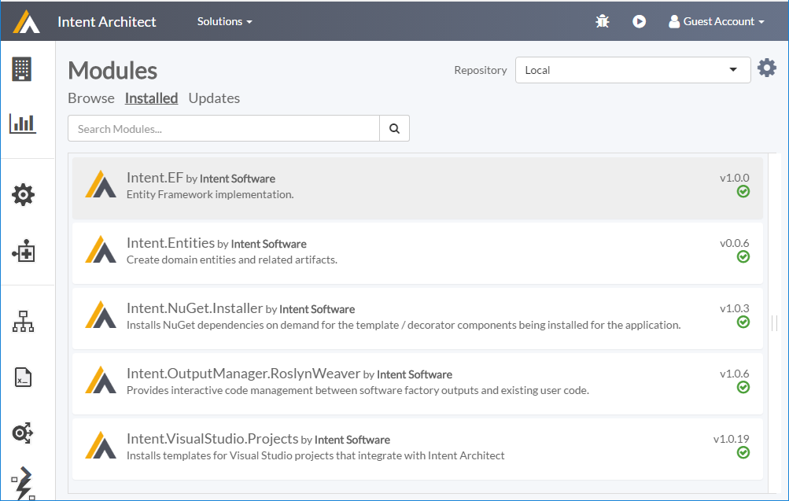
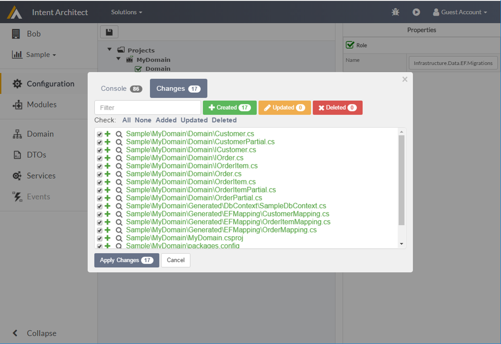

# Welcome to Intent Architect

## What is Intent Architect ?

Intent Architect is a coding automation tool for software developers. It's based on the principles of a software factory, and provides a platform for design and pattern reuse.

- Build Faster - Allow Intent Architect to manage the tedious and repetitive tasks that take up most of your time, freeing you up to focus on meaningful value-adding development.
- Quality Assured - Create your patterns, and then rest easy, knowing that they are applied consistently and correctly throughout your codebase.
- Agile Architecture - Future-proof your architecture! Effortlessly upgrade (or even swap out) your technologies and design patterns at the push of a button - mitigating technical risk has never been easier.

## How does it work ?

Before I explain how it works, it's important to understand a little about the thinking behind it. All software, and this is particularly true of large enterprise systems, are composed of sets of patterns. This code is often referred to as boiler plate code or plumbing . The more patternized a system is the more maintainable and robust it is. The real challenges comes in around things like:-
- How to make sure the pattern is implemented consistently, this often breaks down when people don't understand the original intent of the pattern, the technology or simply implement it lazily.
- Refactoring the pattern, once a pattern is implemented refactoring the pattern can be an expensive exercise as you may need to change every instance of pattern rather than the pattern itself.
- Doing the easy thing as opposed to the right thing, some times we take short cuts in design because we know that the implementing the boiler plate would be too onerous.

Intent Architect is a continuous code generation tool which 'integrates' with your solution code to allow you to build highly patternized systems of your own design. Intent Architect directly address the issues described above allowing you maintain and refactor your design patterns directly as opposed to hard coding them into your solutions and maintaining each and every pattern instance. Intent Architect also directly addresses many of the issues inherent with traditional code generation tools. Intent Architect operates completely at design time and as a result has no lock-in, it simply writes the code you want it to write, how you want it to write it. It's important to note that Intent Architect is build by developers, for developers, we are in no way trying to diminish the development experience. This tool allows developers to better capture our design intent as developers rather than hard coding it into our applications. 

Conceptually Intent Architect works in 3 steps:- 
- Describe your application through Metadata
- Choose your patterns and their backing technologies through Modules
- Click the play button 

*Overview of how Intent Architect work*

In practice you would apply these steps organically and iteratively as you build out your application, describing your application and refining your design as you model your business domain, patternizing your application architecture either explicitly or in an emergent fashion depending on your experience. 

So what is involved in these 3 steps ?

### Describe your application through Metadata
In this step you can describe your application or aspects of your application in a technology agnostic way. Some of the typical things you might wish to describe, about your application, are
- Domain model
- Service Contracts
- Services
- Inbound and outbound events
- ANY other aspect of your application you feel is appropriate

Am I not just documenting my design ? Is principle yes, but unlike traditional documentation this is a living document which *integrates* into your actual source code. As you change your design (Metadata) your application source code changes. Through this process you capture the design intent of your application rather than hard coding it into your application source code as it is traditionally done. This decoupling of the design intent from the actual source code makes refactoring or changing your designs easier as you are literally changing the design rather have to reverse engineer it out of the source code and refactor the code.

Intent Architect has serval Domain Specific Languages (DSLs) which you can use to model the application concepts described above. An example of such a DSL would be our UML modelling DSL which would typically be used to model your application domain.

*UML Modelling DSL example*

All the DSLs are fully extensible though a custom metadata extension system simply referred to as *stereotypes*. Stereotypes allow you to extend existing models and add your own custom data to the existing model. This would typically be data that is specific to you application or design. Should you wish to describe other aspects of your application that Intent Architect does not have a DSL for  you can provide your own Metadata models. These can be in what ever format you like, some examples may include JSON, XML or .Net source code. This can be done through creating your own MetaDataLoader plugin.

It is important to note you do not have to describe your entire application upfront, you can describe your application iteratively as you uncover the domain you are building for. 

### Choose your patterns and their backing technologies through Modules

When capturing Metadata we are really describing 'what' we want to build, in this step we are specifying 'how' we want it built. Specifying the 'how' is choosing which design patterns you want to use in you application. As an application architect this is analogous to choosing which design patterns you want to using to in your application design. To be clear these design patterns literally describe what the source code to be generated so solve a specific aspect of your application, things like:-
- Domain model persistence
- Service accessibility 
- Application event propagation
- Any patterns you as the application architect would like to see realized in your application

The way you 'choose your patterns' is by installing modules of your choosing into your application design. Theses modules typically contain coded templates which will generate these design patterns into your solution, based on the Metadata you have previously described.

*Installed Modules example*

Some additional points on modules:-
- Modules are technically more than just collections 'patterns' and can be used to extend or enhance the code generation process.
- Modules support configuration, allowing the user to fine tune how and what they execute.
- The outputs of the Modules can be mapping into your solutions using the application configuration screen. 
- These design patterns are often backed by a specific technology, an powerful side effect of this approach is that you have a clean loose coupling between your application and the underlying technologies through this patternized approach.

### Click the play button

So this step ..., really is that easy. Clicking the play button in Intent Architect will execute the software factory, Intent Architect will take your Metadata, patterns, configuration and generate your solution accordingly. What this means practically is that source code, as you per your design, will be generated. It is important to note at this point that Intent Architect is designed to work with continuous code generation in mind, i.e. whenever you change your design or patterns simply clicking play should update your solution accordingly.

*Software Factory execution example*

When running the Software Factory feedback about the execution is provided in the console tab. The Changes tab provides comprehensive information about the code changes the Software Factory wants to implement. These changes can be reviewed and then applied.  

And that in a nutshell is how it works
- Describe your application
- Patternize it
- Realise the architecture

## Why is this a better way to build software ?

There are many benefits to building your applications this way

Truly patternized solution

Encapsulated Technology Stacks

Avoid the "It's too much work to do it right, lets do it good enough"

Refactor Architecture

Softcoded architecture 

Industrialized architecture vs Artisan architecture

Your design / intent is no longer hard coded into your application, it can be revisited 

Visualization of architecture which easily consumable by the development team, and more consumable by system / business analysts