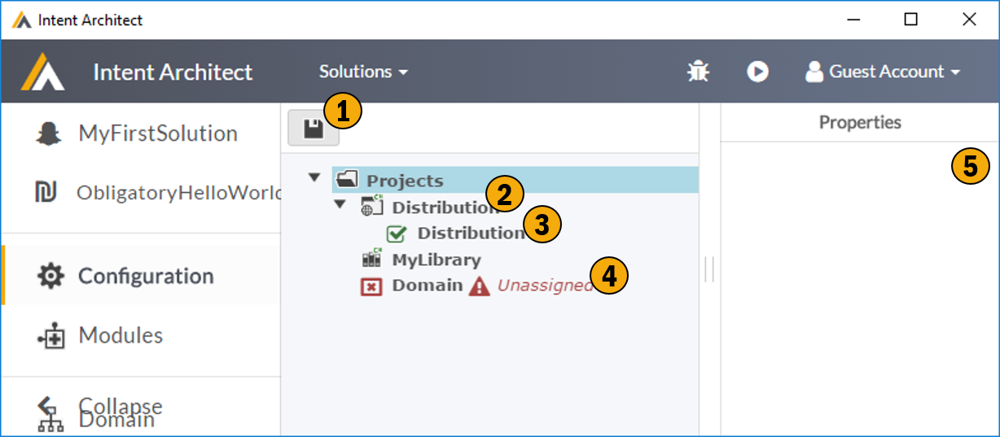

# Application Configuration

The  screen is where you configure / describe your applications code project structure.

## 1. Save
Save your changes, save the world.

## 2. Project
Add one or more projects, these projects represent the physcial code projects you are generating code for. These projects can either be created by Intent Architect or be existing projects. Projects have project types, project type are dynmic and available in Intent Architect through modules.

## 3. Assigned Roles
These are the Roles currently assigned to this specific projects. Code generating modules, typically specify which role their output should target. In this way you are essentially mapping the code generation outputs to your projects. 

## 4. Unassigned Roles
This is a list of roles, which have been registerd with Intent Architect through the modules you have added to your application, which are currently not mapped onto a project. These roles need to be mapped to a specific project.

## 5. Properties
Show the properties of the currently selected item, and typically allows them to be edited.