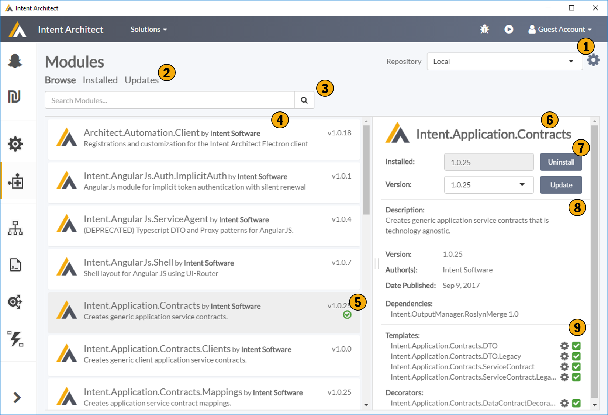

# Application Modules

This screen allows to manage which modules are applicable to your applications. These modules are typically packaged templates generating your selected patterns, but can also be other types of modules i.e. IDE Integration, Code Weavers, etc. 

## 1. Repository Configuration
This allows you to configure your repositories, i.e. where Intent Architect is discovereing your application templates and other discoverable plugins. 

## 2. Module Filter
This controls what modules you are seeing in the modules list.
- Browse - All modules availble from you currently selected repository.
- Installed - All modules installed for current application. 
- Update - All modules installed for current application which have updates available. 

## 3. Search
Finds what you looking for.

## 4. Module List
Displays a list of modules based on your current repository, filters and search input.

## 5. Module List Item
This gives an overview of a Module. This would include a name, the author, brief description and version information. If the module is currently installed for the applciation there is an icon indicating it is installed, the colour of the icon denotes additional information.

|Colour|Description|
|-|-|
|Green|You have the latested version of the module installed.|
|Blue|There is a newer version of the installed module available.|
|Red|This module is installed but Intent Architect is unable to locate module in the configured repositories.|
 
## 6. Module Details
This section contains detailed information about the module, the ability to install, update, uninstall the module, as well as the ability to configure installed modules.

## 7. Module Commands
This panel is dynamic and changes based on whether or not the module is installed. It allows for installing the module, uninstalling the module and changing the version of a currently installed module.

## 8. Module Meta Data
Provides meta data about the module including authoring information, modules dependancies, etc.

## 9. Module Configuration
This section provides technical details about the various plugins present in the modules, typically this would be the list of templates the modules contains but it can also contain other plugin types. These plugins can be enabled or disabled using the check box. These plugins can be configured through the cog.