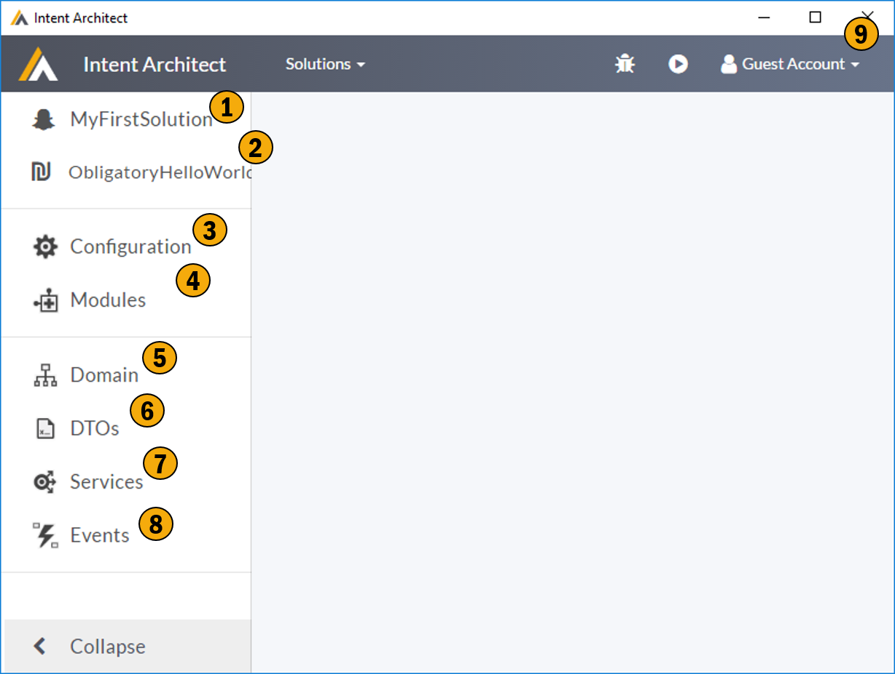

# Application Screen

The  screen is where you configure / describe your application and generate your application.

## 1. Solution
This is the solution the application belongs too.

## 2. Current Application
This drop down indicates which application you are currently working with. You can swap between the various applications within a solution using this drop down.

## 3. Configuration
This section allows you to configure how you would like your applications code to be structured. It allows you describe your code projects structures and map the code generation onto that project structure. 

## 4. Modules
This section allows you to manages your applications modules. This modules can be many things but typically are your patterns you would like applied to your Meta Data. 

## 5. Domain
This DSL allows you to describe your applications domain model using UML modeling. 

## 6. DTO
This DSL allows you to describe your applications data contracts. This DSL also supports concepts like describing your contracts with reference to your domain allowing weakly coupled integrity checking. 

## 7. Services
This DSL allows you to describe your applications services. 

## 8. Events
Not implemented yet. This DSL will allow for describing inbound and outbound application events.

## 9. Shell
All the functions in this area are described in [Shell](Shell.md).

