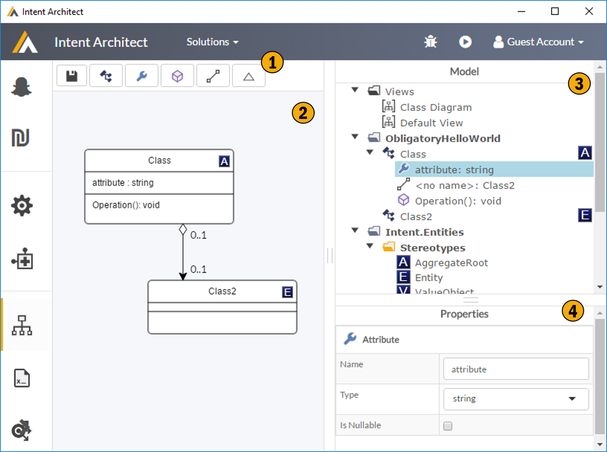
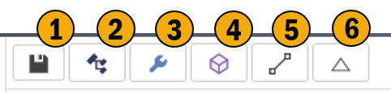
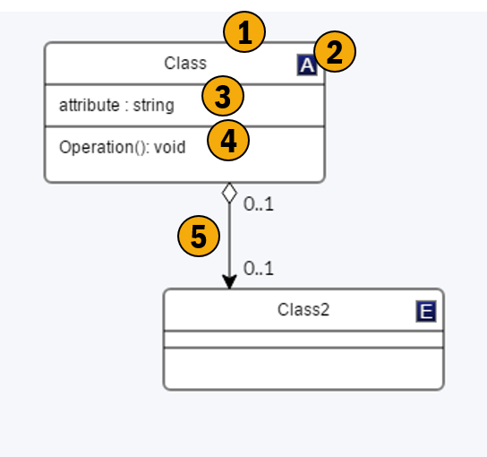
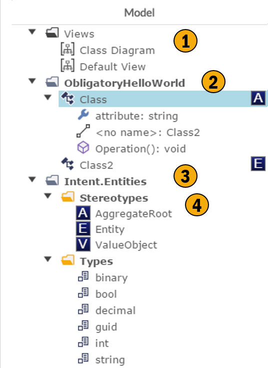
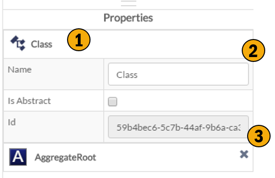

# Domain

## Overview

This screen allows to describe your business domain through the use of UML class diagrams. As with all the meta data describing DSLs this data is technology agnostic and can be extending using your own custom meta data through the stereotype system. 

### 1. Toolbar
These are the controls which allow you to perfrom high level interactions with the current UML Diagram. 

### 2. Uml Editor
This is the UML visualization of the currently selected UML diagram. The diagram as well as the unlying model can be edited in this view. 

### 3. Tree Model
This view shows the model in it's entirety :-
- Views of the domain model
- Actual domain model
- Type definitions
- Stereotypes

### 4. Properties
This is a basic property editor for the currently selected item.

## Toolbar

Allows for high level interaction with the current UML View within the UML Editor region.

### 1. Save
Saves your changed.

### 2. Add Class
Adds a new class to you current view, this class is also added to the domain model.

### 3. Add Attribute
Add an attribute to a class.

### 4. Add Operation
Add an operation to a class.

### 5. Add Association
Add an association between the two classes you select.

### 6. Add Inheritance
Add an inheritance relationship between the two classes you select.

## Uml Editor

Model you domain or a sub view of it using UML. This supports standard UML functionality as well as the concept of stereotypes which allow you to annotated any custom meta data you wish, to any aspect of the model. Note the editor has an short cut keys and context menu.

### 1. Class
A UML Class.

### 2. Stereotypes
An example of a stereotype being applied to a class, note stereotypes can be applied to any aspect of the model attributes, properties, etc.

### 3. Attributes
List of classes attributes.

### 4. Operations
List of classes operations.

### 5. Association
An association between classes.

## Tree Model

This tree view contains the entire domain model, as opposed to the UML editor which showing you a specific view of the model.

### 1. Views
These are the views of the domain model, or sub section of the domain model. This tool allows for mutliple views to be created ontop a single domain model. This allows for creating simplified views or perspective based views ontop of the unlying model.

### 2. Domain Model Artifacts
These artifacts would be the basic model i.e. the UML Classes and their properties, plus the associations between them.

### 3. Folders
This tool supports a dynamic folder structure allowing you store your domain model artifacts in a structure which makes sense to you. 

### 4. Supporting Model Artifacts
These would be the extensions to the UML model, namely custom data types, enumerations and stereotype definitions.

## Property Window

This shows, and allows for editing, the properties of the currently selected item.

### 1. Item Type
Type indicator for the selected item.

### 2. Properties
The properties of the selected item.

### 3. Stereotypes
Stereotypes which are on the currently selected item.
