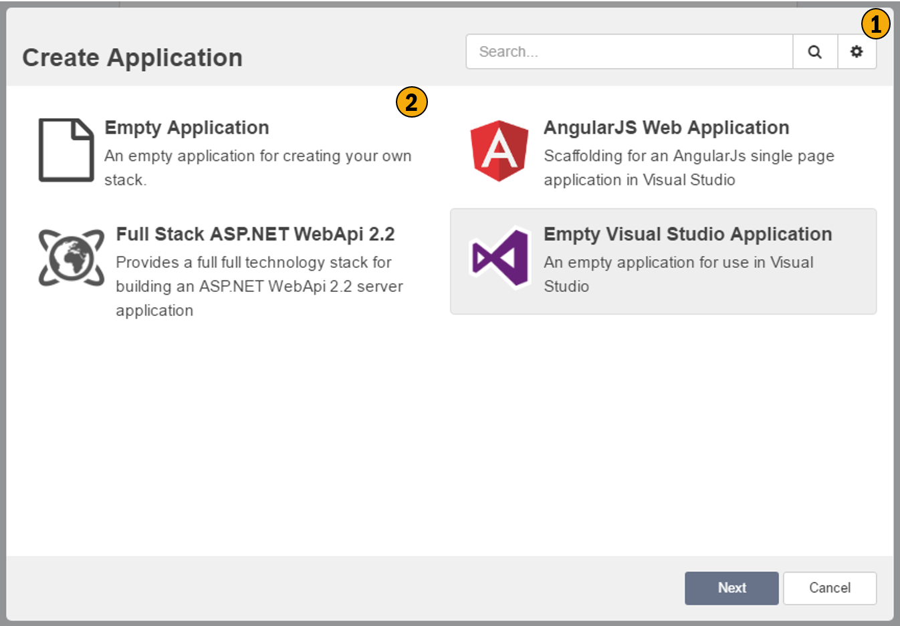

# New Application Wizard

This wizard creates new applciations with in the current solution. 

## 1. Repository Configuration
This allows you to configure your repositories, i.e. where Intent Architect is discovereing your application templates and other discoverable plugins. 

## 2. Application Templates
This is a list of application templates you can base your application on. Application templates pre-configure your application according to the template. Application Template simply initialize you application to a pre-defined state, everything the Application Template does can be done manually through the UI.

## 3. Application Template description
This section provides more detailed information about the application template and it's intentions, this information is supplied by the template's creator.

## 4. Icon Selection
Associate an Icon with you application. This icon is used purley for visual purposes within Intent Architect and is meant to make it easier to visually see which application you are working with, for users who work with  many applications.

## 5. Location
This is the folder where you would like the application and it's associated data to be stored.

## 6. Create
Will create the application based on your selections. 