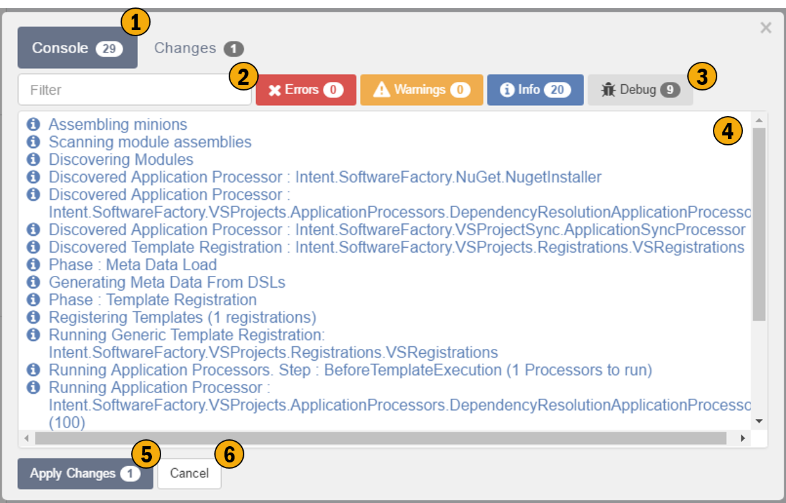
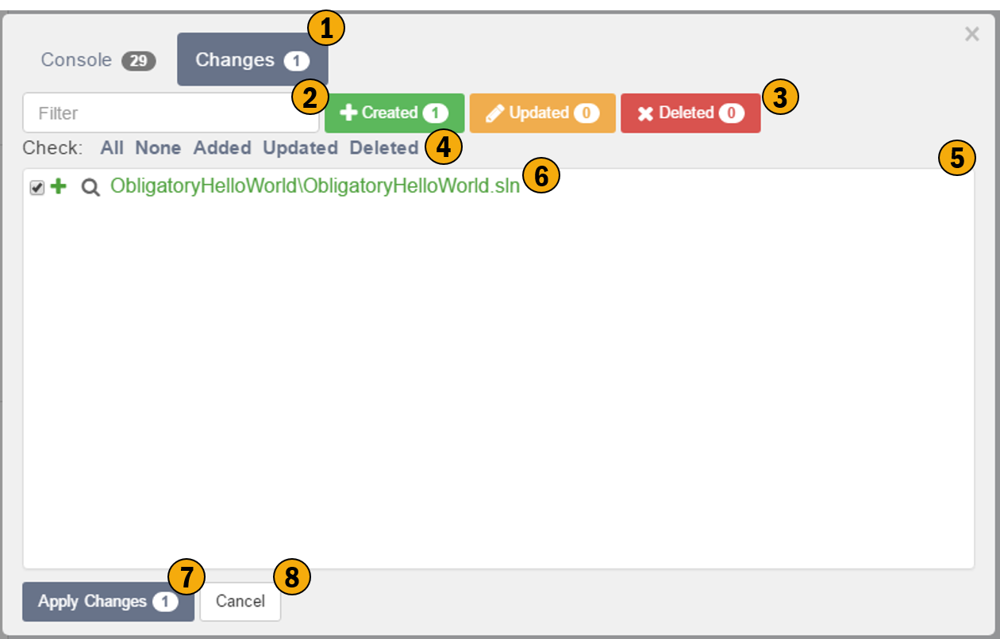

# Software Factory Execution

This screen shows the execution of the software factory, it provides detailed information about what is happening in Intent Architect's code generation process. This screen also shows the user what code changes will be made and allows for reviewing these changes.

## Console tab

### 1. Console Tab

This tab shows the details of the code generation execution process.

### 2. Search Filter
Use this search to filter the console messages.

### 3. Category Filter
These toggleable buttons allow for filtering of console messages based on their category.

### 4. Console Messages
These messages are the output from the code generation process. These can be useful for giving insight into the code generation process, should it be required.

### 5. Apply Changes
Apply changes will commit the "Checked" changes / outputs of the code generatation process, i.e. write the output to disk, this will overwrite files if they exist on the hard drive.

### 6. Cancel
This will cancel the process, no output will be written to disk, i.e. no changes will occur to your existing code base.

## Changes tab  

### 1. Changes Tab
This tab shows the details of the output from the code generation execution process.

### 2. Search Filter
Use this search to filter the changes messages.

### 3. Category Filter
These toggleable buttons allow for filtering of changes messages based on their category.

### 4. Bulk output selector
This allows for the bulk checking and unchecking of changes.

### 5. Change Messages
This is a list of all file based changes which Intent Architect would like to make.

### 6. Individual Change Message
Each line represents a file which will change. This line contains the following:-
- Check box - unchecking this box will prevent this change from occuring when clicking Apply Changes.
- Category Indicator (Created, Updated, Deleted)
- Compare Changes icon (magnifying glass)
- Name of the file which is changing. This file name is relativly pathed from the iSln file.

### 7. Apply Changes
Apply changes will commit the "Checked" changes / outputs of the code generatation process, i.e. write the output to disk, this will overwrite files if they exist on the hard drive.

### 8. Cancel
This will cancel the process, no output will be written to disk, i.e. no changes will occur to your existing code base.
