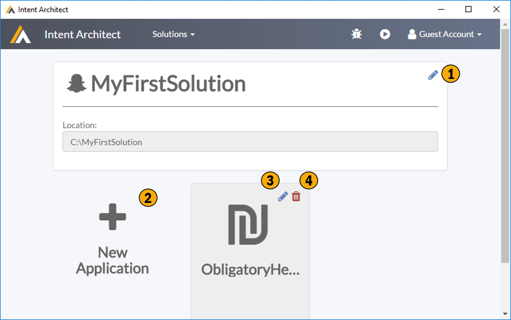

# Solution Screen

Ths screen allows for the creation / maintainenance a solution. A solution simply represents a named logical grouping of applications.

## 1. Edit Solution Details
Enough said.

## 2. Add New Applcation
Adds a new application to this solution. 

## 3. Edit Application
Edit the application

## 4. Delete Application
Delete this application