# Template Settings: capture Severity & Classification and emit them into the .imodspec

## Context

The Change Review severity/classification feature (plans `2026-08-20-deviation-severity-classification` and `2026-08-24-classification-elements-severity-levels`) already ships the **consumer** side in `Intent.IArchitect.*`: it reads `<severity>` (plain tokens `none`/`low`/`medium`/`high`) and a `<classifications>` element (semicolon-separated string) off each `.imodspec` `<template>` entry, resolves the classification names to File Classification elements, and surfaces classification pills + a severity flag on the Change Review rows. The **module-builder** side never caught up — a module author cannot set severity/classification on a template, and the generated `.imodspec` never emits those elements. Added `Severity` (Select) and `Classification` (free text) to both `Template Settings` stereotype definitions in the Module Builder designer, and wired the values through `TemplateRegistrationRequiredEvent` into `IModSpecTemplate` so each `<template>` carries them — `<severity>` as the lowercase token, `<classifications>` as a single element whose text is the raw stereotype property value (semicolon-separated; the consumer splits it).

**Worked example:** a module author opens a module's Module Builder designer, selects the `PaymentProcessor` C# Template, sets `Template Settings` → `Severity` = `3 - High`, `Classification` = `PCI scope; Auditing`. The Software Factory regenerates `Intent.MyModule.imodspec`; that template's entry gains `<severity>high</severity>` and `<classifications>PCI scope; Auditing</classifications>`. When `Intent.MyModule` is installed and `PaymentProcessor.cs` is later customised, the consumer splits on `;`, resolves each name to a File Classification element, and shows the high-severity flag — no hand-editing of the `.imodspec`.

## Approach

```mermaid
flowchart LR
  classDef changed fill:#8a6d1f,stroke:#fbbf24,color:#ffffff
  classDef existing fill:#3f4b5b,stroke:#94a3b8,color:#ffffff
  TS["Template Settings stereotype (x2)<br/>+ Severity (Select)<br/>+ Classification (text)"]:::changed --> ACC["TemplateSettings accessors"]:::changed
  ACC --> WRAP["TemplateRegistrationModel.GetSeverity()/GetClassification()<br/>(Static Content reads its accessor inline)"]:::changed
  WRAP --> IFACE["IModuleBuilderTemplate interface<br/>+ GetSeverity / GetClassification (default impl)"]:::changed
  IFACE --> EVT["TemplateRegistrationRequiredEvent<br/>+ Severity + Classification"]:::changed
  EVT --> IMOD["IModSpecTemplate<br/>emits severity + classifications element per template"]:::changed
  IMOD --> OUT[".imodspec template entry"]:::changed
```

Model-first: the two `Template Settings` stereotype definitions in the Module Builder designer gain `Severity` (Select: `0 - None`/`1 - Low`/`2 - Medium`/`3 - High`, default `0 - None`) and `Classification` (free text). The numeric prefix is there purely to control the dropdown's display order in the designer — it plays no other role. Running the Software Factory regenerates the Static Content `TemplateSettings` accessor (`StaticContentTemplateModelStereotypeExtensions`) to expose `Severity()`/`Classification()`; the C#/File/Registration `Template Settings` accessor (`TemplateRegistrationExtensions.TemplateSettings`) is **not** SF-regenerated — its generating template isn't modelled anywhere in this designer/package (unlike the Static Content one, which is produced by a generic per-property generator) — so it was hand-maintained to mirror the same shape. `TemplateRegistrationModel.GetSeverity()`/`GetClassification()` (inherited by `FileTemplateModel`, `CSharpTemplateModel`, `RazorTemplateModel`) read that accessor; Static Content has no equivalent model-level wrapper — its template partial reads `Model.GetTemplateSettings().Severity().Value`/`.Classification()` directly, matching the existing `GetRole()`/`GetDefaultLocation()` convention already used there. `IModuleBuilderTemplate` gains the two methods with **default interface implementations** (`=> null`) so any other/unknown implementer of the interface keeps compiling. `TemplateRegistrationRequiredEvent` carries `Severity`/`Classification` from both constructors; `IModSpecTemplate` emits `<severity>` (lowercased token) and `<classifications>` (single element, text = the raw `Classification` string) per `<template>`, omitting/removing both when `0 - None` or empty. The module-builder side does not split, parse, or resolve the classifications string — it passes the value through verbatim; the consumer splits on `;`.

<Callout id="severity-format" tone="decision" title="Severity: numbered Select, lowercase token, None omitted">

`Severity` is a Select with options `0 - None`/`1 - Low`/`2 - Medium`/`3 - High` (default `0 - None`) — the leading digit only orders the dropdown. The `.imodspec` emits the **plain lowercase token** (`none`/`low`/`medium`/`high`) — the format the consumer parses (strict, case-insensitive, trimmed). `0 - None` or unset → no `<severity>` element; the element is also removed on re-runs that clear the value, so the emission is idempotent.

</Callout>

<Callout id="classifications-element" tone="decision" title="Classifications: single element, raw string, no children">

`Classification` is one free-text property whose value may contain semicolons (e.g. `PCI scope; Auditing`). The `.imodspec` emits a **single** `<classifications>` element whose text content is the raw property value, passed through verbatim — **no** `<classification>` children, **no** splitting on the module-builder side. The consumer splits on `;` when it reads the element. When the property is empty, no `<classifications>` is emitted; on re-runs that clear the value, the element is removed, so the emission is idempotent. The module-builder side does not resolve classification names to elements — that is the consumer's job on install.

</Callout>

<Callout id="both-stereotypes" tone="decision" title="Both Template Settings stereotypes touched">

Both `Template Settings` definitions in the Module Builder designer are modified: the one applied to C# Template / File Template / Template Registration (`applicableToReferencedTypes`: Single File / File Per Model / Custom) and the one applied to Static Content Template. Static Content templates get the same two properties; in practice their severity/classification are usually unset → no element emitted.

</Callout>

## Model changes

<ModelChanges id="stereotype-props" caption="Module Builder designer (ModuleBuilder app) — both Template Settings stereotype definitions" changes={[
  { element: "Template Settings (C# / File / Template Registration)", designer: "Module Builder", change: "modified", note: "Applied via referenced types Single File / File Per Model / Custom.",
    fields: [
      { label: "Severity", before: "—", after: "Select: 0 - None, 1 - Low, 2 - Medium, 3 - High [default 0 - None]" },
      { label: "Classification", before: "—", after: "text (free; may contain ';'-separated values, passed through verbatim)" }
    ] },
  { element: "Template Settings (Static Content Template)", designer: "Module Builder", change: "modified", note: "Same two properties added.",
    fields: [
      { label: "Severity", before: "—", after: "Select: 0 - None, 1 - Low, 2 - Medium, 3 - High [default 0 - None]" },
      { label: "Classification", before: "—", after: "text (free; may contain ';'-separated values, passed through verbatim)" }
    ] }
]} />

No other designer model changes — the `.imodspec` `<template>` emission is code, not model. A stray `Severity` value of the old, unprefixed `"None"` (left on one element by an earlier manual test) had to be reset to `"0 - None"` after the option list changed — a reminder that renaming Select option values invalidates any element already holding the old literal.

## imodspec — before / after

<Diff id="imodspec-diff" filename="Intent.MyModule.imodspec"
  before={`<template id="Intent.MyModule.Templates.PaymentProcessor" externalReference="…">
  <role>Api</role>
  <location>Api</location>
</template>`}
  after={`<template id="Intent.MyModule.Templates.PaymentProcessor" externalReference="…">
  <role>Api</role>
  <location>Api</location>
  <severity>high</severity>
  <classifications>PCI scope; Auditing</classifications>
</template>`}
  annotations={[
    { side: "after", lines: "4", label: "severity", note: "Plain lowercase token; omitted when None/unset, removed on re-runs" },
    { side: "after", lines: "5", label: "classifications", note: "Single element, raw string passed through verbatim; omitted/removed when empty" }
  ]}
/>

## Code changes

**`Intent.ModuleBuilder`** (3.18.10 → 3.19.0, minor):
- `Api/Extensions/StaticContentTemplateModelStereotypeExtensions.cs` — SF-regenerated; adds `Severity()`/`Classification()`, a nested `SeverityOptions` class, and a `SeverityOptionsEnum` (`_0None`/`_1Low`/`_2Medium`/`_3High` — SF derives identifiers from the option text, hence the leading-digit names).
- `Api/Extensions/TemplateRegistrationExtensions.cs` — **not** SF-managed despite its `DefaultIntentManaged(Mode.Fully)` attribute (confirmed via two SF re-runs with no effect); hand-added a `SeverityOptions`/`SeverityOptionsEnum` mirroring the shape above, plus `Classification()`.
- `Api/TemplateRegistrationModel.cs` — added `GetSeverity()`/`GetClassification()` (parallel to `GetRole()`/`GetLocation()`), reading `TemplateSettings.Severity().Value` / `.Classification()`; inherited by `FileTemplateModel`, `CSharpTemplateModel`, `RazorTemplateModel`.
- `Templates/TemplateExtensions/IModuleBuilderTemplate.cs` — added `GetSeverity()`/`GetClassification()` with default implementations (`=> null`) so the interface change can't break an implementer that doesn't override them.
- `Templates/IModSpec/TemplateRegistrationRequiredEvent.cs` — added `Severity`/`Classification` props; the `(IModuleBuilderTemplate)` constructor reads `template.GetSeverity()`/`GetClassification()`; the explicit-args constructor gained required `severity`/`classification` params.
- `Templates/IModSpec/IModSpecTemplate.cs` — after `role`/`location`, emits `<severity>` via a `GetSeverityToken` helper that maps `"1 - Low"`/`"2 - Medium"`/`"3 - High"` → `low`/`medium`/`high` (anything else, including `"0 - None"`, omits/removes the element), and a `<classifications>` element with the raw `Classification` string when non-empty (omitted/removed when empty). Both idempotent on re-runs.
- `Templates/FileTemplatePartial/FileTemplatePartialTemplatePartial.cs` — passes `Model.GetSeverity()`/`Model.GetClassification()` into the explicit-args `TemplateRegistrationRequiredEvent` (File Template does not implement `IModuleBuilderTemplate`).
- `Templates/StaticContentTemplateRegistration/StaticContentTemplateRegistrationTemplatePartial.cs` — implements `IModuleBuilderTemplate.GetSeverity()`/`GetClassification()` by reading `Model.GetTemplateSettings().Severity().Value`/`.Classification()` directly (no model-level wrapper, matching the existing `GetRole()`/`GetDefaultLocation()` pattern already in this file).
- `Intent.Modules.ModuleBuilder.csproj` — `<Version>` bumped to match (wasn't tracking the designer's Module Settings version).

**`Intent.ModuleBuilder.CSharp`** (3.7.6 → 3.8.0, minor):
- `Templates/CSharpTemplatePartial/CSharpTemplatePartialTemplatePartial.cs` — implements `IModuleBuilderTemplate.GetSeverity()`/`GetClassification()` → `Model.GetSeverity()`/`GetClassification()` (inherited from `TemplateRegistrationModel`).
- `Templates/RazorTemplatePartial/RazorTemplatePartialTemplatePartial.cs` — same.
- `Intent.Modules.ModuleBuilder.CSharp.csproj` — `<Version>` bumped to match; `PackageReference`s for `Intent.Modules.ModuleBuilder` (→3.19.0), `Intent.Modules.Common` (3.7.7→3.11.1) and `Intent.SoftwareFactory.SDK` (3.7.0→3.14.0) bumped — the latter two were stale enough to trigger `NU1605` downgrade errors once `Intent.ModuleBuilder` moved.
- `Intent.ModuleBuilder.CSharp.imodspec` — `supportedClientVersions` floor raised from `4.4.0-a` to cover the bumped `Intent.SoftwareFactory.SDK`'s real floor (settled at `5.1.0-a` after the SF's own migration chain advanced it once more); `Intent.ModuleBuilder` dependency floor bumped to `3.19.0`. `Intent.ModuleBuilder`'s own `supportedClientVersions` floor moved the same way (`5.0.0-a` → `5.1.0-a`).

## Gotchas hit along the way

- **`Template Settings` (the `applicableToReferencedTypes` one) isn't visible to `find_designer_elements`/`get_designer_model_structure`** — these tools don't enumerate Stereotype-Definition objects. It's still a real, editable part of the package; address it with `lookupById(<the stereotype's id from get_designer_schema>)`, which returns a distinct API object exposing `getProperties()`/`addProperty()`.
- **Reinstalling a module at the same version number is a no-op for content.** After rebuilding `Intent.Modules.ModuleBuilder.dll` locally, `install_or_update_modules` at the same `3.19.0` did not refresh the plugin used by a self-hosting application — traced to a stale entry in the NuGet global-packages cache (`~/.nuget/packages/intent.modules.modulebuilder/3.19.0/`) that a changed local-feed `.nupkg` never invalidates. Clearing that cache folder and the app's `.intent/modules/Intent.ModuleBuilder.3.19.0` folder before reinstalling forced a fresh extraction.
- **A running Intent Architect process can keep an already-loaded module assembly resident** even after the on-disk plugin is refreshed — a second layer of staleness beyond the NuGet cache one above, only fixable by restarting the app. This blocked a fully live re-verification of the renumbered `Severity` tokens specifically (see Verification).

## Critical files / elements

- Designer `Module Builder`, both `Template Settings` stereotype definitions (C#/File/Registration and Static Content) — the model change.
- `Api/Extensions/StaticContentTemplateModelStereotypeExtensions.cs` (SF-regenerated) + `Api/Extensions/TemplateRegistrationExtensions.cs` (hand-maintained) — the two accessors.
- `Api/TemplateRegistrationModel.cs` — `GetSeverity`/`GetClassification` wrapper.
- `Templates/TemplateExtensions/IModuleBuilderTemplate.cs` — interface, with default implementations.
- `Templates/IModSpec/TemplateRegistrationRequiredEvent.cs` + `Templates/IModSpec/IModSpecTemplate.cs` — carry + emit.
- `Templates/FileTemplatePartial/...` + `Templates/StaticContentTemplateRegistration/...` + `Intent.ModuleBuilder.CSharp` `CSharpTemplatePartial` + `RazorTemplatePartial` — publishers/wiring.

## Verification

- `get_designer_validation_errors` on the Module Builder designer — clean throughout.
- `dotnet build` both `Intent.Modules.ModuleBuilder.csproj` and `Intent.Modules.ModuleBuilder.CSharp.csproj` — 0 errors (pre-existing, unrelated `CS0436`/`NU1901` warnings only).
- Ran the SF for both apps to full idempotency (zero staged changes on a clean re-run) after every round of changes.
- Inspected the regenerated `Intent.ModuleBuilder.imodspec` and `Intent.ModuleBuilder.CSharp.imodspec` via `get_file_diffs` — existing templates emit **no** `<severity>`/`<classifications>` (default/empty → omitted), confirming backward compatibility.
- End-to-end manual test on a real existing template (`TemplateExtensions`, a C# Template in `Intent.ModuleBuilder` itself, rather than a throwaway module): set `Severity = High`, `Classification = "PCI scope; Auditing"`, ran the SF, confirmed the `.imodspec` gained exactly `<severity>high</severity>` and `<classifications>PCI scope; Auditing</classifications>`; reverted both, re-ran, confirmed both elements were removed. This proved the mechanism end-to-end with the original (unprefixed) option values.
- After renumbering the `Severity` options, the same live re-test was attempted but blocked by the process-residency gotcha above (the `.imodspec` kept omitting `<severity>` for `"3 - High"` even though the on-disk `GetSeverityToken` switch was correct and `dotnet build` compiled clean) — see Follow-ups.
- Reinstalling both modules into a separate test application, and the consumer-side end-to-end resolution of classifications, were not attempted (optional per scope, depends on `Intent.Modelers.CodebaseStructure`'s own consumer-side support).

## Follow-ups

- Restart Intent Architect and re-run the manual Severity/Classification test with the numbered option values (`3 - High`, etc.) to get a live confirmation matching the one already obtained for the original values — the source is correct and builds clean, so this is a confirmation step, not expected to surface a defect.
- Optional: reinstall both modules into a throwaway test application and confirm the consumer (`Intent.IArchitect.*` Change Review) resolves `<classifications>` end-to-end.
