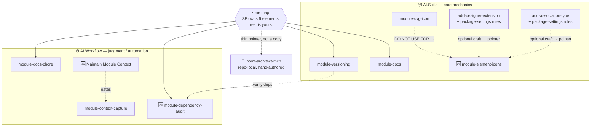

# ModuleBuilder AI modules: new capabilities + correct the `.imodspec` guidance

## TL;DR

Two workstreams:

- **A — New capabilities** (the original five asks): 1 new skill in `AI.Skills`; 1 new skill + 1 new setting in `AI.Workflow` (the skill wired in as a fourth workflow phase-4 gate); a release-notes gate; and two package-settings rules folded inline into the skills that trigger them.
- **B — Correct the `.imodspec` guidance** (found while researching A): the shipped skills are factually wrong about how `.imodspec` is written. `module-versioning` says "never hand-edit `.imodspec`" in four places; `module-docs` says "edit it directly" — and *both* are wrong, in opposite directions, because neither describes what the Software Factory actually owns.

Workstream B is the bigger and more urgent half.

---

## The governing fact (workstream B rests on this)

`IModSpecTemplate.cs` is a **read-modify-write XML merger**, not a regenerator. `TransformText()` loads the existing file (`:75-81`) and mutates named nodes. `CreateImodSpecFile()` (`:650-673`) is a first-run-only scaffold.

**The Software Factory owns six things. The rest of the file is yours, permanently.**

| Zone | Behaviour | Elements |
|---|---|---|
| 🔴 **SF-owned** — hand-edits silently lost | set unconditionally every run | `<id>`, `
`, `<description>`, `<iconUrl>`, `<migrations>` (deleted & rebuilt), `<moduleSettings>`/`<groupExtension>` bodies (`RemoveNodes()`) |
| 🟡 **Seeded once** — designer writes if absent, then yours | create-if-missing only | `<projectUrl>`, `<releaseNotes>`, `<template>/<config>` |
| 🟢 **Yours** — template never writes a value | never emitted / scaffold-only | `<tags>`, `<authors>`, `<files>`, `<interoperability>`, `<designers>`, `<designerSettings>`, `<packages>`, `<minClientVersion>`, `<owners>`, `<licenseUrl>` |
| 🔵 **Yours if unstamped** | prune loops skip entries lacking `externalReference` | hand-added `<template>`, `<decorator>`, `<factoryExtension>`, `<install>` |
| ⚫ **Special** | see below | `<version>`, `<dependency>`, `<supportedClientVersions>` |

### Where the 🔴 values actually come from

The zone map is only useful if it says where to make the change instead. This is the half the current skills get wrong.

| Element | Set it here |
|---|---|
| `
` **and** `<description>` | **Application Settings page in Intent Architect** → flows to `.application.config` root `<description>` → SF writes the *same string to both*. Not the config file by hand. |
| `<iconUrl>` | `.application.config` root `<icon>`/`<iconType>`, **by script** — the one sanctioned exception, because no settings-page field exists for it (`module-svg-icon`) |
| `<version>` | Module Builder designer → `Module Settings` → `Version` |
| `<id>` | The Module Builder package name |
| `<migrations>`, `<moduleSettings>` | Modelled elements — regenerated wholesale |

**`<version>`** — written only when the designer value is *strictly greater* (`:87-92`). Upward hand-edits are overwritten; **downward hand-edits stick**. That asymmetry *is* the downgrade guard.

**`<dependency>`** — added if absent, **never pruned**. Hand-added dependencies survive indefinitely. Version bumps governed by the `DependencyVersionOverwriteBehavior` setting.

**`<supportedClientVersions>`** — scaffolded once, then advanced automatically by a `.Replace()` ladder (`:94-112`) as the client SDK moves forward. **Leave it alone.** The ladder rewriting an older range to a newer one is the mechanism working as intended, not drift. The only trigger for looking at this field is an SF run actually complaining about client-version compatibility — so **no new skill should teach auditing it**, and `module-dependency-audit` explicitly stays out of it.

### `.application.config` — the companion rule

Confirmed: **the Application Settings page is the authoring surface**, not the file. That validates `module-svg-icon`'s previously-unsourced *"normally off-limits to hand-editing"* premise and makes the icon a *genuine* narrow exception — the icon has no settings-page field, the description does.

---

## Workstream B — the defects

### B1. Mis-scoped absolutes → **revise**

`module-versioning` states "never by hand-editing `.imodspec`" unqualified at `SKILL.md:3` (frontmatter), `:22`, and `:46` (checklist). For 🟢 and 🔵 fields there is no rule to be exempt from — the SF never writes them. The blanket prohibition misdescribes the file and is contradicted by three other shipped skills.

**Fix:** invert it. State what the SF owns (six elements) and where to set each instead, not what you may not touch.

### B2. Instructions that are futile → **revise**

| Where | Says | Reality |
|---|---|---|
| `module-docs:140` | *"Edit the `*.imodspec` file in the module directory directly."* | Futile for `
`/`<description>` — both clobbered every run. Git proves it: a hand-written `<description>` was added in `7cf806179` and **silently reverted** in `70c27b2ce`, while `<tags>`/`<authors>` from the same commit survived to HEAD. |
| `module-docs:168` | *"`<description>` … Only expand (max 2 sentences) if the module is complex enough."* | **Structurally impossible.** `IModSpecTemplate.cs:114-118` writes *one string to both fields*. A description differing from the summary cannot survive regeneration. This is the branch that licensed the bad Wolverine description. |
| `module-docs-chore:187-192` | *"replace generic filler in a summary or description"* | Correct trigger, but **names no file** — so the agent defaults to the futile `.imodspec` edit. |

**One string, two jobs.** Because the same value fills `
` and `<description>`, concision isn't a style preference to enforce by exhortation — there is no long-form field to expand into. The corrected guidance should say so plainly and drop the escape hatch. Worked example of the failure mode:

| | |
|---|---|
| ❌ | *"Owns the single, shared `builder.Host.UseWolverine(...)` registration for an application's ASP.NET host, so multiple Wolverine-based modules can contribute to it without overwriting or stranding each other's handlers."* |
| ✅ | *"Shared Wolverine host registration for ASP.NET applications."* |

The rejected text isn't worthless — it's **`CONTEXT.md` material** (the why, the invariant) that leaked into a shop-window field. Say where it belongs rather than just banning it.

### B3. Factual errors → **revise**

The same wrong belief in two places: that `<description>` is model-owned.

- `module-versioning:13` — *"`<version>` (and `<description>`) are generated FROM the model on every Software Factory run."* Wrong twice over: `<description>` comes from the application settings, not the model; and `<version>` is conditional, not every-run.
- `AI.Skills/CONTEXT.md:9` — *"unlike `Version`/`Description` which the model does own."* False for Description.

### B4. Genuine exemptions → **keep, and stop contradicting them**

| Exemption | Why it's real |
|---|---|
| **Version downgrade** — hand-edit the `<version>` line | No setting, no override, no event hook exists. Already documented at `module-version-increment:153-161`; `module-versioning` currently contradicts it flatly. |
| `.application.config` root `<icon>`/`<iconType>`, by script | **Now confirmed:** the description has a settings-page field, the icon does not. That asymmetry is exactly what makes this a narrow exception rather than a loophole. `module-svg-icon`'s wording is the pattern to copy. |
| `.csproj` bump on NU1605 | Already documented at `add-module-migration:75`. |

### B5. Resolved by your answers

- **Unstamped entries (🔵)** → *sanctioned but discouraged*. Document that they survive and why; designer element first, unstamped entry only when no element type fits.
- **`modules.config`** → **never hand-edit**; manage via Intent (install/update). `intent-architect-mcp:176` is right. `intent-modelers-integration` Must #2 is wrong to imply hand-authoring. `.imodspec` `<dependency>` *is* adjustable by hand when appropriate — consistent with never-pruned behaviour.
- **Installation Settings, when installing a designer module into a module-building application** — tick **`Install Designer Metadata` only**. See below; this is the concrete "install it via Intent" instruction that replaces the hand-edit.

#### The metadata-only install rule

A module-building application references a designer module so its **element types become visible to model against**. It is not running that designer's generation. So of the five Installation Settings:

| Setting | For a module-building app |
|---|---|
| **Install Designer Metadata** | ✅ **the one to tick** |
| **Install Designers** | ⚠️ rare — only if the needed element types still do not appear with metadata alone |
| Enable Factory Extensions | ❌ |
| Install Application Settings | ❌ |
| Install Template Outputs | ❌ |

Ticking the last three pulls the referenced module's factory extensions, settings and template output into an application whose only job is to *define* a module. That is how a module-builder app starts generating code it never asked for.

This is the UI face of `includeAssets="none"` in `modules.config`, and it corroborates a rule already shipped at `intent-architect-mcp:214` — *"Install metadata-only by default; install the designer too if the needed types still don't appear."* `intent-modelers-integration` currently states the `modules.config` attribute without ever saying which boxes produce it.

### B6. `intent-architect-mcp` — the repo-local rules index

`E:\Intent.Modules\.agents\skills\intent-architect-mcp\SKILL.md` is **hand-authored, not module-generated** (no `TemplatePartial.cs`, no `template-id`/`contentHash` frontmatter). Edited directly — no version bump, no SF run, no propagation to consumers.

It describes itself at `:40` as *"the index plus the gotchas those skills don't cover"* — precisely what the zone map is.

**Keep verbatim:**

| Line | Rule | Why it stands |
|---|---|---|
| `:15` | *"Never edit generated files directly **when the same change can be modelled**."* | The correctly-qualified formulation. **The sentence the whole zone map should hang off** — the test is "can it be modelled?", not "is it generated?" |
| `:176` | *"Never hand-edit `modules.config`"* | Confirmed correct. |
| `:34` | *"…under an `intent`/`.intent` metadata folder."* | Scoped **by folder, not extension** — so it never covered `.application.config` or `.imodspec` (both at module root). The two rules were talking past each other, not disagreeing. |
| `:196`, `:214` | `NugetPackages.cs`, `pkg.config` | Accurate. |

**Change:**

| # | Line | Defect | Fix |
|---|---|---|---|
| 1 | `:208-210` | *"Never hand-author them"* (absolute). | The failure-mode explanation is excellent — keep it. But it conflates hand-writing a `<template>` entry to paper over a missing `C# Template` element (genuinely bad, and what the quoted SF error describes) with a `<factoryExtension>` that has no designer element type — which `Intent.Common.imodspec:14-18` does today and the prune loop deliberately preserves. Add the sanctioned-but-discouraged carve-out. |
| 2 | — | The merge fact is absent. | Add one line — SF owns six elements, rest is yours — pointing at `module-versioning` for the full map rather than duplicating it. |
| 3 | — | `.application.config` has no rule here. | **Now resolvable:** state it — the file is off-limits; the Application Settings page is the authoring surface; the scripted root `<icon>`/`<iconType>` pair is the one exception. |

**Division of labour:** the generated skills carry the zone map (they ship to consumers); this local file stays thin and points at them.

---

## Workstream A — new capabilities

| Ask | Verdict | Lands as |
|---|---|---|
| Tick **Include in Module** | ✅ real gap | **no new skill** — rule folded into `add-designer-extension`, `add-association-type`, `module-building-strategies` |
| Set **Reference in Designer** | ✅ real gap (same stereotype) | same — folded into `add-designer-extension`, `add-association-type` |
| **Release notes** | ⚠️ re-scoped — see below | gate `module-docs-chore` on `Include Release Notes` |
| Icons on **stereotypes / element types** | ✅ real gap | `module-element-icons` — **AI.Skills** |
| **Dependencies** in `.imodspec` | ⚠️ premise corrected | `module-dependency-audit` — **AI.Workflow**, wired into Phase 4 close-out |
| *(added)* control context capture | new | `Maintain Module Context` setting — **AI.Workflow** |

> **Re-scoped on a closer reading of your answer.** You said the AI should *"perform a check on the Module Settings before worrying about maintaining it — if the user wants this to happen of course."* `Module Settings` carries an **`Include Release Notes`** checkbox (property `2e0e1191-…`) that is exactly that expression of intent — it already drives whether `<releaseNotes>release-notes.md</releaseNotes>` is written. Today `module-docs-chore` decides purely on whether the file exists on disk and never consults the flag. **Fix: gate release-notes maintenance on `Include Release Notes`.** Flagging because it's a firmer reading than my first pass, which folded it vaguely into the package-settings work — itself since distributed into its trigger points.

### Package settings — **no new skill; two rules folded into their trigger points**

These are **obligations, not craft**. If you skip them the thing is simply broken, and the moment that creates the obligation is the moment you introduce a stereotype or a designer element. A separate skill would have to be *remembered and loaded* precisely when the agent is busy doing something else — so the rule goes where the trigger already is.

| Rule | Fires when | Lands in |
|---|---|---|
| `Include in Module` = true | a **stereotype** is introduced in a package — otherwise the package's files never reach the `<install>` entry and the stereotype ships nowhere | `add-designer-extension`, `add-association-type`, `module-building-strategies` (§3, at the setting-vs-stereotype decision) |
| `Reference in Designer` = target designer(s), or `Reference in` = All Designers | a **new or extension designer element** is introduced — drives `<install target=…>` so the element lands in the right designer | `add-designer-extension`, `add-association-type` |

Both those skills already wire `Designer Settings → Extend Designers`, which is the *extension-level* half of designer targeting. The package-level half has been the missing companion step all along — so this is completing an existing procedure rather than bolting on a new one.

The Software Factory already warns when a package has Stereotype Definitions but isn't included. The rule front-runs that warning instead of waiting for it.

`Include Release Notes` no longer needs a home here — it is a preference, and the behaviour it gates lives entirely in `module-docs-chore`.

> **The principle, worth recording in `CONTEXT.md`:** an **obligation** goes inline at its trigger point; a **craft** gets its own skill. `module-element-icons` stays separate because setting an icon is optional and there is a *how* worth teaching — exactly why `module-svg-icon` is its own skill. Package settings have no craft to them; they are a checkbox you must not forget.

**`module-element-icons`** — stereotype icons (`<icon type=… source=…/>` + `displayIcon`/`displayIconFunction` on the definition root) and element-type icons (`Icon`/`Expanded Icon`/`Icon Function` via the `Settings` stereotype on `Element Settings`/`Core Type`). Explicitly excludes the package icon. Gets a *pointer* from `add-designer-extension`/`add-association-type` — optional craft, so a pointer rather than an inline rule.

**`module-dependency-audit`** — **a Phase 4 close-out check, not opt-in.** Cross-check the module's real package/type references against the generated `<dependencies>`; fix at source where possible; hand-add to `.imodspec` when appropriate (safe — never pruned). Never touch `modules.config`. Stays out of `supportedClientVersions`.

Why it has to be part of the process rather than something you remember to ask for: **a missing `.imodspec` dependency compiles perfectly and fails at install**, in a consumer you cannot see. That is precisely the failure class `module-building-workflow`'s own "Compiling is not working" rule exists to catch — a green build is not evidence here, so nothing in Phase 3 will surface it. It needs its own gate.

This makes it the **fourth workflow skill**, which means `module-building-workflow.instructions.md` changes too:

| Skill | Phase |
|---|---|
| `module-context-capture` | 1 (read) and 4 (write) |
| `module-version-increment` | 2 (increment up front) and 4 (confirm) |
| `module-docs-chore` | 3 and 4 |
| **`module-dependency-audit`** | **4 (verify)** |

Placed **second in Phase 4's ordered list — after Version, before Documentation**. Version stays first because documentation refers to it; dependencies come next because if the audit finds and fixes something, that *is* an observable change, and the documentation step immediately after must describe it. Landing it after Documentation would leave the fix undocumented.

Cost is proportionate: when a change introduces no new cross-module reference, the check is a quick confirmation, in the same way the docs step is cheap when nothing observable changed.

**`Maintain Module Context`** — Switch, default `false`. Off = today's behaviour (only maintain an existing `CONTEXT.md`). On = also create one when missing. Modelled exactly like `Maintain Module README`/`Maintain Module Icon`.

---

## Changes by file

**AI.Skills** *(Minor bump)*

| File | Change |
|---|---|
| `Templates/Skills/ModuleElementIcons_SkillMd_Agents/…Partial.cs` | 🆕 new skill (the only one in this module) |
| `…/ModuleVersioning_SkillMd_Agents/…Partial.cs` | **B1+B3+B4** — invert to the zone map + "set it here" table; fix the Core Trap's two errors; acknowledge the downgrade exemption |
| `…/ModuleDocs_SkillMd_Agents/…Partial.cs` | **B2** — route `
`/`<description>` to the Application Settings page; delete the "expand to 2 sentences" branch; add the one-string-two-jobs rule + worked example; mark `<tags>`/`<authors>` hand-owned |
| `…/ModuleSvgIcon_SkillMd_Agents/…Partial.cs` | cross-ref → `module-element-icons`; its "off-limits" premise is now sourced |
| `…/AddDesignerExtension_…`, `…/AddAssociationType_…` | **both package-settings rules inline**, as the companion step to the `Extend Designers` wiring they already do; plus a pointer → `module-element-icons` |
| `…/ModuleBuildingStrategies_…Partial.cs` | the `Include in Module` rule at §3's setting-vs-stereotype decision point |
| `CONTEXT.md` | **B3** — correct the "Description is model-owned" line |

**AI.Workflow** *(Minor bump)*

| File | Change |
|---|---|
| `Templates/Skills/ModuleDependencyAudit_SkillMd_Agents/…Partial.cs` | 🆕 new skill |
| `…/ModuleDocsChore_SkillMd_Agents/…Partial.cs` | **B2** — name the Application Settings page as the surface for summary/description; **gate release-notes maintenance on `Include Release Notes`** |
| `…/ModuleContextCapture_SkillMd_Agents/…Partial.cs` | gate "create if missing" on `MaintainModuleContext()` |
| `Templates/RootPrinciples/ModuleBuildingWorkflowMd/…Partial.cs` | **add `module-dependency-audit` as the fourth workflow skill** — phase table, Phase 4 ordered list (position 2), and the exit checklist |
| `AI Workflow Settings__jl2lkjdh.xml` | 🆕 `Maintain Module Context` field (modelled) |
| `Settings/ModuleSettingsExtensions.cs` | regenerated → `MaintainModuleContext()` |

**AI.Modelers** *(Patch bump)*

| File | Change |
|---|---|
| `…/IntentModelersIntegration_SkillMd_Agents/…Partial.cs` | **B5** — Must #2 must not imply hand-authoring `modules.config`; install via Intent with **`Install Designer Metadata` only** (rarely also `Install Designers`; never Factory Extensions / Application Settings / Template Outputs), which is what yields `includeAssets="none"` |

**Repo-local, hand-authored — no SF run, no version bump**

| File | Change |
|---|---|
| `.agents/skills/intent-architect-mcp/SKILL.md` | **B6** — carve-out at `:208-210`; add the merge fact + pointer; state the `.application.config` rule |

Each module's `.imodspec` / `managed-files.xml` are SF-updated, never hand-edited.

---

---

## Editing hazards — these govern most of this plan's edits

Recorded from real incidents (and already in `AI.Skills`/`AI.Modelers` `CONTEXT.md`). Workstream B edits **six existing `TemplatePartial.cs` markdown raw strings**, so these apply to nearly every step here, not just the new skills.

| Hazard | Consequence |
|---|---|
| **Never use Intent's `patch_file` on a `TemplatePartial.cs` markdown raw string** | Re-indents the *entire* string to the constructor's nesting level and flattens indentation inside every fenced sample. Damage is whole-file and **silent** - it reports success. Use `write_file` (full-content overwrite) or a plain text editor. |
| **The closing `""""""` delimiter's indentation is load-bearing** | At column 0 it compiles and packages perfectly while generating an effectively empty document. **Check file size, not existence.** |
| **A stray `---` toggles frontmatter mode** and truncates the file | Use `===` for horizontal rules, as the existing resource files do. |
| **`description` must be one physical line** | The flat parser silently empties a multi-line value. |

Always `get_file_diffs` and **read it** before `apply_staged_file_changes` on these templates.

---

## Steps

| # | Step |
|---|---|
| 1 | Bump versions — Minor for `AI.Skills` and `AI.Workflow`, Patch for `AI.Modelers` |
| 2 | **Workstream B first** — it corrects guidance the new skills reference. Zone map + "set it here" into `module-versioning`; fix `module-docs`, `module-docs-chore`, `intent-modelers-integration`, `AI.Skills/CONTEXT.md` |
| 3 | Model the **2** new File Templates + the `Maintain Module Context` field; run SF to scaffold and regenerate `ModuleSettingsExtensions.cs` |
| 4 | Author `module-element-icons` and `module-dependency-audit` |
| 4b | Wire `module-dependency-audit` into `module-building-workflow.instructions.md` — phase table, Phase 4 step 2, exit checklist |
| 5 | Gate `module-context-capture` on `MaintainModuleContext()`; gate release notes on `Include Release Notes` |
| 6 | **Fold the package-settings rules inline** into `add-designer-extension`, `add-association-type` and `module-building-strategies`; cross-reference edits across `module-svg-icon` and `module-versioning` |
| 7 | Update `intent-architect-mcp` **last**, so it points at settled wording |
| 8 | Record rationale in `AI.Skills` + `AI.Workflow` `CONTEXT.md` — the zone map, why package settings are trigger rules rather than an audit, why the dependency audit is a close-out gate rather than opt-in, why the setting defaults off, and the metadata-only install rule |
| 9 | Release notes for all three modules; confirm all three bumps landed |

## Verification

- [ ] SF run on all three modules; the **2** new `SKILL.md` files render under `.agents/skills/` and mirror to `Tests/ModuleBuilderSkills/`
- [ ] The package-settings rules appear **inline** in `add-designer-extension` / `add-association-type` alongside their existing `Extend Designers` step — not as a "see also"
- [ ] **No skill says "never hand-edit `.imodspec`" unqualified**; every `
`/`<description>` mention points at the Application Settings page
- [ ] The "expand description to 2 sentences" branch is gone
- [ ] Release-notes maintenance consults `Include Release Notes`
- [ ] `intent-modelers-integration` names the **Installation Settings** boxes, not just the `includeAssets` attribute — metadata-only by default
- [ ] `module-building-workflow` lists **four** workflow skills; Phase 4 runs Version → **Dependencies** → Documentation → Context, and the exit checklist has a dependency line
- [ ] `MaintainModuleContext()` generates; **off-state output byte-identical to today's**
- [ ] Cross-reference edits produce small non-destructive diffs
- [ ] All three bumps + release-notes entries landed
- [ ] `intent-architect-mcp` contradicts nothing the modules now ship

## Open questions resolved

| Q | A |
|---|---|
| Release-notes automation? | `module-docs-chore` already maintains the file — but should first **check `Module Settings → Include Release Notes`**. |
| "dependencies and interrupts in the imodspec"? | No `<imports>` element exists; `<dependencies>` is SF-computed but the heuristic misses real deps in custom modules → `module-dependency-audit`. |
| Which module owns the audit? | `AI.Workflow` — judgment, not mechanics. |
| Is the audit opt-in? | **No.** A missing dependency compiles and fails at install, so a green build proves nothing — it becomes a Phase 4 close-out gate, second after Version. |
| Control context capture? | Yes — `Maintain Module Context`, default off. |
| Unstamped `.imodspec` entries? | Sanctioned but discouraged — designer element first. |
| `modules.config`? | Never hand-edit — manage via Intent. Adjust `.imodspec` `<dependency>` instead when appropriate. |
| Which Installation Settings for a module-building app? | **`Install Designer Metadata` only.** `Install Designers` rarely; never Factory Extensions / Application Settings / Template Outputs. |
| How is the description authored? | **Application Settings page.** Not `.application.config` by hand — which also sources `module-svg-icon`'s "off-limits" premise and confirms the icon as a genuine narrow exception. |
