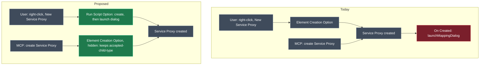

# Move `Service Proxy` creation off `On Created` onto a context-menu script

## Context

Creating a `Service Proxy` in the Services designer currently fires an `On Created` element event handler whose entire body is `element.launchMappingDialog(...)`. That is fine when a human clicks the menu item — the Service Reference mapping dialog opens and they pick the service to proxy. It breaks when the element is created programmatically, because the MCP creates elements directly and a modal mapping dialog has no user to answer it.

`Intent.Metadata.RDBMS` already hit and solved this for `Index`. Its `On Created` script was removed; the dialog now lives in an `Add Index` **Run Script Option** on the `Class` context menu, and the original `New Index` Element Creation Option was kept but hidden (`Is Option Visible Function` returning `false`) purely so `Index` stays an accepted child type. The MCP does not invoke context-menu items, so the dialog is now reachable only from a real user action.

This plan applies that same, already-proven pattern to `Service Proxy` in `Intent.Modelers.Types.ServiceProxies`.

## What the user does, what the system does back

A developer right-clicks a folder in the Services designer and picks **New Service Proxy** — same label, same `ctrl + shift + p` shortcut, same icon as today. A `Service Proxy` named `Service` is created and the Service Reference mapping dialog opens immediately. They pick `InvoicingService`; `On Mapped` renames the proxy to `InvoicingService` and trims the `Command`/`Query` suffixes off its operations. Nothing about the human experience changes.

The AI modelling agent, meanwhile, asks the MCP to create a `Service Proxy` under that same folder. The element is created, no dialog appears, and the agent goes on to set the mapping itself.

## Approach

Three moves, all in the Module Builder model of `Modelers.Types.ServiceProxies`:

1. Delete the `On Created` handler on `Service Proxy` — the dialog launch is the whole body, so nothing else is lost.
2. Add a `New Service Proxy` **Run Script Option** to each of the three context menus that offer proxy creation today. Its script creates the element and then launches the same mapping projection, `Service Reference`, that `On Created` launched.
3. Keep the three existing `New Service Proxy` Element Creation Options but hide them, so `Service Proxy` remains an accepted child type of `Folder`, `Services Package` and `Service Proxies Package` — which is what keeps MCP-driven creation working at all.



Colour key: green = new or changed, red = removed, grey = unchanged.

### Decision: the creation options are hidden, not deleted

Deleting them is the tempting simplification and it is wrong. An Element Creation Option is what registers `Service Proxy` as a legal child of `Folder` / `Services Package` / `Service Proxies Package`; a Run Script Option registers nothing. Delete them and the MCP loses the ability to create a proxy at all — the exact opposite of the goal. `Intent.Metadata.RDBMS` labels its equivalent hidden option "a temporary hack to make the `Index` an accepted Child type for the Extension"; the same comment should go on these.

## The script

One script, used verbatim in all three Run Script Options.

```javascript
let proxy = createElement("Service Proxy", "Service", element.id);

try {
    await proxy.launchMappingDialog("df491bea-8a85-4bc9-a93d-41b7abb80ffb");
} catch (err) {
    if (proxy.getMapping() == null) {
        proxy.delete();
    }
}
```

- **Name it `Service`.** `On Mapped` renames a proxy whose name is `Service` or `NewServiceProxy` after the mapped service. Two of the three menus already default to `Service`; the third defaulted to `NewServiceProxy`, so this makes the three consistent.
- **`df491bea-8a85-4bc9-a93d-41b7abb80ffb`** is the `Service Reference` Mapping Projection Settings on `Service Proxy` — the identical id `On Created` passes today.
- **Cancellation cleanup.** `Add Index` checks `getChildren().length === 0`; for a proxy the mapping lives on the element itself, and a proxy legitimately mapped to a service with no HTTP endpoints has no children — so test the mapping, not the child count.

### Tradeoff: a second proxy in the same folder may collide on the name `Service`

`Service Proxy` has `Name Must Be Unique = true`. The Element Creation Option path let Intent Architect resolve a duplicate default name; a raw `createElement` call may not. Creating two proxies back-to-back in the same folder is therefore an explicit verification step below. If it does collide, the fix is local to the script — suffix the name until it is free — not a change to the approach. `Add Index` carries the same latent issue with `IX_` plus the class name and has shipped with it.

### Tradeoff: the keyboard shortcut moves with the menu item

`ctrl + shift + p` currently sits on the Element Creation Options. Two of the three are about to become invisible, and it is not established whether a hidden option's shortcut still fires. The shortcut moves to the Run Script Options and is cleared from the hidden creation options, so exactly one handler owns it.

## Model changes

Designer **Module Builder**, application **Modelers.Types.ServiceProxies**, package `Intent.Modelers.Types.ServiceProxies`.

| Element | Change |
| --- | --- |
| `Service Proxy` → `[events]` → `On Created` | **Removed.** Body is only `element.launchMappingDialog(...)`. `On Mapped` on the same element is untouched. |
| `Service Proxy Types` → `Folder Extensions` → `[context menu]` → `New Service Proxy` | **Added** Run Script Option (Inline Script), `Shortcut = ctrl + shift + p`, icon = the same value already on `Service Proxy`'s `Settings.Icon` |
| `Service Proxy Types` → `Folder Extensions` → `[context menu]` → existing `New Service Proxy` creation option | **Modified.** Renamed to `Service Proxy (type registration)`, `Is Option Visible Function` = `return false;`, `Shortcut` cleared |
| `Service Proxy Types` → `Services Package Extension` → `[context menu]` → `New Service Proxy` | **Added** Run Script Option — same script, shortcut, icon |
| `Service Proxy Types` → `Services Package Extension` → `[context menu]` → existing creation option | **Modified.** Retained, hidden, renamed, shortcut cleared |
| `Service Proxy Services Extension` → `Service Proxies Package` → `[context menu]` → `New Service Proxy` | **Added** Run Script Option — must still read adjacent to `New Folder`, which sits at `Type Order` 0 |
| `Service Proxy Services Extension` → `Service Proxies Package` → `[context menu]` → existing creation option | **Modified.** Retained, hidden, renamed, shortcut cleared |
| `Intent.Modelers.Types.ServiceProxies` module package, `Module Settings` | **Modified.** `Version` and `NuGet Package Version` `5.5.5` → `5.5.6-pre.0` |

The three creation sites, and what each is attached to:

| Context menu owner | Type | Today's default name | Notes |
| --- | --- | --- | --- |
| `Service Proxy Types` / `Folder Extensions` | Element Extension on `Folder` | `Service` | Right-click a folder in the Services designer |
| `Service Proxy Types` / `Services Package Extension` | Package Extension on `Services Package` | `Service` | Right-click the Services package root |
| `Service Proxy Services Extension` / `Service Proxies Package` | Package Settings (own package type) | `NewServiceProxy` | The standalone Service Proxies package; also owns `New Folder` |

### Tradeoff: Run Script Options and Element Creation Options may not share one ordering space

`New Folder` in the `Service Proxies Package` menu uses `Type Order` (an Element Creation Option setting); a Run Script Option orders by `Order` and can be placed in a `Menu Group`. Whether the two interleave is not something the designer schema settles, so the `Menu Group` / `Order` values need to be set by looking at the rendered menu, not derived on paper. `Add Index` set neither and simply accepted where it landed.

## Code changes

None hand-written. The two `.designer.settings` files under `modelers/` and the `.imodspec` are Software Factory output of the Module Builder model above; `release-notes.md` is the only file edited by hand.

| File | Change |
| --- | --- |
| `Modules/Intent.Modules.Modelers.Types.ServiceProxies/modelers/Service Proxy Types.designer.settings` | Generated — `On Created` removed, two Run Script Options added, two creation options hidden |
| `Modules/Intent.Modules.Modelers.Types.ServiceProxies/modelers/Service Proxy Services Extension.designer.settings` | Generated — one Run Script Option added, one creation option hidden |
| `Modules/Intent.Modules.Modelers.Types.ServiceProxies/Intent.Modelers.Types.ServiceProxies.imodspec` | Generated — version `5.5.6-pre.0` |
| `Modules/Intent.Modules.Modelers.Types.ServiceProxies/release-notes.md` | Hand-edited — new `### Version 5.5.6-pre.0` section at the top |

## Steps

1. **Bump the version first** — set `Module Settings.Version` and `NuGet Package Version` on the `Intent.Modelers.Types.ServiceProxies` module package to `5.5.6-pre.0`, before touching anything else (per `module-version-increment`).

2. **Remove the `On Created` handler** on `Service Proxy` (`Service Proxy Types` designer settings). Leave `On Mapped` and the `Service Reference` mapping projection alone — the projection id is what the new script calls.

3. **Add the three Run Script Options** — one per context menu in the table above, each an `Inline Script` named `New Service Proxy`, carrying the script above, `Shortcut = ctrl + shift + p`, and the same icon value already on `Service Proxy`'s `Settings.Icon` so the menu entry looks unchanged. Batch as one `run_designer_script` per designer settings element rather than one call per option.

4. **Hide and rename the three existing Element Creation Options** — `Is Option Visible Function` = `return false;`, name changed to `Service Proxy (type registration)`, `Shortcut` cleared, and a comment mirroring the RDBMS wording explaining they exist only to keep `Service Proxy` an accepted child type.

5. **Set `Menu Group` / `Order`** on the `Service Proxies Package` Run Script Option so `New Service Proxy` still reads adjacent to `New Folder`; confirm against the rendered menu.

6. **Run the Software Factory** for `Modelers.Types.ServiceProxies`, review the diffs (the two `.designer.settings` files plus the `.imodspec`), and apply.

7. **Add the release-notes entry** (`module-docs-chore`) — a `Fixed:` line stating that proxy creation no longer opens the mapping dialog from an `On Created` script, so programmatic creation works, and that the dialog is now launched by the `New Service Proxy` context-menu option.

8. **Check the three dependent modules** — `Intent.Modelers.ServiceProxies`, `Intent.Modelers.Services.ProxyInteractions`, `Intent.Modelers.UI.ServiceProxies` all declare a dependency on this module. No consumed API surface changes here, so the expectation is no propagation; confirm rather than assume (`module-dependency-audit`, `module-version-increment` close-out).

## Deliberately out of scope

- **No module migration.** The change is entirely within this module's own designer settings; no consumer's persisted metadata shape moves, and existing `Service Proxy` elements in consuming applications are untouched.
- **No change to `On Mapped`, the `Service Reference` mapping projection, or the `Service Proxy Extension` parameter-sync script.** The dialog moves; what the dialog does is unchanged.
- **No audit of other `On Created` dialog launches** in other modules. `Intent.Modelers.Services.DomainInteractions` also calls `launchMappingDialog`, but whether it has the same MCP problem is a separate question and a separate module.

## Critical elements

- `Intent.Modelers.Types.ServiceProxies/designers/Service Proxy Types/Service Proxy` — owns the `On Created` handler being removed and the `Service Reference` mapping projection the new script targets.
- `Intent.Modelers.Types.ServiceProxies/designers/Service Proxy Types/Folder Extensions` — folder context menu.
- `Intent.Modelers.Types.ServiceProxies/designers/Service Proxy Types/Services Package Extension` — Services package root context menu.
- `Intent.Modelers.Types.ServiceProxies/designers/Service Proxy Services Extension/Service Proxies Package` — Service Proxies package context menu.
- Reference implementation, for wording and shape: `Intent.Metadata.RDBMS` → `RDBMS Types` → `Class Extension` → `[context menu]` → `Add Index` and `New Index`.

## Verification

- [ ] Designer validation on `Modelers.Types.ServiceProxies` is clean, and the Software Factory run reports no destructive changes.
- [ ] In a consuming application, right-click a Services folder: **New Service Proxy** appears once, with the proxy icon, and `ctrl + shift + p` still triggers it.
- [ ] Picking it creates the proxy **and** opens the Service Reference mapping dialog; choosing a service leaves the proxy renamed after that service (proving `On Mapped` still fires).
- [ ] Cancelling the dialog leaves no orphan `Service` element behind.
- [ ] Create two proxies back-to-back in the same folder — the second is created without a name-uniqueness failure. (The collision case flagged above; the step most likely to need a script tweak.)
- [ ] Same three checks on the Services package root and on a `Service Proxies` package menu.
- [ ] Ask the AI agent (MCP) to create a Service Proxy under a folder — the element is created, no dialog appears, and the turn completes. **This is the actual bug being fixed; everything else is regression cover.**
- [ ] `release-notes.md` leads with `### Version 5.5.6-pre.0` and the `.imodspec` version matches.

## Open questions resolved

- **Q:** Should the visible menu label change, as it did for `Add Index` vs `New Index`? **A:** No — the Run Script Option is named `New Service Proxy` and keeps the `ctrl + shift + p` shortcut, so users see no change; the retained-but-hidden Element Creation Option is renamed instead.
- **Q:** What version should this ship as? **A:** `5.5.6-pre.0`.
