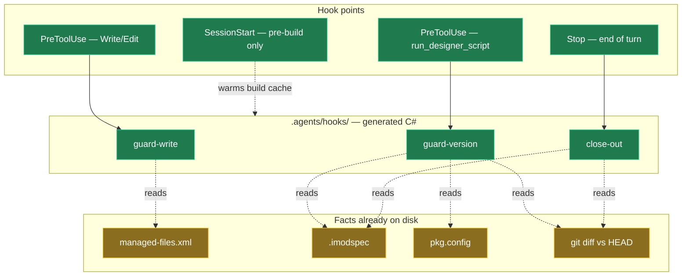

# Making module-building agents actually follow the workflow skills

## Context

`Intent.ModuleBuilder.AI.Workflow` bundles four process skills — `module-context-capture`, `module-version-increment`, `module-docs-chore`, `module-dependency-audit` — plus the always-on `module-building-workflow.instructions.md`. The content is good. Agents read it and skip it anyway.

<Callout id="layer1-done" tone="success" title="The discovery half of this problem is already solved">

The original plan diagnosed lazy skill discovery: the bundle was emitted to `Modules/.agents|.claude|.opencode/`, one level below the repo root, so nested skills only loaded *after* the agent touched a file under `Modules/` — by which point the turn-one decisions they govern were already made.

That was fixed by relocating the bundle to the repository root (commit `fe055426d`). Skills now appear in the startup manifest. **This plan does not revisit it.**

</Callout>

What remains is the harder half: the agent has the instructions and still doesn't follow them. Every failure below has actually happened in this repo.

<Table
  id="failures"
  caption="Observed failures — all silent, none caught by a green build"
  columns={["Failure", "Why nothing catches it"]}
  rows={[
    ["Version not incremented", "A module rebuilt at an already-published version is ignored in favour of the published copy — work gets verified against the old behaviour with no sign it did"],
    ["Version incremented twice", "Phantom bumps (`pre.4` → `pre.5` → `pre.6`) for one line of work"],
    ["Wrong version scheme", "Pre-release configured, but a plain `1.0.1` set instead of `1.0.1-pre.0`"],
    ["Generated output hand-edited", "Looks like it worked; the next Software Factory run silently wipes it"],
    ["`modules.config` hand-edited", "Corrupts the application's module state"],
    ["Dependencies wrong or missing", "Compiles perfectly, fails at install — in a consumer's application, not yours"],
    ["Docs / `CONTEXT.md` left behind", "Nothing observes it at all"],
    ["Icon missing, or the font-awesome shortcut taken", "Nothing observes it"]
  ]}
/>

## Why hooks, and why deterministic ones

Anthropic's own memory documentation states the thesis more plainly than the previous draft of this plan did:

> "Claude treats them as context, **not enforced configuration**. To block an action regardless of what Claude decides, use a PreToolUse hook instead."

The checks that matter here are answerable from files already on disk — no model, no network. *Did the version move? Is this path Software-Factory-owned? Does the manifest declare what the code references?* Those are facts, not judgments.

<Callout id="no-nagging" tone="decision" title="The governing constraint: a hook must never nag">

The rejected design was a check on every file edit asking whether the agent had loaded the relevant skill. Verbatim from the review: *"Definitely don't want a ton of fine-grain events that will ask the AI (did you load the skill… did you load the skill…) that will cause huge token waste and will just fill the context window up and cause the AI to do stupid stuff."*

What makes the current design compatible with that is a documented Claude Code behaviour: **an `allow` decision's reason is never injected into the model's context.** A silent pass costs zero tokens. The cost is per-*complaint*, not per-invocation.

So no hook here ever asks "did you check the skill?" Each one either stays completely silent or states the specific thing that is wrong.

</Callout>

## The design



### Three commands, three moments

<Table
  id="commands"
  caption="Each fires at the one moment it can reach a verdict"
  columns={["Command", "Fires", "Decides"]}
  rows={[
    ["`guard-write`", "Before any Write/Edit", "Is this path one the agent must not hand-edit?"],
    ["`guard-version`", "Before a designer script sets `Version`", "Is this specific version change legal?"],
    ["`close-out`", "End of turn", "Which Phase 4 chores were skipped?"]
  ]}
/>

### `guard-version` — a verdict, not a reminder

This is the check the no-nagging constraint shaped most, and it is worth stating why it is cheap.

The module version has exactly one scriptable signature, confirmed against the live model:

```js
pkg.ensureStereotype("Module Settings").setProperty("Version", "1.0.0-pre.9")
```

Claude Code hook matchers accept MCP tool names, and `tool_input` carries the **full tool arguments** — so the hook can match `run_designer_script` specifically and then inspect the script text. Every designer script that isn't setting a version passes silently and invisibly.

And because the new version string is right there in the arguments, the gate does real work rather than prompting:

<Checklist
  id="guard-version-logic"
  items={[
    { id: "gv1", label: "Extract the new version from the script text" },
    { id: "gv2", label: "Resolve `applicationId` → module folder via `Modules/*/*.application.config`" },
    { id: "gv3", label: "Read that module's current `.imodspec` version" },
    { id: "gv4", label: "**Downgrade guard** — deny if the new version doesn't sort strictly higher by semver precedence" },
    { id: "gv5", label: "**Double-bump guard** — deny if this module's version already moved vs `HEAD` in this tree" },
    { id: "gv6", label: "**Scheme guard** — deny `1.0.1` when pre-release is configured and `1.0.1-pre.0` is expected" },
    { id: "gv7", label: "Otherwise: silent allow, zero tokens" }
  ]}
/>

<Callout id="downgrade-timing" tone="success" title="This catches the downgrade guard before it bites, not after">

The Software Factory silently refuses to regenerate `.imodspec` when the new version compares *lower* by semver precedence — a `-pre.#` suffix sorts below the same `X.Y.Z` with no suffix, so correcting `1.1.0` down to `1.0.3-pre.0` trips it. Regeneration reports nothing staged, with no error or warning.

Today that is discovered by confusion after the fact. Here it is denied before the value is ever written.

</Callout>

### What blocks, and what only warns

Deny is reserved for actions that are *always* wrong. Everything else surfaces at close-out, where the agent is in the chore phase anyway.

<Table
  id="deny-warn"
  caption="Deny vs warn"
  density="compact"
  columns={["Check", "Behaviour"]}
  rows={[
    ["Software-Factory-owned output (`managed-files.xml`)", "**Deny**"],
    ["`modules.config`", "**Deny** — never hand-edited, for any reason"],
    ["Version already bumped this line of work", "**Deny**"],
    ["Wrong version scheme for the configured mode", "**Deny**"],
    ["Overwriting an existing module icon", "**Deny** — unless it is the stock icon, or the user asked"],
    ["Module changed but version never moved", "Warn"],
    ["`.imodspec` version vs `.csproj` version disagree", "Warn"],
    ["Referenced-but-undeclared dependencies", "Warn"],
    ["Release-notes heading still carries `-pre.#`", "Warn"],
    ["`CONTEXT.md` not updated, or misplaced", "Warn"],
    ["`docs/README.md` missing", "Warn"],
    ["Tags not lowercase / not hyphenated", "Warn"],
    ["Module icon missing", "Warn"],
    ["Module icon is font-awesome rather than PNG/SVG", "Warn"]
  ]}
/>

<Callout id="context-soft" tone="warning" title="The CONTEXT.md check warns rather than blocks, deliberately">

It compares the module's changed files (`git diff` / `git log`) against whether `CONTEXT.md` moved. That is a heuristic with real false positives — sometimes there genuinely is nothing durable to record. Blocking on a judgment call would train people to work around the gate, so it nudges instead.

Transcript inspection was considered and rejected: harness-specific, fragile, and it would have made the check unportable.

</Callout>

<Callout id="imodspec-scope" tone="warning" title="The .imodspec deny is field-scoped, not file-scoped">

Three edits to `.imodspec` are legitimate and must stay possible: a **version downgrade** (the Software Factory won't do it), **interop/dependency** entries, and **`<tags>`**. Everything else in that file is Software-Factory-owned — notably `<summary>` and `<description>`, which the SF overwrites from the Application Settings page on every run, discarding a manual edit without an error.

So `guard-write` cannot simply deny the file. It has to reason about which field is being touched, which is more work and more room to get wrong.

</Callout>

## The runtime

<Callout id="runtime-decision" tone="decision" title="Templates generate the C#; the tests verify what ships">

The module's templates generate the hook scripts as C# into the consumer repo. When the module updates in the test app, they install where they are expected to run. A unit test project then targets **those generated files at that location** and verifies them in isolation.

No parallel source project, so no drift: the tests exercise exactly what ships. `Modules/Intent.Agent.Gate/` stops being a standalone project — its code becomes template content.

</Callout>

This is viable because of a .NET 10 feature the earlier draft predated:

<Table
  id="directives"
  caption="File-based app directives — `dotnet run app.cs`, no .csproj"
  columns={["Directive", "Effect", "Available"]}
  rows={[
    ["`#:include helpers.cs`", "Compiles another `.cs` into the app", "SDK **10.0.300+**"],
    ["`#:property PublishAot=false`", "Disables native AOT, which is on by default", "SDK 10"],
    ["`#:package`, `#:project`, `#:sdk`", "NuGet / project / SDK references — not needed here", "SDK 10"]
  ]}
/>

An earlier test concluded file-based apps cannot include sibling files. That test predated `#:include`; the conclusion is withdrawn. The gate is therefore several focused files plus a thin entry point, not one 500-line blob:

<Code id="entry" filename=".agents/hooks/gate.cs" language="csharp" caption="Included files hold classes only — top-level statements stay in the entry file"
  code={`#:property PublishAot=false
#:include SemVer.cs
#:include ManagedFilesGuard.cs
#:include ModuleVersionAuditor.cs

return Cli.Run(args, Console.In, Console.Out, Console.Error, Directory.GetCurrentDirectory());`}
/>

### Why .NET rather than Node

The original concern was forcing a runtime install. That premise inverted on inspection: this only ever runs in repos that build Intent modules, which are .NET repos by definition. **.NET is guaranteed present; Node is not.** The residual constraint is only *which* .NET — `#:include` needs SDK 10.0.300+.

### One shared copy, not five

The five harnesses have five hook-config locations. The scripts live **once**, in `.agents/hooks/`, referenced by path from each config.

Unlike a skill — which must sit inside a harness folder because each harness only reads its own — a hook config names an explicit path, so one copy is reachable from all five. Duplicating executable code five ways multiplies divergence surface for no gain.

<Callout id="path-gotchas" tone="warning" title="Two placement constraints, both verified">

**No `.csproj` at the repo root**, so the documented "avoid project file cones" hazard doesn't apply. But the root **`Directory.Build.props` does apply** to a file-based app beneath it — Microsoft's own mitigation is an isolated `Directory.Build.props` inside `.agents/hooks/` to shield it.

And the command must resolve the repo root reliably, never a bare relative path — a relative path breaks the moment the session's working directory moves into a subdirectory. The mechanism differs per harness, verified directly rather than assumed uniform:

- **Claude Code** exposes `$CLAUDE_PROJECT_DIR`.
- **Codex and Kiro expose no equivalent env var** and run hook commands from the session's cwd. Codex's own docs recommend `$(git rev-parse --show-toplevel)` command substitution at invocation time instead — Kiro has the identical gap, so the same fix applies to both.
- **Cursor runs project hooks from the project root already** (its own docs: "Project hooks run from the project root"), so a plain relative path resolves correctly there with no substitution needed.

</Callout>

<Callout id="cursor-fail-open" tone="risk" title="Cursor fails open on any exit code other than exactly 0 or 2">

Verified against Cursor's own hooks docs: exit `0` succeeds, exit `2` blocks, and *every other non-zero code is treated as allow* — the opposite of what "fail closed" needs. This means the fail-closed design decision below only holds on Cursor if the gate's own top-level exception handler explicitly calls `exit(2)` on any unhandled failure — it cannot rely on the runtime's default non-zero exit code for a crash, which would silently become an allow there. Also note Cursor's `hooks.json` uses `"version": 1` (an integer), where Kiro's is the string `"version": "v1"` — copy neither literally into the other.

</Callout>

## Harness integration

All five verified against vendor documentation.

<Table
  id="harness-matrix"
  caption="Verified September 2026"
  density="compact"
  columns={["Harness", "Config location", "Ownership", "Blocks via"]}
  rows={[
    ["**Claude Code**", "`.claude/settings.json`", "Shared — **merge required**", "exit 2 · JSON `permissionDecision` · stderr"],
    ["**Codex**", "`.codex/hooks.json`", "Owned outright", "exit 2 · JSON `permissionDecision` · legacy `{\"decision\":\"block\"}`"],
    ["**Kiro**", "`.kiro/hooks/<name>.json`", "Owned outright", "exit 2"],
    ["**Cursor**", "`.cursor/hooks.json`", "Repo-level, checked in", "exit 2 · JSON allow/deny/ask"],
    ["**OpenCode**", "`.opencode/plugins/*.ts`", "Owned outright, **auto-loads**", "plugin throws after checking the exit code"]
  ]}
/>

<Callout id="opencode-confirmed" tone="success" title="OpenCode's row is the one confirmed by an actual run, not documentation">

Built via `Bun`/Node's `spawnSync` rather than the `$` shell API, to avoid shell-quoting risk entirely — checked directly against the real thing, not assumed: a diagnostic plugin logged real `tool.execute.before` payloads, confirming `input.tool` is `"write"`/`"edit"` and — the one place this differed from every other harness — `output.args` uses **camelCase `newString`**, not `new_string`. The gate's edit extractor only checked the snake_case form; fixed, with a unit test. Then run for real against a scratch project with the real OpenCode CLI and a real model: an illegal hand-edit to a `managed-files.xml` path was denied with the gate's own message and left the file untouched; a legal edit to an unmanaged file succeeded normally. See `intent/.plans/evidence/harness-block-matrix.md` for the full account.

</Callout>

<Callout id="exit-code" tone="success" title="Exit code 2 is universal — one protocol, not five">

All four command-based harnesses honour **exit 2 as block, 0 as allow**. So the script always signals through the exit code, *and* writes the harness-appropriate JSON to stdout for those that read it. The `--harness` flag selects only the stdout shape, never the exit semantics. OpenCode's TypeScript plugin just runs the script and throws on a non-zero code.

This replaces the current design, where both commands always return 0 and signal purely via stdout JSON — which means **they cannot block on Kiro or Cursor at all today**.

Exit 2 must stay distinguishable from exit 1, or a crash becomes indistinguishable from a policy denial.

</Callout>

<Callout id="upstream-bugs" tone="risk" title="Two upstream issues where deny is reportedly not enforced">

- `openai/codex` **#27833** — *"PreToolUse deny (exit 2 + permissionDecision JSON) is not enforced for `apply_patch`."* Directly relevant: `apply_patch` is Codex's file-write path.
- `anthropics/claude-code` **#43407** — same symptom.

Surfaced by title; **open/closed status not checked.** If either is still live, a "hard block" is advisory in practice on that harness. Verify before shipping, and do not promise enforcement the harness won't deliver.

</Callout>

<Callout id="kiro-schema" tone="warning" title="The currently generated Kiro config is wrong in three ways">

Found while verifying against Kiro's docs. The generated JSON omits `"version": "v1"`; uses `PreTaskExecution` where the real trigger for close-out should be **`Stop`** (Kiro has this trigger too — see below — and it matches the end-of-turn semantics the other harnesses use for close-out, rather than the before-the-next-task timing `PreTaskExec` implies); and gives `PreToolUse` **no `matcher`**, so it fires on every tool call — precisely the shape this plan exists to avoid.

Kiro's real triggers (per `kiro.dev/docs/cli/v3/hooks-migration/`, quoting its `"version": "v1"` schema directly): `SessionStart`, `PostFileSave`, `PostFileCreate`, `PreToolUse`, `PostToolUse`, `PreTaskExec`, `PostTaskExec`, `PostFileDelete`, `UserPromptSubmit`, `Stop`, `Manual`.

`HooksJsonTemplatePartial.cs` needs its `TransformText()` rewritten wholesale, not patched.

</Callout>

<Callout id="kiro-sessionstart-correction" tone="success" title="Correction: Kiro does have SessionStart, so it pre-builds like the others">

The previous draft of this plan asserted Kiro has no `SessionStart` trigger and accepted a cold first compile there as a result (see `kiro-prebuild` below, superseded). Re-verified directly against `kiro.dev/docs/cli/v3/hooks-migration/`, which quotes `SessionStart` in its trigger list and states it "fires when a new session begins" and does not block. Kiro's `hooks.json` now includes a `SessionStart` entry that runs `gate.cs -- warm`, the same as Codex — there is no accepted-risk carve-out left for Kiro.

</Callout>

<Callout id="kiro-prebuild" tone="warning" title="Superseded — Kiro does have SessionStart">

Originally: "Kiro has no SessionStart, so it cannot pre-build... accepted: without AOT the compile is fast enough that a single cold run is tolerable." Wrong — see `kiro-sessionstart-correction` above. Kiro's `hooks.json` now warms the build cache at `SessionStart` exactly like Codex; `#:property PublishAot=false` still matters (it's what makes that warm-up fast), but it's no longer the sole mitigation carrying a cold path.

</Callout>

## Failure behaviour

<Callout id="fail-closed" tone="decision" title="Fail closed — with one carve-out">

If the script can't execute — missing, broken, wrong SDK — it **blocks**, and tells the agent to inform the user it cannot run the gate and stop.

**The one exception is build contention.** Microsoft documents that concurrent invocations of the same file-based app can fail over build-output contention, and hooks do fire concurrently. Under a strict fail-closed rule that becomes an *intermittent* hard block with a confusing message, in someone else's repo — which teaches people to delete the hooks, costing more than the check was ever worth. A transient build lock is not a policy violation, so it fails open.

Mitigations: `PublishAot=false`, pre-build at `SessionStart`, then `--no-build` on the hook path.

</Callout>

<Callout id="fail-closed-build-failure" tone="risk" title="A build failure exits 1, not 2 — the gate cannot fix this from inside its own code">

Found while writing the test suite, not by inspection: `dotnet run` itself returns **exit 1** on a build failure (a missing `#:include`, a syntax error, the wrong SDK) — never 2. Cursor's own docs confirm any exit code other than exactly 0 or 2 is treated as an **allow**. So a bare `dotnet run gate.cs -- <command>` hook command would silently stop protecting anything the moment the gate's own source broke — the opposite of "fail closed" — and `Cli.cs`'s own top-level try/catch cannot fix this, because it never runs until *after* the build already succeeded.

The fix has to live in the hook command itself, not the C# it runs: every generated command is suffixed with `; test $? -eq 0 && exit 0 || exit 2`, collapsing any non-zero `dotnet run` exit code into the universal block signal. Verified against both a broken and a healthy gate, and locked in by `GateSmokeTests`. On Windows this relies on Claude Code's documented default of running hook commands through Git Bash when it's present (true for any repo installing this module, since git is already required) — not independently verified for Codex, Kiro or Cursor's own Windows shell behaviour specifically, only inferred by their commands already relying on POSIX substitution (`$(git rev-parse --show-toplevel)`) elsewhere.

</Callout>

## Model changes

<ModelChanges id="model-changes" caption="Intent.ModuleBuilder.AI.Workflow — Module Builder designer" changes={[
  { element: "AI Workflow Settings", designer: "Module Builder", change: "modified", note: "Settings already present after earlier work — no new fields required by this plan",
    fields: [
      { label: "Install Agent Gate Hooks", after: "Switch — gates every hook artifact" },
      { label: "Use Pre-release Versions", after: "Switch — baked into the generated `guard-version` command line" }
    ] },
  { element: "HooksJson", designer: "Module Builder", change: "modified", note: "Exists; `TransformText()` rewritten for correct Kiro schema, exit-code semantics, and Cursor/OpenCode output" },
  { element: "GateScripts", designer: "Module Builder", change: "added", note: "File-per-model template emitting the C# gate sources into `.agents/hooks/`" },
  { element: "ClaudeSettingsJson", designer: "Module Builder", change: "dropped", note: "Superseded by the fallback — see `claude-merge`. `GateScripts` emits `CLAUDE_SETUP.md` (a one-time manual paste) instead of a merge-aware generator" },
  { element: "OpenCodePlugin", designer: "Module Builder", change: "added", note: "`.opencode/plugins/intent-agent-gate.ts` — auto-loads, runs the script, throws on non-zero exit" },
  { element: "DotnetToolsJson", designer: "Module Builder", change: "removed", note: "Superseded — file-based apps need no tool manifest" }
]} />

<Callout id="settings-baked" tone="success" title="Module settings reach the script through the template, not at runtime">

The hook file is itself generated by a template, so the template **bakes the setting into the generated command line** — `guard-version --scheme pre`. The script never reads Intent settings, never resolves an application, and needs no access to the designer. One whole runtime dependency removed.

</Callout>

<Callout id="claude-merge" tone="decision" title="Reversed — the merge-aware template is being built, and CLAUDE_SETUP.md is deleted">

The original decision was to skip it. `.claude/settings.json` is a shared, developer-edited file carrying permissions, env and unrelated hooks; a safe upsert needed a new template type, and no way was found to verify it wouldn't corrupt an existing config on some edge-case merge. The sanctioned fallback was `GateScripts` emitting `.agents/hooks/CLAUDE_SETUP.md` — a one-time manual paste — accepted as a real gap that does not survive a fresh install into a second repository.

**That is now reversed, for two reasons.** Under the per-harness layout every other harness gets a generated config beside its own gate copy, which would leave Claude Code as the only harness still requiring a human to paste something — an asymmetry harder to justify than the original risk. And the blocker itself has weakened: "cannot verify it won't corrupt a config" is a test list, not an impossibility, and the suite to write it against now exists.

A `ClaudeSettings` template generates `.claude/settings.json` directly: absent, it writes a default as-is; present, it loads the JSON, adds the gate's keys, and writes the whole file back. It only ever runs inside a `.claude` folder. `CLAUDE_SETUP.md` and its `ClaudeSetupContent` constant are deleted.

The test list this must satisfy before it ships: no file present · file present with unrelated hooks preserved · file present with a conflicting `PreToolUse` entry · malformed JSON (must refuse rather than overwrite) · a second run being idempotent.

</Callout>

<Callout id="stale-claudesettings-reference" tone="warning" title="A code comment claimed this template already existed">

`HooksJsonTemplateRegistration.cs` carried the comment *"`.claude` needs merge-aware generation and is handled by `ClaudeSettingsJson` instead"* — naming a template that was never built. The code asserted one design, the plan recorded the opposite, and the truth was the manual paste. The same failure mode as `OpenCodePlugin` being listed in the model-changes table and never implemented: a name in a comment is not evidence a thing exists.

</Callout>

## Skill and rule changes

Separate track from the hooks, and **not** made redundant by them: hooks may not be installed, so the skills stay complete on their own.

<Table
  id="skill-changes"
  caption="Changes to shipped skills and rules"
  columns={["Target", "Change"]}
  rows={[
    ["`module-docs-chore`", "`Include Release Notes` ticked but file missing currently says *report the inconsistency*. The Software Factory **drops the file off initially** when the setting is enabled — so it should say regenerate, while still never hand-creating it"],
    ["`module-docs`", "Clarify that the Software Factory creates `release-notes.md`; the agent never does"],
    ["`module-versioning`", "Prefer `saveOnSuccess` to persist a model change; fall back to a Software Factory run where it isn't available"],
    ["`module-svg-icon` / `module-element-icons`", "Reflect the package-vs-stereotype split, and that setting an icon needs a script because of the base64 payload"],
    ["New conciseness rule", "Shaped like `.claude/rules/csharp-guidelines.md`; checked at the Phase 4 chore point"],
    ["`file-builder-expert`", "New rule: unconditional `AddUsing` goes dead silently"]
  ]}
/>

<Callout id="saveonsuccess" tone="warning" title="saveOnSuccess and the Software Factory are not interchangeable">

`run_designer_script` now takes `saveOnSuccess`, which persists the designer to disk **without** a Software Factory run. But it persists the *model* only. Anything that is **generated output** — `.imodspec` `<version>` above all — is written only by the Software Factory.

So a version bump needs **both**: `saveOnSuccess` to persist the designer value, then a Software Factory run to regenerate the manifest. The substitution holds only for model-only changes.

Its own docs also warn the save *"does not block on validation errors"*, so setting it mid-sequence can persist an invalid model. Not hook-checkable — a hook sees one call and cannot know whether it is the last — so this is skill guidance only.

</Callout>

<Callout id="addusing" tone="warning" title="The AddUsing rule comes from two real bugs, both shipped">

`.AddUsing("Namespace")` cannot notice when the code that justified it stops spelling out a type from that namespace.

`ValidationMiddlewareTemplatePartial.cs` added `System.Reflection` while reaching `GetMethod`/`Invoke` entirely through `var` — dead from the day it was written. `AuthorizeCheckOperationFilterTemplatePartial.cs` added `System.Collections` when only `List<>` from `.Generic` was used, and added an OpenApi namespace while the type names were raw string literals inside `AddStatement`, invisible to the builder.

The rule: resolve the type through `UseType("Namespace.Type")` and interpolate it — even into a raw statement string — so the using tracks the reference. Reserve `AddUsing` for namespaces needed independent of any spelled-out type.

</Callout>

## Code changes

<FileTree
  id="code-files"
  title="Template content, generated into consumer repos"
  entries={[
    { path: ".agents/hooks/gate.cs", change: "added", note: "Entry point — top-level statements, `#:include` directives" },
    { path: ".agents/hooks/Cli.cs", change: "added", note: "Routes guard-write / guard-version / close-out; owns exit-code semantics" },
    { path: ".agents/hooks/SemVer.cs", change: "added", note: "Precedence comparison — the downgrade and scheme guards" },
    { path: ".agents/hooks/ManagedFilesGuard.cs", change: "added", note: "Reads every module's managed-files.xml" },
    { path: ".agents/hooks/ModuleVersionAuditor.cs", change: "added", note: "git diff vs .imodspec version per changed module" },
    { path: ".agents/hooks/Directory.Build.props", change: "added", note: "Shields the scripts from the root Directory.Build.props" }
  ]}
/>

<FileTree
  id="retired-files"
  title="Retired"
  entries={[
    { path: "Modules/Intent.Agent.Gate/DoctorCommand.cs", change: "removed", note: "Built speculatively; fail-closed now makes a broken gate announce itself" },
    { path: "Modules/Intent.Agent.Gate/Intent.Agent.Gate.csproj", change: "removed", note: "Templates become the source of truth" }
  ]}
/>

## Steps

1. **Restore the lost Template Output assignments.** An uninstall/reinstall cycle stripped the "template X owns this folder" records for the `.claude/` and `.opencode/` mirrors, leaving those files unclaimed — so the next Software Factory run proposes deleting them. Ten records across four files, all deletion-only. A live fault in the tree; fix it before anything else.
2. **Run the version gate** on AI.Workflow per `module-version-increment`. It currently sits at `1.0.0-pre.8`, a prerelease — so if nothing at or beyond it is published, it is in flight and must be left alone.
3. **Rewrite `HooksJsonTemplatePartial.cs`.** Correct Kiro schema, exit-code semantics, and add Cursor and OpenCode output. Delete the dead `context` command references.
4. **Build the gate scripts as template content**, and stand up the test project against the generated files in `Tests/ModuleBuilderSkills` — including the smoke test that invokes `dotnet run gate.cs` for real.
5. **Implement the deny set first** — smallest and highest-confidence: managed files, `modules.config`, the three version guards, icon overwrite.
6. **Implement the warn set** at close-out.
7. **Merge-aware `.claude/settings.json`** — sequenced last, because it is the one unsolved template problem and everything else works without it.
8. **Skill and rule changes** per the table above.
9. **Fill in the harness matrix, then run the evals.** The matrix is a shipping gate: a deny that nothing honours has to be recorded as advisory rather than described as enforcement. The evals come after it, because they only mean anything once the checks demonstrably fire.
10. **Close out** — `module-dependency-audit`, then `module-docs-chore`, then `module-context-capture` to record the uninstall/reinstall traps and the Kiro pre-build gap.

## Testing and evaluation

Three layers, because they fail differently. A unit test proves the guard reaches the right verdict; it says nothing about whether the harness honours it, and neither says anything about whether the agent then does the right thing.

<Table
  id="test-layers"
  caption="What each layer proves, and what it is blind to"
  columns={["Layer", "Runs", "Proves", "Blind to"]}
  rows={[
    ["**1 — Gate logic**", "CI, every build", "Given a file state and a tool call, the verdict is correct", "Whether the script runs at all outside the test host"],
    ["**2 — Harness enforcement**", "Manually, per harness, before shipping", "A deny is actually obeyed", "Whether the verdict was right"],
    ["**3 — Behavioural evals**", "On demand, against a scratch module", "The agent ends up doing the right thing", "Nothing — but non-deterministic, so graded on disk state rather than transcripts"]
  ]}
/>

### Layer 1 — gate logic

The test project links the generated sources directly — `<Compile Include="$(RepoRoot).agents/hooks/*.cs" Exclude="$(RepoRoot).agents/hooks/gate.cs" />` — and drives `Cli.Run` with substituted stdin/stdout and a temp working directory. `gate.cs` is excluded because top-level statements cannot compile into a test assembly.

<Callout id="smoke-test" tone="warning" title="Linking proves the logic and nothing else">

A linked build resolves nothing that makes a file-based app a file-based app: `#:include` resolution, the SDK floor, and whether the `Directory.Build.props` shield actually holds are all invisible to it. A suite that stops there repeats this repository's own *"compiling is not working"* failure, one level up.

So one test shells out to the real `dotnet run gate.cs` and asserts on its exit code.

</Callout>

<Table
  id="cases-guard-version"
  caption="guard-version — current version, proposed version, configured scheme"
  density="compact"
  columns={["Current", "Proposed", "Scheme", "Expected"]}
  rows={[
    ["`1.0.0-pre.8`", "`1.0.0-pre.9`", "pre", "Allow, silently"],
    ["`1.0.0-pre.9`", "`1.0.0-pre.10`", "pre", "Allow — numeric identifier comparison, not lexical"],
    ["`1.1.0`", "`1.0.3-pre.0`", "pre", "Deny — downgrade"],
    ["`1.0.0-pre.9`", "`1.0.0`", "pre", "Allow — promotion to release sorts higher"],
    ["`1.0.0`", "`1.0.1`", "pre", "Deny — scheme; expect `1.0.1-pre.0`"],
    ["`1.0.0`", "`1.0.1`", "final", "Allow"],
    ["`1.0.0-pre.9`", "`1.0.0-pre.9`", "either", "Deny — not strictly higher"],
    ["Already moved vs `HEAD`", "anything", "either", "Deny — double bump"],
    ["—", "script does not set `Version`", "either", "Allow, and write nothing at all"]
  ]}
/>

<Callout id="semver-traps" tone="warning" title="Two of those rows fail a naive implementation">

`1.0.0-pre.10` sorts **above** `1.0.0-pre.9` — semver compares numeric pre-release identifiers numerically, while a string comparison puts `pre.10` first. AI.Workflow is at `pre.8` and will reach `pre.10` shortly, so this is not hypothetical.

And `1.0.0-pre.9` to `1.0.0` is a legal promotion, not a scheme violation. A scheme guard that simply demands a `-pre` suffix whenever pre-release mode is on would block the one moment the suffix is supposed to come off.

</Callout>

<Table
  id="cases-guard-write"
  caption="guard-write — path and edit content"
  density="compact"
  columns={["Target", "Edit", "Expected"]}
  rows={[
    ["A path listed in `managed-files.xml`", "any", "Deny, naming the owning template"],
    ["`modules.config`", "any", "Deny"],
    ["`.imodspec`", "`<tags>`", "Allow"],
    ["`.imodspec`", "add a `<dependency>`", "Allow"],
    ["`.imodspec`", "lower the `<version>`", "Allow — the sanctioned downgrade route"],
    ["`.imodspec`", "`<summary>` or `<description>`", "Deny — the Software Factory overwrites both from Application Settings"],
    ["`.imodspec`", "whole-file `Write` changing only `<tags>`", "Allow"],
    ["`.imodspec`", "whole-file `Write` changing `<summary>`", "Deny"],
    ["Module icon, none present", "set", "Allow"],
    ["Module icon, stock icon present", "overwrite", "Allow"],
    ["Module icon, custom icon present", "overwrite", "Deny unless the user asked"],
    ["`CONTEXT.md`, `docs/README.md`", "any", "Allow"]
  ]}
/>

The two whole-file `Write` rows are there to force the implementation to diff against what is on disk. A guard that inspects only the edit string passes every `Edit` case and then silently allows a `<summary>` change delivered as a full-file write — which is exactly how an agent that has just read the file will deliver it.

<Table
  id="cases-close-out"
  caption="close-out — fixture repository states"
  density="compact"
  columns={["Fixture", "Expected"]}
  rows={[
    ["Nothing changed", "Silent"],
    ["Module changed, version never moved", "Warn"],
    ["`.imodspec` version and `.csproj` version disagree", "Warn"],
    ["A template imports a namespace no `<dependency>` declares", "Warn"],
    ["Release-notes heading still reads `Version 1.0.3-pre.0`", "Warn — the suffix belongs stripped in the heading"],
    ["Module changed, `CONTEXT.md` untouched", "Warn"],
    ["Module has no `docs/README.md`", "Warn"],
    ["Tags read `module builder`", "Warn — two meaningless tags where one was meant"],
    ["Module icon is font-awesome", "Warn — package icons are PNG or SVG"],
    ["Everything in order", "Silent"]
  ]}
/>

### Layer 2 — harness enforcement

A verdict nothing obeys is worse than no verdict: it reads as enforcement here and behaves as a suggestion in the repo. Two upstream issues report exactly that, and neither can be settled by reading the issue thread — only by trying it.

So the probe is one deliberately illegal action per harness — editing a file listed in `managed-files.xml` — with the result written down rather than left in a transcript.

<Checklist
  id="harness-probe"
  items={[
    { id: "hp-claude", label: "**Claude Code** — the write is prevented, and the denial reason reaches the model" },
    { id: "hp-codex", label: "**Codex** — probed through `apply_patch` specifically, since issue #27833 names it", note: "If deny is not honoured, the matrix records it as advisory and this plan stops describing it as enforcement there" },
    { id: "hp-kiro", label: "**Kiro** — exit 2 honoured on `PreToolUse`, under the corrected `v1` schema" },
    { id: "hp-cursor", label: "**Cursor** — `beforeMCPExecution` and `afterFileEdit`" },
    { id: "hp-opencode", label: "**OpenCode** — the plugin throws on a non-zero exit and the tool call is abandoned" }
  ]}
/>

### Layer 3 — behavioural evals

The first two layers can both pass while the original problem survives: the guard is right, the harness obeys it, and the agent still makes a mess — thrashing against a deny it does not understand, or padding `CONTEXT.md` to silence a warning.

Each eval is a task given to an agent against a scratch copy of a module, with a pass condition **observable on disk after the run**. That keeps them re-runnable, and keeps the grader from having to interpret prose.

<Table
  id="evals"
  caption="One eval per behaviour the hooks are supposed to change"
  columns={["Eval", "Setup", "Passes when"]}
  rows={[
    ["**E1 — Double bump**", "A module whose version already moved in this working tree, plus another small change to make", "The final `.imodspec` version equals the pre-task version, and the agent said why it did not bump again"],
    ["**E2 — A denied path teaches the allowed one**", "A version needs correcting downward from `1.1.0` to `1.0.3-pre.0`; the designer route is denied, the `.imodspec` route is allowed", "The correction actually lands — rather than the agent retrying the blocked route, or abandoning the correction"],
    ["**E3 — Generated output**", "A task whose obvious shortcut is hand-editing a generated file", "That file is byte-identical to before, and the designer model changed instead"],
    ["**E4 — Silence costs nothing**", "A task running several designer scripts, none of which touch `Version`", "Total hook output is zero bytes, and context consumption sits within noise of a control run with hooks disabled"],
    ["**E5 — A warning does not cause busywork**", "A genuine internal refactor with nothing durable to record; close-out warns about `CONTEXT.md` regardless", "`CONTEXT.md` is unchanged and the agent said why, rather than inventing an entry to silence the warning"]
  ]}
/>

<Callout id="evals-load-bearing" tone="decision" title="E2 and E5 are the two worth running first">

The others check that a check fires. These two check what the check *costs*.

**E2** is the difference between a deny that redirects and a deny that traps. The downgrade case is the sharpest form of it, because the blocked route and the allowed route lead to the same legitimate destination — so if the message does not name the allowed route, the agent has no way to find it.

**E5** is the failure mode of the warn set. A warning that cannot be satisfied honestly tends to get satisfied dishonestly, and `module-context-capture` says why that is the worse outcome: *"A confidently wrong CONTEXT.md is worse than none, because the next session trusts it."*

</Callout>

<FileTree
  id="test-files"
  title="Test and evidence artifacts"
  entries={[
    { path: "Tests/AgentGate/", change: "added", note: "Not `Tests/ModuleBuilderSkills/` as first planned — that name collides with a pre-existing consuming application used to test AI.Skills/AI.Workflow installation, discovered while building this" },
    { path: "Tests/AgentGate/SemVerTests.cs", change: "added", note: "The precedence traps directly" },
    { path: "Tests/AgentGate/GuardVersionTests.cs", change: "added", note: "Layer 1 — the `cases-guard-version` table, one test per row" },
    { path: "Tests/AgentGate/GuardWriteTests.cs", change: "added", note: "Layer 1 — the `cases-guard-write` table; three icon rows are `Skip`-documented, not implemented" },
    { path: "Tests/AgentGate/CloseOutTests.cs", change: "added", note: "Layer 1 — the `cases-close-out` table; two rows are `Skip`-documented, not implemented" },
    { path: "Tests/AgentGate/FailClosedTests.cs", change: "added", note: "A throwing `IGitChangeProvider`, an unknown command, no arguments — all must exit 2, never crash" },
    { path: "Tests/AgentGate/GateSmokeTests.cs", change: "added", note: "Shells out to `dotnet run gate.cs` for real, including the build-failure-exits-1 finding and its shell-wrapper fix" },
    { path: "Tests/AgentGate/TestSupport/", change: "added", note: "`FakeGitChangeProvider`, `TempDirectory`, `RepoRootLocator`, `GateTestHarness` — no fixture git repos; git-dependent behaviour goes through the fake" },
    { path: "intent/.plans/evidence/harness-block-matrix.md", change: "added", note: "Layer 2 — Claude Code inconclusive (a known Claude Code bug); Codex/Kiro/Cursor/OpenCode untested, need a human with those tools" },
    { path: "intent/.plans/evidence/evals.md", change: "added", note: "Layer 3 — E2 and E5 run for real against an isolated scratch fixture and passed; E1/E3/E4 not run as dedicated evals" }
  ]}
/>

### Does this cover the failures it was built for?

<Table
  id="coverage"
  caption="Each observed failure, and what now catches it"
  density="compact"
  columns={["Observed failure", "Caught by", "Strength"]}
  rows={[
    ["Version not incremented", "`close-out`", "Warn"],
    ["Version incremented twice", "`guard-version`", "**Deny** · E1"],
    ["Wrong version scheme", "`guard-version`", "**Deny**"],
    ["Generated output hand-edited", "`guard-write`", "**Deny** · E3"],
    ["`modules.config` hand-edited", "`guard-write`", "**Deny**"],
    ["Dependencies wrong or missing", "`close-out`", "Warn"],
    ["Docs / `CONTEXT.md` left behind", "`close-out`", "Warn · E5"],
    ["Icon missing, or font-awesome taken as a shortcut", "`close-out`", "Warn"]
  ]}
/>

<Callout id="coverage-honesty" tone="warning" title="Half the original failures are only warned about">

Four of the eight become denials the agent cannot get past. The other four — version not incremented, dependencies, documentation, icon — stay warnings it can ignore, because each turns on a judgment a script cannot make reliably, and a false deny would cost more than the occasional miss.

So this plan does not eliminate those four. It makes them visible at the one moment the agent is already in the chore phase. If they keep happening after this ships, the answer is a better close-out message, not a promotion to deny.

</Callout>

### Acceptance

The case tables above are the unit suite. These are the things no unit test reaches:

<Checklist
  id="verify"
  items={[
    { id: "v1", label: "**Tests link the generated files** — the suite compiles `.agents/hooks/*.cs` from where the module installed them, not from a copy kept beside the tests", note: "Done — `Tests/AgentGate/AgentGate.Tests.csproj` links `.agents/hooks/*.cs` directly (excluding `gate.cs`)" },
    { id: "v2", label: "**One test runs the real command** — `dotnet run gate.cs` executes and returns the expected exit code", note: "Done — `GateSmokeTests`, several cases, including a real deny against this repo's own managed-files.xml" },
    { id: "v3", label: "**Fail-closed works, and build contention does not** — a deleted script blocks; concurrent invocations of the same app do not", note: "Done, and a real gap found and fixed along the way: a build failure alone exits 1 (an allow on Cursor), not 2 — see `fail-closed-build-failure`. The shell-wrapper fix is what actually makes this row true, not `Cli.cs`'s own exception handling" },
    { id: "v4", label: "**Defaults are quiet** — with `Install Agent Gate Hooks` off, nothing is emitted for any harness", note: "The setting-gated half (no files generated when the switch is off) verified manually against the real repo. The CLI-level half — silent, zero-byte stdout on every allow/pass path — is directly asserted by several `GuardWriteTests`/`CloseOutTests` cases" },
    { id: "v5", label: "**Regeneration is idempotent** — a second Software Factory run stages nothing, and hand-edited content in `.claude/settings.json` survives it", note: "Regeneration idempotency observed repeatedly during this work (re-running the Software Factory after no source change stages nothing); the `.claude/settings.json` half is moot — that file is no longer generated at all, see `claude-merge`" },
    { id: "v6", label: "**The harness matrix is filled in and committed** — every row an observed result, none inferred from documentation", note: "Partially satisfied — see `intent/.plans/evidence/harness-block-matrix.md`. OpenCode is genuinely confirmed (a real CLI run, real model, illegal action denied and left the file untouched, legal action succeeded) — and building it surfaced a real gap (its `edit` tool uses camelCase `newString`, fixed). Claude Code is inconclusive (a known Claude Code bug, not a config error). Codex/Kiro/Cursor remain untested. The two upstream deny-enforcement issues remain unresolved" },
    { id: "v7", label: "**All five evals have been run at least once and their outcomes recorded**, including any that failed and what changed in response", note: "3 of 5 (E1, E2, E5) run for real and passed; see `intent/.plans/evidence/evals.md`. E3 and E4 are genuinely blocked, not just deferred — both measure what a live, firing hook does, and Claude Code's hook does not reliably fire in this environment (the same #47810 bug behind the v6 note). Substantively covered by the Layer 1/2 work; re-run once a session with reliable hooks is available" }
  ]}
/>

## What changed from the previous draft

<Table
  id="corrections"
  caption="Superseded decisions — recorded so they are not re-proposed"
  columns={["Previous draft", "Now", "Why"]}
  rows={[
    ["Generate a root `AGENTS.md` index", "**Dropped**", "Explicitly rejected — no `AGENTS.md` or `CLAUDE.md` is generated in this repo"],
    ["Six settings including `Target Claude Code/Cursor/Codex/Kiro`", "**Dropped**", "Harness targeting is determined by which root folder already exists, not by manual toggles"],
    ["`context` command injecting a skill index at session start", "**Removed**", "Removed by decision; `SessionStart` now only warms the build cache"],
    ["`doctor` command", "**Dropped**", "Speculative; fail-closed makes a broken gate self-announcing"],
    ["Distributed as a .NET tool with `dotnet-tools.json`", "**Replaced**", "Templates generate file-based C# apps — no install, no restore step, no manifest"],
    ["Four harnesses", "**Five**", "OpenCode added — its plugin folder auto-loads with no manual enable"],
    ["Blocking via per-harness JSON dialects", "**Exit code 2, universally**", "All four command-based harnesses honour it; the current always-return-0 design cannot block on Kiro or Cursor at all"],
    ["File-based apps must be one large file", "**Withdrawn**", "`#:include` exists as of SDK 10.0.300; the earlier test predated it"],
    ["Layer 1 — move the bundle to the repo root", "**Done**", "Landed in `fe055426d`"]
  ]}
/>

## Per-harness layout — the redesign

The original design put one gate at a canonical repo-root path and had every harness config point at it. That collapsed under its own anchor model, and the replacement is simpler.

<Callout id="anchor-cross-product" tone="risk" title="The root cause: AI.Context is a fan-out role, and the hook templates borrowed it">

`GateScripts`, `HooksJson` and `OpenCodePlugin` all declared `Role = "AI.Context"`. A consuming app carries an `AI.Context` Output Anchor in **every** harness folder — that is precisely how one skill lands in `.agents`, `.claude` and `.opencode` at once. Role matching is one-to-many by design.

For a skill that is correct: three anchors, three different files. For these three templates it was fatal, because each escaped upward with `relativeLocation: "../…"` to reach a repo-root path — and an escaped path resolves **identically from every anchor**:

```
root/.agents/   + ../.kiro/hooks ┐
root/.claude/   + ../.kiro/hooks ├─→ root/.kiro/hooks/intent-agent-gate.json
root/.opencode/ + ../.kiro/hooks ┘
```

Three template instances, one path, `DuplicateOutputPathException`, and the Software Factory refuses to run at all. It stayed hidden only while no `.kiro` folder existed, so the template produced no models.

This was patched downstream **five times** — pruning duplicate `Template Output` elements in the consuming app — before the cause was identified. Re-installing with template outputs enabled recreates the full cross-product (3 templates × 3 anchors = 9), so the pruning never held.

</Callout>

<Callout id="nested-layout" tone="decision" title="Decision — every harness carries its own self-contained copy, nested inside its own folder">

No canonical path, no escaping. Each template writes **inside the anchor it landed in**, which makes collision unrepresentable rather than merely fixed:

```
.agents/hooks/gate/     ← neutral; always generated; what the tests link against
.claude/hooks/gate/     + .claude/settings.json          (create-or-merge)
.codex/hooks/gate/      + .codex/hooks.json              (generic shape)
.kiro/hooks/gate/       + .kiro/hooks/intent-agent-gate.json
.cursor/hooks/gate/     + .cursor/hooks.json
.opencode/hooks/gate/   + .opencode/plugins/intent-agent-gate.ts
```

`hooks/gate/` is uniform across all of them — deliberately, so no harness is a special case. `hooks/` stays each harness's own word; `gate/` stays ours. Kiro forced the question by owning `hooks/` for its configs, and uniformity was chosen over a Kiro-only exception.

The duplication is real but cheap: in production a repo uses one harness, and under test only `.agents` is exercised. Every copy is generated from the same template constants, so they cannot drift.

</Callout>

<Callout id="folder-is-identity" tone="decision" title="The anchor folder name is the harness identity — replacing on-disk discovery">

Each template instance gates on the folder it is in, via `IOutputTarget.Name`, and emits nothing when it is somewhere else. No `Directory.Exists` probing, no harness enum threaded through a model.

| Template | Runs in | Emits |
|---|---|---|
| `GateScripts` | every anchor | `hooks/gate/*.cs` |
| `HooksJson` (generic) | `.codex` | `hooks.json` |
| `ClaudeSettings` | `.claude` | `settings.json`, create-or-merge |
| `KiroHooks` | `.kiro` | `hooks/intent-agent-gate.json` |
| `CursorHooks` | `.cursor` | `hooks.json` |
| `OpenCodePlugin` | `.opencode` | `plugins/intent-agent-gate.ts` |

**Cursor is a third exception, not a generic-shape harness.** Its config uses `version`, camelCase event names (`sessionStart`, `afterFileEdit`, `beforeMCPExecution`) and different nesting. Claude Code, by contrast, uses the *same* JSON shape as Codex — its exception is only *where the file goes* and having to merge, so `ClaudeSettings` can reuse the generic block verbatim.

</Callout>

## Findings from implementation

<Callout id="agent-shell-reinstall" tone="risk" title="In Agent Shell, a rebuilt module is NOT auto-reinstalled — and this invalidated shipped guidance">

Solution Shell re-detects and re-installs a repackaged module automatically. **Agent Shell does not.** Measured directly:

| Attempt | Picked up? |
|---|---|
| `dotnet build` alone | No |
| build + delete `Modules/.cache/modules/<id>.<ver>/` | No |
| build + delete cache + `install_or_update_modules` | **Yes** |

Both steps are required; neither alone suffices. Every apparent success earlier in the session was the first Software Factory run after an Intent restart, where the assembly loads fresh anyway — every failure was a *second* same-version rebuild inside one session, which is exactly the loop an agent lives in.

`known-build-gotchas` shipped the opposite advice (*"neither a version bump nor an explicit `install_or_update_modules` belongs in the routine fix"*) to an audience that is by definition in Agent Shell. Corrected to be symptom-based rather than mode-based, since **an agent has no supported way to detect which shell it is in** — no MCP tool reports it, `workspace_context` does not carry it, and the only signal is sniffing an npm launcher env var.

</Callout>

<Callout id="markdown-bullet-bug" tone="risk" title="The markdown builder ate every paragraph that opened with bold">

`MarkdownFileParser`'s unordered-list regex allowed *zero* whitespace after the bullet character, while the ordered-list regex beside it correctly required one:

```csharp
@"^(\s*)([-*+])\s*(.+)$"    // unordered — the bug
@"^(\s*)\d+\.\s+(.+)$"      // ordered   — correct
```

So `**Check whether…**` had its first asterisk consumed as a bullet marker and was re-emitted as `- *Check whether…**`. **69 generated files across 23 skills and resource documents** were corrupted in shipped output. Fixed by requiring the whitespace (`\s+`); `Intent.Common` 3.11.6 → 3.11.7-pre.0.

Verified as a genuine guard, not assumed: restoring the old regex fails exactly the three emphasis cases while all five legitimate-bullet cases still pass. Across every AI.* template there were no bullets written without a following space, so nothing legitimate changed shape. These are the first `MarkdownFileParser` tests — none existed.

Notably, an earlier release note had already *worked around* this by rewording the affected headings, rather than tracing it to source.

</Callout>

<Callout id="gate-scan-root" tone="risk" title="The gate only protected applications under Modules/">

`ManagedFilesGuard` anchored its scan on `repoRoot/Modules`, so an application anywhere else matched **nothing** and every edit to its generated output was allowed. Test and sample applications live under `Tests/` — and those are exactly the ones a harness gets pointed at, so a probe against one would pass while protecting nothing.

Now walks from the repo root, skipping `.git`, `node_modules`, `bin`, `obj` and friends for speed and so a stale manifest in build output cannot deny edits to a live file. Two tests cover it; the first provably failed before, since the old code returned `null` outright when `repoRoot/Modules` was absent.

</Callout>

<Callout id="harness-results" tone="success" title="Harness matrix — what is actually known">

- **Claude Code — pass.** The hook fired and denied a managed-file edit in a fresh session. The earlier inconclusive run matches `anthropics/claude-code` #47810 (PreToolUse silently stops firing after background-task completion or a long session); circumstantial, but removing both triggers fixed it.
- **OpenCode — pass.** Real CLI, real model, deny and allow both verified.
- **Kiro — fail, and not the module's fault.** A catch-all `".*"` matcher with an unconditional `exit 2` left no sentinel file and blocked nothing, so CLI 2.22.0 / KAS 0.66.0 never runs `.kiro/hooks/*.json` at all. Ruled out: no enabling setting exists, and `agent create` scaffolds twelve keys with no `hooks` among them. The generated config matches Kiro's documented v3 contract exactly — path, `version: "v1"`, PascalCase triggers, `action.type: command`.
- **Kiro's matcher was wrong regardless** — `Write|Edit|ApplyPatch` are Claude Code's tool names. Corrected to `fs_write` per Kiro's own hooks reference. Grounded in documentation, not observation, because no hook ever ran to reveal the real v3 names; `--trust-tools` looked like an oracle but a known-bogus control passed silently too. **Codex's arm is unverified for the same reason and is the next to check.**
- **Codex is reachable on a plain API key** — `printenv OPENAI_API_KEY | codex login --with-api-key`. It also has a `--dangerously-bypass-hook-trust` flag, so it gates hook execution behind a trust model — a likely source of false negatives.
- **GitHub Copilot is a viable sixth target** — a real, fail-closed `preToolUse` hook at `.github/hooks/*.json`, contract already matching what this module generates. Caveats: command-hook timeouts and HTTP hooks both fail *open*.

</Callout>

<Callout id="tooling-faults" tone="warning" title="Intent MCP faults worth reporting">

- **`installTemplateOutputs: false` deletes outputs rather than skipping them.** It stripped all ten AI.Workflow Template Outputs; restoring with `true` put them back only under `.agents`, and the next run wanted to **delete nine shipped files**. Caught by the destructive warning.
- **`get_file_diffs` reports `"unchanged"`** for a file with staged changes — it reads disk, not staging.
- **`get_application_settings` / `update_application_settings` / `list_ignored_files`** all fail with *"Not in solution context"*, across restarts. This is why `Install Agent Gate Hooks` could not be toggled from here.
- **`apply_staged_file_changes`** routinely returns *"Failed to apply changes: Value cannot be null (Parameter 'key')"* while having applied the files correctly. Verified on disk every time.

</Callout>

<Callout id="claude-settings-shipped" tone="success" title="ClaudeSettings shipped — merge-not-own, and it proved itself by blocking its own author">

`.claude/settings.json` is the one hook config this module writes into rather than owns, because it also carries the developer's permissions, environment and unrelated hooks. Behaviour, all covered by tests: **absent** → write a default; **present** → parse, add only entries that are missing, never overwrite; **invalid JSON** → return the content byte-for-byte and log a warning. Throwing would fail the consumer's whole Software Factory run over a file this module does not own.

`System.Text.Json`, not Newtonsoft — the earlier plan to use Newtonsoft was premised on preserving comments, but Claude Code's own docs state settings files are strict JSON where a `//` comment or trailing comma is a syntax error. There are no comments to preserve, so the dependency buys nothing. `UnsafeRelaxedJsonEscaping` is set only so the fail-closed wrapper's `&&` renders as typed rather than as `&&`.

**The template's own generation locked its author out.** The moment `settings.json` was written, the hook went live in the authoring session and denied editing `ClaudeSettingsTemplatePartial.cs` — whose `TransformText` is `Body = Mode.Ignore`, so hand-editing is the only way to author it. Fixed by exempting scaffold template-id prefixes (`Intent.ModuleBuilder.ProjectItemTemplate.`, `Intent.ModuleBuilder.TemplateRegistration.`) alongside the merge-owned `.claude/settings.json` suffix. The over-blocking risk flagged earlier in this document is therefore no longer theoretical — it was demonstrated.

**Known seam:** the merge tests re-state the template's rules rather than linking them, because the template lives in the module assembly and cannot be referenced from the test project. A change to one that is not mirrored in the other goes uncaught.

</Callout>

<Callout id="comment-stripping" tone="risk" title="Regeneration strips hand-written comments above designer-owned members — and truncates rather than deletes">

Three files lost hand-written comments to a single regeneration, and the pattern is exact: **a comment sitting immediately above a member whose signature is `Mode.Fully` is not protected**, even when the member's *body* is `Mode.Ignore`. Lost were the anchor-multiplicity root cause on `HooksJsonTemplateRegistration.GetModels`, and the OpenCode probe findings (`args.filePath`, camelCase `oldString` vs Claude Code's snake_case `new_string`) — knowledge that cost a real CLI run to obtain.

The dangerous case is `OpenCodePluginTemplateRegistration`: a three-line comment lost lines 2–3 only, leaving `// A single-element list is "generate the file"; empty is "generate nothing" - this` dangling mid-sentence. It does not merely delete — it **truncates into something that still reads as intentional**.

The same diff carried its own fix: `GetTemplateFileConfig`'s comment *inside* its body survived untouched. So the rule is **put durable commentary inside the method body, never above the member** — the existing `Body = Mode.Ignore` is what protects it, and no new directive is needed. All three were moved inside and a follow-up run staged nothing, which is a real idempotency proof rather than a vacuous clean run: the same files were rewritable moments earlier.

</Callout>

<Callout id="scaffold-using" tone="warning" title="The FilePerModel scaffold emits a using this module cannot resolve, and re-adds it every run">

The `FilePerModel` and `SingleFileListModel` registration scaffolds emit `using Intent.ModuleBuilder.Api;` unconditionally. Every other registration in the repo takes a model type that genuinely lives there (`FileTemplateModel`, `CSharpTemplateModel`, `ElementSettingsModel`). This module's three are the abnormal case — local marker classes (`HarnessFolderModel`, `GateSourceFileModel`) and plain `object` — so the namespace is never used, and with no package supplying it the module **fails to compile**. Removing the using by hand does not hold: the next run re-adds it.

Notable because this change was flagged `destructive: "no"` — it was the only one of four not scrutinised, and the only one that broke the build. **The destructive flag tracks deletion, not harm.**

Resolved by declaring the namespace empty in `ScaffoldCompatibility.cs`. The alternative — referencing `Intent.Modules.ModuleBuilder`, which actually provides it — would force every consumer of this module to install the entire Module Builder module to satisfy a using nothing consumes. The shim costs nothing and is deletable the day the scaffold emits that using conditionally.

</Callout>

<Callout id="gate-cwd" tone="risk" title="The gate's hook command is cwd-relative, so leaving the repo root locks the agent out">

Every generated hook command invokes the gate by a repo-root-relative path (`dotnet run .claude/hooks/gate/gate.cs ...`). When the agent's working directory moves into a subdirectory — a plain `dotnet build` inside a module folder is enough — the path no longer resolves, `dotnet run` binds to whatever project *is* there, and the hook errors out.

It fails **closed**, which is the correct direction and not a security hole. But the practical effect is a total editing lockout with an error message about `OutputType` that names neither the gate nor the real cause. Observed live during this session.

The fix is to anchor the command rather than rely on cwd — Claude Code exposes `$CLAUDE_PROJECT_DIR` for exactly this, and the other harnesses have equivalents. **Not yet implemented; it affects every harness template, not just Claude's.**

</Callout>

<Callout id="silent-switch" tone="risk" title="With the switch off, the module generates nothing and says nothing — the most expensive failure of the session">

`InstallAgentGateHooks()` is `bool.TryParse(...) && result`, so an absent or unparseable setting yields **false**. Nothing is generated, and nothing is reported: no warning, no log line, no entry in the Software Factory result.

Diagnosing this in `Tests/ModuleBuilderSkills` consumed most of a session. Every inference from outside was contradicted by one template that *had* generated earlier and whose output had not needed to change since — and **a template that stopped running is indistinguishable from one that runs and produces identical output**, given only the SF result. It was settled by bypassing the gate in a throwaway build and watching six files appear.

The fix is not to the switch but to the silence: when the switch is off *and* harness anchor folders exist, the registration should say so once. Not yet implemented.

</Callout>

<Callout id="gate-overblocks" tone="risk" title="The gate blocks two more files it should not — one fixed, one still open">

Both were found the same way: the gate obstructing this module's own development, not by inspection.

- **`release-notes.md` — fixed.** Declared `OverwriteBehaviour.OnceOff`, so the Software Factory seeds it once and never rewrites it; every line after that is hand-written by definition. The gate was denying `module-docs-chore`, the documentation chore this module itself ships and mandates. Exempted via `SeededOnceTemplateIds`, with a test.
- **`.csproj` — still blocked.** The repo's own `known-build-gotchas` instruction says NuGet versions are *"corrected in the `.csproj`"*, and a hand edit was confirmed to survive regeneration untouched. But the file is genuinely part-generated, and the gate matches on paths, not on which element an edit touches — so it cannot tell a `PackageReference` version fix from a wholesale rewrite. Exempting the whole file is worse than the current false positive, so this is left open rather than patched.

The general shape: `managed-files.xml` records only path and templateId, never overwrite behaviour, so the gate cannot infer merge-owned, scaffold-owned or seed-once files and has to name each one.

</Callout>

<Callout id="markdown-floor" tone="warning" title="The markdown fix needs a dependency floor, and three sibling modules still lack it">

The parser fix ships in `Intent.Common` 3.11.7-pre.0. A consumer whose install resolves an earlier version regenerates the corrupted bold, so every module generating markdown needs its floor raised — the declarative fix, rather than reinstalling into applications one happens to know about.

`Intent.ModuleBuilder.AI.Workflow` is done (`3.11.4` → `3.11.7-pre.0`). The floor lives in the `.imodspec` `<dependency>` entry and is **hand-maintained** — the packager does not derive it from the `.csproj` `PackageReference`, so both had to move.

Still stale, and each needs the version gate run before it can move: **AI.Skills** (`3.11.4`), **AI.Modelers** (`3.11.4`), and **AI.SDD** (`3.7.2`, and published at exactly its local `1.0.0-pre.2`, so it needs a version bump first).

</Callout>

<Callout id="guard-scope-inverted" tone="risk" title="guard-write was aimed at the wrong file set entirely — close to the inverse of the rule">

The instruction was that **`managed-files.xml` must not be touched**, and more broadly that all `intent/**` metadata is changed through the Intent MCP server or a skill, never by hand. It was implemented as *"nothing listed in `managed-files.xml` may be touched"* — the manifest read as an index of protected paths, rather than as a protected file.

Measured against the real rule, the old guard **permitted every file it should have denied**:

| Path | Should be | Old behaviour |
|---|---|---|
| `*.application.managed-files.xml` | deny | **allow** |
| `*.application.config` | deny | **allow** |
| `Intent.Metadata/**` designer XML | deny | **allow** |
| `modules.config` | deny | deny |
| generated output, scaffolds, release notes, `.csproj` | allow | **deny** |

Across a full session of real use it produced **five false positives and not one true positive**. Every exemption list it accumulated — `MergeOwnedSuffixes`, `CoOwnedScaffoldTemplateIdPrefixes`, `SeededOnceTemplateIds` — was discovered by the gate blocking real work, which is the signal that a rule is aimed at the wrong thing rather than merely tuned too tightly.

Rescoped to metadata, which is high precision by construction: every legitimate change there has a proper mechanism, so a denial can always say where to go instead of only saying no. `ManagedFilesGuard` and all three lists are deleted; `IntentMetadataGuard` replaces them. Verified end to end against the real gate — metadata denies with 2, generated output and `.csproj` allow with 0 — and the inversion is asserted directly in the tests so it cannot return quietly.

</Callout>

<Callout id="copilot-shipped" tone="success" title="GitHub Copilot is the sixth harness, and the first whose anchor this module does not own">

`.github/hooks/intent-agent-gate.json`, per Copilot CLI's own hooks reference. Its schema differs again: the command lives in `bash` and/or `powershell` fields rather than one `command`, there is **no matcher** (so `preToolUse` fires for every tool and the gate self-filters, allowing silently when no file path is present), and the end-of-turn event is `agentStop`. Both shell forms are generated, the PowerShell one spelling the fail-closed wrapper with `$LASTEXITCODE` since `test $?` is not PowerShell.

`.github` is unlike every other anchor: it is **not** a Copilot-owned folder — most repositories already keep workflows, issue templates and CODEOWNERS there. So the template owns `.github/hooks/` and nothing above it, and names its file `intent-agent-gate.json` rather than `hooks.json` because Copilot treats every `*.json` in that folder as a hook file.

**Unverified:** how Copilot signals a denial is not stated in its documentation. Exit 2 is assumed for consistency with the other harnesses. If Copilot instead treats a non-zero exit as advisory, this guard reports without blocking — the same silent-and-open failure the matcher work guards against elsewhere, and the first thing to confirm when Copilot is actually driven.

</Callout>

## Open risks

No open design questions remain. These risks carry into implementation:

1. **The upstream deny-enforcement issues** — verify before promising enforcement on Codex or Claude Code. Claude Code is now confirmed passing; Codex remains unverified, and its hook-trust flag suggests a further way for a probe to silently pass while enforcing nothing.
2. ~~**Merge-aware generation** for `.claude/settings.json`~~ — **no longer deferred.** Being built as `ClaudeSettings`; see the `claude-merge` callout for the reversal and the test list it must satisfy.
3. **Uninstall/reinstall strips Template Output assignments** — now understood rather than merely observed: the installer recreates a Template Output for every anchor whose Role matches, so the cross-product returns on every reinstall. The per-harness layout removes the *consequence* (a cross-product of distinct paths is harmless), but the churn remains. `installTemplateOutputs: false` is **not** a mitigation — it deletes.
4. **Per-harness tool-name matchers are largely unverified.** Each harness matches on its own internal tool names and there is no shared vocabulary. Kiro's was wrong and is now documentation-grounded but unobserved; Codex's is unchecked. A wrong matcher fails *silently and open* — the hook config looks right and simply never matches.
5. **Kiro cannot currently be tested at all** — its CLI does not execute hook files. Every Kiro claim rests on documentation until a build ships that runs them.
6. ~~**The gate is cwd-dependent**~~ — **fixed for Claude Code** by anchoring the command to `${CLAUDE_PROJECT_DIR}`, proven with a control from a subdirectory. Still open for Codex, Cursor and Kiro: no equivalent project-root variable has been confirmed for them, and guessing one would expand to nothing and break the hook outright. Confirming those three is outstanding.
7. **A same-version module reinstall does not create Template Outputs for templates added since.** Adding CopilotHooks made the Software Factory fail outright — *"Unable to find output target ... with role [AI.Context]"* — in an application that had no Template Output for it. A hard stop, not a silent skip, so a consumer updating within a version line hits it too.
8. **`.claude/settings.json` merge rules are duplicated in the tests** — see the seam noted in `claude-settings-shipped`. Until the template is reachable from the test project, the two can drift apart silently.
